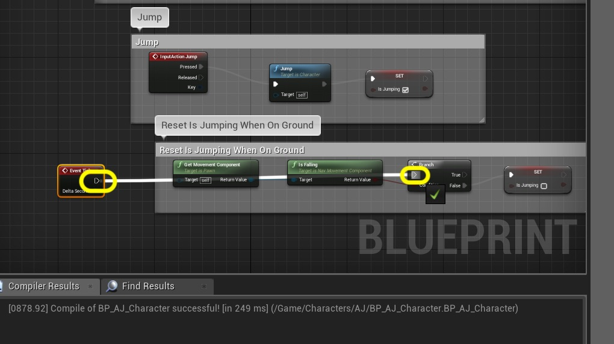

  

_____ 

### Jumping Animation
Lets add the ability for the player to jump around the level and tune this to our liking.

_____ 



{:start="{{ num }}"}
{{ num }}. Before we start lets set this level as the default boot up level.  Go to **Edit \| Project Settings** and navigate to the **Maps & Modes** section.  Change the **Editor Startup Map** to `TestLevel`:

  

_____ 


{:start="{{ num }}"}
{{ num }}. Now we need to add a controller event for jumping.  Go to the **Engine \| Input** section and press the **+** button next to the **Action Mappings** heading.

  

_____ 


{:start="{{ num }}"}
{{ num }}. Call this new action `Jump`.  Press the **+** button next to the **Jump** setting and add a `Space Bar` to the controls.

  

_____ 


{:start="{{ num }}"}
{{ num }}. Open up the **BP_AJ_Character** blueprint and go to the **Event Graph**.  Right clicik and add a **Action Events \| Jump** to the graph.

  

_____ 


{:start="{{ num }}"}
{{ num }}. Pull off of the **Jump** node's **Pressed** execution pin and select the **Jump** node.

  

_____ 


{:start="{{ num }}"}
{{ num }}. Add a comment around these two nodes called `Jump`. 

  

_____ 


{:start="{{ num }}"}
{{ num }}. Run the game and press the jump button (space bar).  Now you should be jumping around the level.

<iframe class="embed-responsive-item" src="https://www.youtube.com/embed/l8sCun9rUT8?autoplay=1&rel=0&controls=0&amp&showinfo=0&version=3&loop=1&playlist=l8sCun9rUT8" frameborder="0" allowfullscreen></iframe>

_____ 


{:start="{{ num }}"}
{{ num }}. Now we could leave it like this as it looks ok. We will add a jump start just to show how it is done.  Go back to the [mixamo](https://www.mixamo.com/#/) site and look for the start of a jump animation.  Make sure you speed it up as we want it to be very fast. Also clip just the very begining of the jump.  Pick one that will work from jump from stand and from run.

<iframe class="embed-responsive-item" src="https://www.youtube.com/embed/ns9h-YP1YBE?autoplay=1&rel=0&controls=0&amp&showinfo=0&version=3&loop=1&playlist=ns9h-YP1YBE" frameborder="0" allowfullscreen></iframe>

_____ 


{:start="{{ num }}"}
{{ num }}. Remember to set **Skin** to **Wihtout Skin** when downloading:

  

_____ 


{:start="{{ num }}"}
{{ num }}. Import the **Jump Start** animation into the jump start folder.

  

_____ 


{:start="{{ num }}"}
{{ num }}. In the **FBX Import Options** select the skeleton for the character.  Press the **Import** button.

  

_____ 


{:start="{{ num }}"}
{{ num }}. Rename the animation `Jump_Start` and run it to confirm you are happy with the animation:

  

_____ 


{:start="{{ num }}"}
{{ num }}. Open the **aj_AnimBlueprint** and go to the **Anim Graph \| Core Locomotion** page.  Right click and select **Add State**:

  

_____ 


{:start="{{ num }}"}
{{ num }}. Call this state `Jump` and connect a transition from **IdleWalkRun** to **Jump** to **Falling**.  There will be a different path to just running off a platform and jumping.

  

_____ 


{:start="{{ num }}"}
{{ num }}. Now the animation blueprint needs to know when the jump button is pressed.  Go to **BP_AJ_Character** blueprint and add a **Boolean** variable called `IsJumping`.  Keep it public (Private set to false) because we need to access it in the animation blueprint.

  

_____ 


{:start="{{ num }}"}
{{ num }}. Enlarge the comment section for jumping.  Drag and drop a **Set IsJumping** variable next to the **Jump** node:

  

_____ 


{:start="{{ num }}"}
{{ num }}. Set the execution pin from the **Jump** node to the **Set Is Jumping** node.  Set **Is Jumping** to `true`:

  

_____ 


{:start="{{ num }}"}
{{ num }}. We need to reset this boolean when you are touching the ground.  Under the Jump nodes right click on the graph and add a **Get Movement Component** node. Pull of its pin and look for a **Is Falling** node:

  

_____ 


{:start="{{ num }}"}
{{ num }}. Pull off of the **Is Falling** node's pin and select a **Branch** node:

  

_____ 


{:start="{{ num }}"}
{{ num }}. Pull off of the **False** execution pin from this **Branch** node and select a **Set IsJumping** node and leave it as false:

  

_____ 


{:start="{{ num }}"}
{{ num }}. Surround these nodes with a comment saying `Reset IsJumping When On Ground`.  Now notice there are no execution pins that run every frame (Tick Event).

  

_____ 


{:start="{{ num }}"}
{{ num }}. Make some room on the left hand side of the comment.  Right click and add a **Event Tick** node:

  

_____ 


{:start="{{ num }}"}
{{ num }}. Connect the execution pin from **Event Tick** to **Branch**.

  

_____ 


{:start="{{ num }}"}
{{ num }}. Now your graph should look like:

  

_____ 


{:start="{{ num }}"}
{{ num }}. Open the **aj_AnimBlueprint**.  We need to access the character's IsJumping variable.  We are not in the right class with the Pawn Owner.  We need to pull off of it's execution pin and select a **Cast To BP AJ_Character** node:

  

_____ 


{:start="{{ num }}"}
{{ num }}. Pull off the **As BP_AJ_Character** pin on the **Cast** node and select **Get IsJumping**:

  

_____ 


{:start="{{ num }}"}
{{ num }}. We need a varialbe in the animation blueprint to run our transitions with.  Add a new **Boolean** Variable named `PressedJump?` and make it **Private** and set the tooltip to `Jump button was pressed`.

  

_____ 


{:start="{{ num }}"}
{{ num }}. Drag and drop the **Set Pressed Jump?** node and connect its execution pin to the **Cast** node.  Connect the **IsJumping** pin to the **PressedJump?** pin.

  

_____ 


{:start="{{ num }}"}
{{ num }}. To keep things need add a **Sequence** node between the **Is Valid** node and the **Set Are We in Air?** node. Reconnectd **Is Valid** to the **Sequence** input** then the **Then 0** to **Set Are We in Air?** node.  Send the **Then 1** pin to the **Cast to BP_AI_Character** node:

  

_____ 


{:start="{{ num }}"}
{{ num }}. Go back to the **Anim Graph \| Core Locomotion** section of the animatin blueprint and click on the transition button from **IdleWalkRun** to **Jump** transition.

  

_____ 


{:start="{{ num }}"}
{{ num }}. Add a **Pressed Jump?** node and connectd it to the **Result** node.

  

_____ 


{:start="{{ num }}"}
{{ num }}. Go back to the **Anim Graph \| Core Locomotion** page.  Double click the **Jump** state to assign the animation.

  

_____ 


{:start="{{ num }}"}
{{ num }}. Drag and drop the **Jump_Start** animation to the graph. Connect the animation nodes with the **Final Animation Pose**.

  

_____ 


{:start="{{ num }}"}
{{ num }}. Go back to the **Anim Graph \| Core Locomotion** screen.  Double click on the transition in the **Anim Graph \| Core Locomotion** page from **IdleWalkRun** to **Falling**:

  

_____ 


{:start="{{ num }}"}
{{ num }}. This is for falling off the edge of an object without jumping.  We need to find out if we are in the air but not pressing the jump button.  Drag a **Get Are We in Air?** and **Get Pressed Jump?** nodes onto the graph:

  

_____ 


{:start="{{ num }}"}
{{ num }}. Drag off of the **Are We in Air?** pin and add a **Boolean AND** node:

  

_____ 


{:start="{{ num }}"}
{{ num }}. We want to make sure that Pressed Jump is false.  Pull off of the **Pressed Jump?** pin and select a **Boolean NOT** node. Connect the output to the bottom input of the **AND** node:

  

_____ 


{:start="{{ num }}"}
{{ num }}. Connect the output of the **AND** node to **Result**:

  

_____ 



{:start="{{ num }}"}
{{ num }}. Double click on the **Jump** to **Falling** transition button on the **Anim Graph \| Core Locomotion** screen:

  

_____ 


{:start="{{ num }}"}
{{ num }}. Right click on the graph and select a **Time Remaining (ratio) (Jump_Start)** node:

  

_____ 


{:start="{{ num }}"}
{{ num }}. Pull off of the **Return Value** pin and select a **float <= float** node.  Set the bottom to `0.75`.  Connect the output to the **Result** pin.  Press **Compile** on all open blueprints.

  

_____ 


{:start="{{ num }}"}
{{ num }}. Press play and run around and fall off edge and jump. Make sure both transitions of running off edge and jumping are working correctly?  I run up to the cube and the character penetrates it too much for my liking.  The head when jumping up the wall gets buried inside the wall geometry. Lets fix this.

<iframe class="embed-responsive-item" src="https://www.youtube.com/embed/e_zkMmmtElc?autoplay=1&rel=0&controls=0&amp&showinfo=0&version=3&loop=1&playlist=e_zkMmmtElc" frameborder="0" allowfullscreen></iframe>

_____ 


{:start="{{ num }}"}
{{ num }}. Go to the **BP_AJ_Character** blueprint and select the **Mesh** component.  I adjust the mesh back on the **Y** Location a bit.

  

_____ 


{:start="{{ num }}"}
{{ num }}. I then go to the **Capsule** component and increate the **Capsule Radius**. For my character `50.0` seems to work fine.

  

_____ 


{:start="{{ num }}"}
{{ num }}. Now I like the collision much better.  The player small amount of penetration does not bother me and the collisions feel better. Press **Save All** and update Github by **committing** and **pushing** all the changes made.  Next up we will be adding a slow walk and speed run for the player.

<iframe class="embed-responsive-item" src="https://www.youtube.com/embed/6gvU6L77JQU?autoplay=1&rel=0&controls=0&amp&showinfo=0&version=3&loop=1&playlist=6gvU6L77JQU" frameborder="0" allowfullscreen></iframe>

_____ 
  

[<- Previous](Intro-To-Animation-5.html)&nbsp;&nbsp;&nbsp;[Home](../index.html)&nbsp;&nbsp;&nbsp; [Continue ->](Intro-To-Animation-7.html)
   
   
   

