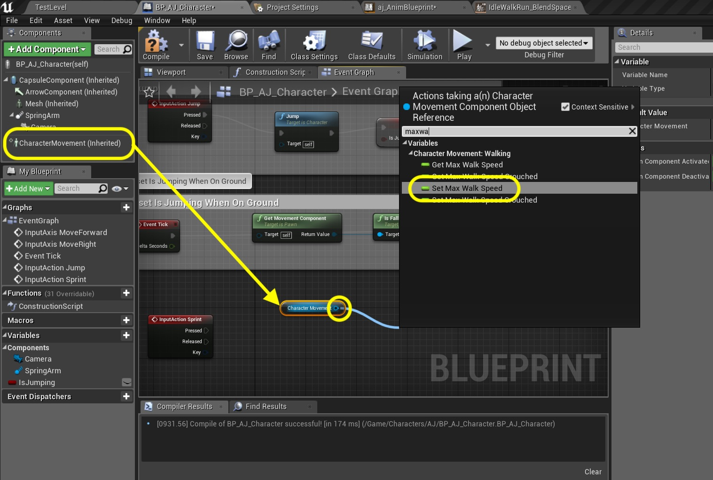
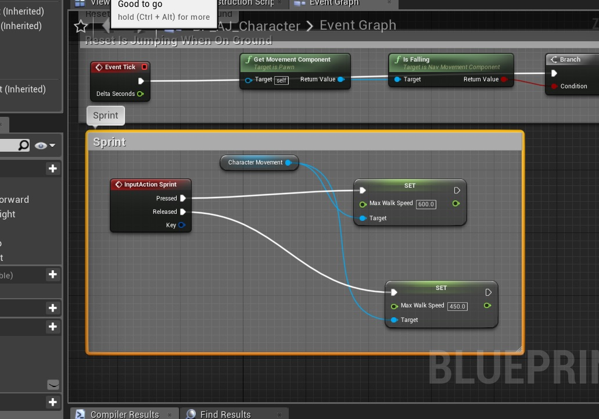
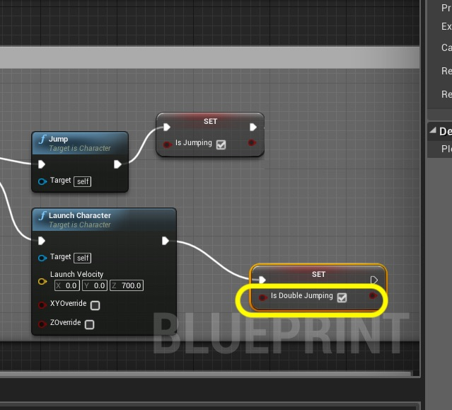

  

_____ 

### Slow Walk and Sprint
Lets add some speed changes so we can adjust our speed based on a button state change.  Lets add a _Alt_ button for slow walk and an _Shift_ button for sprint.  Then lets create some platforms to jump around in.

_____ 



{:start="{{ num }}"}
{{ num }}. So we need to control the speed of the player.  Open the **BP_AJ_Character** blueprint and select the **Character Movement** component.  In the detail panel look for **Character Movement: Walking \| Max Walk Speed**. It is set to 600.  My guess is that this is the same value as the magnitude of the velocity vector. Please take note that the word walking means speed on ground and does not imply an animation state.  It is used for all ground movement (not flying or swimming). RESET THIS VALUE TO `450`.

  

_____ 


{:start="{{ num }}"}
{{ num }}. Remember we placed this velocity magnitude in the animation blueprint.  Open **aj_AnimBlueprint** and add athe bottom of the graph a **Get Speed** node.  Add a **Print Sctring** node.  Connect the output of the **Speed** node to the **In String** of the **Print String** node. Press the arrow at the bottom of the **Print** node and change the **Duration** to `0.0`. Connect the execution pin coming from **Set Pressed Jump?** node to the **Print String** node.

  

_____ 


{:start="{{ num }}"}
{{ num }}. Play the game.  You will noticed that in the turns it ducks below 450 but is at 449 when running straight.  So our assumption is correct, this matches the max walking value in the blueprint.

<iframe class="embed-responsive-item" src="https://www.youtube.com/embed/eFg8p5c3lDU?autoplay=1&rel=0&controls=0&amp&showinfo=0&version=3&loop=1&playlist=eFg8p5c3lDU" frameborder="0" allowfullscreen></iframe>

_____ 


{:start="{{ num }}"}
{{ num }}. Now lets make somre adjustments in our blend space.  We want our top sprinting speed to be 600 and our normal run at 450 .  Open the **IdleWalkRun_BlendSpace** blend in our **Animations** folder.  Click on **Axis Settings** and change the **Horizontal Axis \| Maximum Axis Value** to `600` to match the top speed in game.

  

_____ 


{:start="{{ num }}"}
{{ num }}. That rescales our graph.  So I want to know the speed of our normal run animation. Click on the second to last animation and it should have scaled this value to `450.0`:

  

_____ 


{:start="{{ num }}"}
{{ num }}. Now go back to the **BP_AJ_Character** blueprint and select the **CharacterMovement** Component. Then go to **Character Movement Walking \| Max Walk Speed** and set it to `450.0` and adjust **Max Walk Speed Crouched** to `200.0`.

  

_____ 


{:start="{{ num }}"}
{{ num }}. Play the game.  You will noticed that in the player only runs at 450 and the slower run animation plays:

<iframe class="embed-responsive-item" src="https://www.youtube.com/embed/sdfuFdU-rIs?autoplay=1&rel=0&controls=0&amp&showinfo=0&version=3&loop=1&playlist=sdfuFdU-rIs" frameborder="0" allowfullscreen></iframe>

_____


{:start="{{ num }}"}
{{ num }}. Lets add sprinting to get the speed back up to 600.  We will do this when pressing the **Shift** button.  Now open **Edit \| Project Settings** and go to **Engine \| Input**.  Press the **+** button next to **Action Mappings** and add a new action and call it `Sprint`.  Press the **+** twice next to the **Sprint** action.  Assign the `Left Shift` and `Right Shift` keys.

  

_____ 


{:start="{{ num }}"}
{{ num }}. Reopen **BP_AJ_Character** blueprint and go to the **Event Graph**.  At the bottom add a **Action Events \| Sprint** node:

  

_____ 


{:start="{{ num }}"}
{{ num }}. Drag and drop a reference to the **Character Movement** component.  Pull off of its pin and add a **Set Max Walk Speed** node:

  

_____ 


{:start="{{ num }}"}
{{ num }}. Connect the execution pin **Pressed** from the **Sprint** node to the **Set Max Walk Speed** node.  Change the **Speed** to `600.00`. Copy and paste the the **Set Max Walk Speed** node.

  

_____ 


{:start="{{ num }}"}
{{ num }}. Connect the **Character Movement** node to the **Target** input on the pasted **Set Max Walk Speed** node.  Connect the **Released** execution pin from the **Sprint** node to this node as well.  Change the **Speed** to `450.0`.

  

_____ 


{:start="{{ num }}"}
{{ num }}. Add a comment with `Sprint` around these nodes:

  

_____ 


{:start="{{ num }}"}
{{ num }}. Play the game.  You will noticed that in the player runs at 450 until the sprint button is pressed.  Then the player runs at a full 600 with the faster animation.

<iframe class="embed-responsive-item" src="https://www.youtube.com/embed/MSOvzKYqR10?autoplay=1&rel=0&controls=0&amp&showinfo=0&version=3&loop=1&playlist=MSOvzKYqR10" frameborder="0" allowfullscreen></iframe>

_____ 


{:start="{{ num }}"}
{{ num }}. OK, lets work on the slow walk.  Open the **IdleWalkRun_BlendSpace** editor.  It is the second option on the left.  We can see that it is at 75.

  

_____ 


{:start="{{ num }}"}
{{ num }}. Now open **Edit \| Project Settings** and go to **Engine \| Input**.  Press the **+** button next to **Action Mappings** and add a new action and call it `SlowWalk`.  Press the **+** twice next to the **Slow Walk** action.  Assign the `Left Alt` and `Right Alt` keys.

  

_____ 


{:start="{{ num }}"}
{{ num }}. Go back to the **BP_AJ_Character** blueprint and at the bottom right click and add a **Action Event \| Slow Walk** node.

  

_____ 


{:start="{{ num }}"}
{{ num }}. Copy and paste the **Character Movement** and two **Set** nodes from sprinting and paste them next to the **Slow Walk** node.  Connect the execution pins.  Change the **Max Walk Speed** for the **Pressed** node path to `75.0`.  Leave the **Released** back to `450.0`.  Add a comment `Slow Walk` around these new nodes.

  

_____ 


{:start="{{ num }}"}
{{ num }}. Now run the game and press the **Alt** key.  You will notice that the character skates across the screen.  This is no good we need to slow the player speed down for when this animation is triggered.

<iframe class="embed-responsive-item" src="https://www.youtube.com/embed/1ZU9bsbbXPA?autoplay=1&rel=0&controls=0&amp&showinfo=0&version=3&loop=1&playlist=1ZU9bsbbXPA" frameborder="0" allowfullscreen></iframe>

_____ 


{:start="{{ num }}"}
{{ num }}. Go back to the **IdleWalkRun_BlendSpace**.  Now expand the **Blend Samples \| Creep Walk*** and remove **Snap to Grid**.  Then change the **Speed** to `10.0`.

  

_____ 


{:start="{{ num }}"}
{{ num }}. Scrub the controller to see what happens.  You will notice that when you are at 10 it is blending mostly the Idle and we are not seeing the slow walk.  This is because it blends between the grid divisions.  

<iframe class="embed-responsive-item" src="https://www.youtube.com/embed/tW6cal7tqII?autoplay=1&rel=0&controls=0&amp&showinfo=0&version=3&loop=1&playlist=tW6cal7tqII" frameborder="0" allowfullscreen></iframe>

_____ 


{:start="{{ num }}"}
{{ num }}. Change the number of **Grid Divisions** to `30` and change the **Speed** to `20`:

  

_____ 


{:start="{{ num }}"}
{{ num }}. Scrub the controller to see what happens this time.  You will notice that it now animates much better:

<iframe class="embed-responsive-item" src="https://www.youtube.com/embed/2FqvHoMF23s?autoplay=1&rel=0&controls=0&amp&showinfo=0&version=3&loop=1&playlist=2FqvHoMF23s" frameborder="0" allowfullscreen></iframe>

_____ 


{:start="{{ num }}"}
{{ num }}. Go back to the **BP_AJ_Character** blueprint and change the **Max Walk Speed** from the **Pressed** execution link from **Slow Walk** to `20.0`.

  

_____ 


{:start="{{ num }}"}
{{ num }}. Play the game and press **Shift** and **Control** and you should now have the player moving at three speeds! Press **Save All** and update Github by **committing** and **pushing** all the changes made.

<iframe class="embed-responsive-item" src="https://www.youtube.com/embed/nkytiszefMA?autoplay=1&rel=0&controls=0&amp&showinfo=0&version=3&loop=1&playlist=nkytiszefMA" frameborder="0" allowfullscreen></iframe>

_____ 

### Double Jump
Since I have downloaded this cartoon character, I would like to implement double jump which is not an option in the character controller.  We will have to add this to the game by ourselves.  We will do this now.

_____ 


{:start="{{ num }}"}
{{ num }}. Go back to [Mixamo](https://www.mixamo.com/#/) and look for a good animation for a double jump.  I am going with a foreward roll.  Make sure it is set to **In Place** if there is translation and trim it to just the spin.  We don't don't want any foot on ground bits in our final exported animation.  Export the file without the skin.

<iframe class="embed-responsive-item" src="https://www.youtube.com/embed/Lgu0SHm37-o?autoplay=1&rel=0&controls=0&amp&showinfo=0&version=3&loop=1&playlist=Lgu0SHm37-o" frameborder="0" allowfullscreen></iframe>

_____ 


{:start="{{ num }}"}
{{ num }}. Go to the **Animations** folder and press the **Import** ubtton. Select the latest animation you just downloaded.

  

_____ 


{:start="{{ num }}"}
{{ num }}. In the **FBX Import Options** assign a **Skeleton** that you are using.  Press the **Import** button:

  

_____ 


{:start="{{ num }}"}
{{ num }}. Call thsi animation `Double_Jump`.  Double click it to open it in the editor.

  

_____ 


{:start="{{ num }}"}
{{ num }}. Confim that the animation is correct:

<iframe class="embed-responsive-item" src="https://www.youtube.com/embed/qPa12qJ4KdA?autoplay=1&rel=0&controls=0&amp&showinfo=0&version=3&loop=1&playlist=qPa12qJ4KdA" frameborder="0" allowfullscreen></iframe>

_____ 


{:start="{{ num }}"}
{{ num }}. Open **BP_AJ_Character** blueprint and go to the **Jump** section.  Make some room in this comment box to add some more nodes for double jumps:

  

_____ 


{:start="{{ num }}"}
{{ num }}. Right click and add a **DoN** node.  This node will repeat _n_ number of times.  We will set it to two for double jump.

  

_____ 


{:start="{{ num }}"}
{{ num }}. We are going to now switch on the integer comign from the **DoN** node.  Add a **Switch on Int** node:

  

_____ 


{:start="{{ num }}"}
{{ num }}. Connect the **Counter** pin from the **DoN** node to the **Switch on Int** node's **Selection** pin:

  

_____ 


{:start="{{ num }}"}
{{ num }}. Connect the **DonN** execution pin to the **Switch on Int** node:

  

_____ 


{:start="{{ num }}"}
{{ num }}. Disconnect the execution pin coming out of the **Jump** node:

  

_____ 


{:start="{{ num }}"}
{{ num }}. Connect the **Jump** node's secution pin to the **DoN** node:

  

_____ 


{:start="{{ num }}"}
{{ num }}. Now we need a variable to know that we have pressed this button.  Right click on the **bIsJumping** variable and select **Duplicate** to make another copy.

  

_____ 


{:start="{{ num }}"}
{{ num }}. Call this new Variable `IsDoubleJumping`.

  

_____ 


{:start="{{ num }}"}
{{ num }}. Press the **+** button three times on the **Switch On Int** node. Even though we only need two pins the **DoN** node starts counting at 1 and the **Switch On Int** node starts on 0.  Connect the output pin **1** from the **Switch on Int** node to the **Jump** node:

  

_____ 


{:start="{{ num }}"}
{{ num }}. Pull from the **Switch on Int** node's execution pin and select a **Launch Character** node.

  

_____ 


{:start="{{ num }}"}
{{ num }}. We want to launch the characer upwards, or positive along the Z axis.  Change the **Launch Velocity**'s **Z** to `700.0`. Pull off the execution pin and select **Set Is Double Jumping** variable. 

  

_____ 


{:start="{{ num }}"}
{{ num }}. Set the **Is Double Jumping** setting to `true`:

  

_____ 


{:start="{{ num }}"}
{{ num }}. Right click under the **Action Event Jump** node and select an **Event On Landed**.  This will run when the player lands.

  

_____ 


{:start="{{ num }}"}
{{ num }}. Connect the output execution pin from the **Event On Landed** node and put it on the reset node on the **DoN** node.  This means that each time the player lands he will be able to jump then double jump again!

  

_____ 


{:start="{{ num }}"}
{{ num }}. To test our work lets print on screen.  Add two **Print String** nodes.  Add to the **InString** in the top one `Single Jump` then in the bottom one `Double Jump`.  Connect the **Is Jumping** output to the top **Print String** node and the **Is Double Jumping** to the bottom **Print String** node:

  

_____ 


{:start="{{ num }}"}
{{ num }}. Play the game and you should now be able to double jump and the text should reflect the correct state.  Next up we will add the animation of the player rolling.

<iframe class="embed-responsive-item" src="https://www.youtube.com/embed/t1Iddb0nz98?autoplay=1&rel=0&controls=0&amp&showinfo=0&version=3&loop=1&playlist=t1Iddb0nz98" frameborder="0" allowfullscreen></iframe>

_____ 

  

[<- Previous](Intro-To-Animation-6.html)&nbsp;&nbsp;&nbsp;[Home](../index.html)&nbsp;&nbsp;&nbsp; [Continue ->](Intro-To-Animation-8.html)
   
   
   

