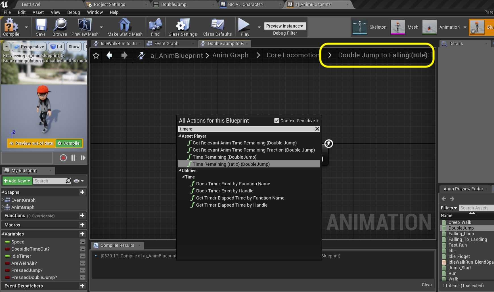
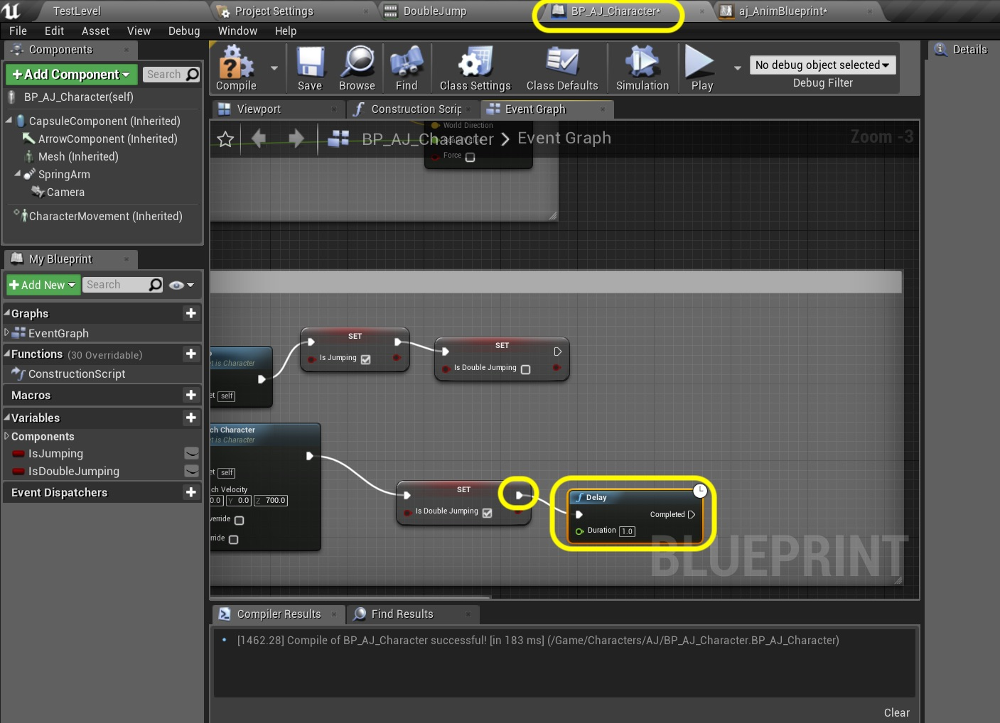

  

_____ 

### Double Jump Continued
We have the physics in now lets trigger the animation we have imported.

_____ 



{:start="{{ num }}"}
{{ num }}. When you have the double jump physics working you can delete the two **Print String** nodes:

  

_____ 


{:start="{{ num }}"}
{{ num }}. Open to the **bj_AnimBlueprint** and go to the **Event Graph**.  Duplicate the **Pressed Jump** variable.  Call it `bIsDoubleJumping`.

  

_____ 


{:start="{{ num }}"}
{{ num }}. Go to the **Set Is Jumping** Section.  Pull the **As BP AJ Character** pin and select a **Get Is Double Jumping** node:

  

_____ 


{:start="{{ num }}"}
{{ num }}. Drag and drop a **Set Pressed Double Jump?** node.  Connect it to the **Is Double Jumping** pin.

  

_____ 


{:start="{{ num }}"}
{{ num }}. Connect the execution pin from the **Set Pressed Jump?** node to the **Set Pressed Double Jump?** node.

  

_____ 


{:start="{{ num }}"}
{{ num }}. Go to the **Anim Graph \| Core Locomotion** screen.  To the right of the **Fall** node right click and select **Add State**:

  

_____ 


{:start="{{ num }}"}
{{ num }}. Call this new state `Double Jump`.

  

_____ 


{:start="{{ num }}"}
{{ num }}. Connect the **Double Jump** node to and from the **Falling** node.  We are double jumping while in the **Falling** state. Double click on the **Double Jump** node to assign the animation to this state.

  

_____ 


{:start="{{ num }}"}
{{ num }}. Drag and drop the **Double Jump** animation onto the animation graph:

  

_____ 


{:start="{{ num }}"}
{{ num }}. Connect the **Play Double Jump** node to the **Final Animation Pose**:

  

_____ 


{:start="{{ num }}"}
{{ num }}. Double click the transition from the **Falling** node to teh **Double Jump** node:

  

_____ 


{:start="{{ num }}"}
{{ num }}. Drag and drop a **Get Pressed Double Jump** node onto the graph.

  

_____ 


{:start="{{ num }}"}
{{ num }}.Connect th e**Pressed Double Jump** node to the **Can Enter Transition** node.  This will be triggered when in air and the **Pressed Double Jump** node is true.

  

_____ 


{:start="{{ num }}"}
{{ num }}. Go back to the **Core Locomotion** screen.  Double click on the **Double Jump** to **Falling** transition button.  Right click on the graph and select a **Time Remaining (ratio) (Double Jump)** node:

  

_____ 


{:start="{{ num }}"}
{{ num }}. Pull off of the **Return Value** from this node and select a **float <= float** node:

  

_____ 


{:start="{{ num }}"}
{{ num }}. Set the value in the **<=** node to `0.75` and connect the output to the **Result** node:

  

_____ 


{:start="{{ num }}"}
{{ num }}. One thing we haven't done is turn off the double jump state.  If we run the game the player will just keep rolling.  Go back to the **BP_AJ_Character** blueprint and go to the **Event Graph**. Pull off of the **Set Is Double Jumping** node's execution pin and add a **Delay** node:

  

_____ 


{:start="{{ num }}"}
{{ num }}. Set the **Duration** of the **Delay** node to `0.1`.  Pull off of the execution pin and add a **Set Is Double Jumping** node and make sure it is set to `false`.

  

_____ 


{:start="{{ num }}"}
{{ num }}. Run the game and a double jump animation should now run during the second jump. Press **Save All** and update Github by **committing** and **pushing** all the changes made. 

<iframe class="embed-responsive-item" src="https://www.youtube.com/embed/QC07bKxBcWw?autoplay=1&rel=0&controls=0&amp&showinfo=0&version=3&loop=1&playlist=QC07bKxBcWw" frameborder="0" allowfullscreen></iframe>

_____ 

### Player Attack
Lets add a punching animation combo to the player so he can interact with objects.

_____
 


{:start="{{ num }}"}
{{ num }}. To attach another actor (like a gun) or a collision volume to follow a bone we will be placing **[Sockets](https://docs.unrealengine.com/en-us/Engine/Content/Types/SkeletalMeshes/Sockets)** in the skeleton. This way the component will move, rotate and scale with that bone that the socket is attached to.   Open **aj_Skeleton** and look for the socket that is at the left wrist.  In my skeleton this was the **LeftHand** bone.  I right click on this bone and select `Add Socket`:

  

_____ 



{:start="{{ num }}"}
{{ num }}. Repeat this for the right hand by clicking on the right hand wrist bone and select `Add Socket`.  This adds two sockets one called **LeftHandSocket** and the other **RightHandSocket**.

  

_____ 


{:start="{{ num }}"}
{{ num }}. Now select both sockets and adjust the location to the center of the hand. It is important that it is on the same part of both hands.

  

_____ 


{:start="{{ num }}"}
{{ num }}. Lets add some collision volumes to our player blueprint over his or her fists.  Open **BP_AJ_Character** and press the **Add Component** button then add a **Sphere Collision** component.

  

_____ 


{:start="{{ num }}"}
{{ num }}. Call this collision sphere `LeftHand`:

  

_____ 


{:start="{{ num }}"}
{{ num }}. Right click on **Left Hand** component and select **Duplicate**.

  

_____ 


{:start="{{ num }}"}
{{ num }}. Call it `RightHand` and move the location to the right hand.  Also on both collision spheres change the **Sphere Radius** to `8.0`.

  

_____ 


{:start="{{ num }}"}
{{ num }}. Now we need to attach both components to the sockets we jsut created in the skeleton. We want this to happen right away so lets put in in the constructor.  Open the **Construction Script** tab and right click and add a **AttachToComponent (LeftHand)** node:

  

_____ 


{:start="{{ num }}"}
{{ num }}. Repeat this but this time select **AttachToComponent (RightHand)**:

  

_____ 


{:start="{{ num }}"}
{{ num }}. Your graph should look like:

  

_____ 


{:start="{{ num }}"}
{{ num }}. Now this attaches to the skeletal mesh. So drag and drop a **Get Mesh** component to the left of these nodes:

  

_____ 


{:start="{{ num }}"}
{{ num }}. Attach the **Mesh** pin to both **Parent** pins on the **Attach To Component** nodes:

  

_____ 


{:start="{{ num }}"}
{{ num }}. This will not be run without the execution pins. Pull off of the **Construction Script** node to the **Attach To Component** node.  Then chain the two **Attach To Component** nodes together:

  

_____ 


{:start="{{ num }}"}
{{ num }}. We have to enter the socket name to attach the component to.  Go to the **Attach To Component** node for the left hand and add the **Socket Name** exactly how it is entered in the skeleton, in my case `LeftHandSocket`.

  

_____ 


{:start="{{ num }}"}
{{ num }}. Go to the **Attach To Component** node for the right hand and add the **Socket Name** exactly how it is entered in the skeleton, in my case `RightHandSocket`.

  

_____ 


{:start="{{ num }}"}
{{ num }}. Add a comment around these nodes called `Attach Collision Components to Hand Sockets`:

  

_____ 


{:start="{{ num }}"}
{{ num }}. Press the **Compile** button and go back to the viewport.  Now our collision spheres should be animating with the hands.  Notice that the offset is off.

<iframe class="embed-responsive-item" src="https://www.youtube.com/embed/_IVh23JWwxw?autoplay=1&rel=0&controls=0&amp&showinfo=0&version=3&loop=1&playlist=_IVh23JWwxw" frameborder="0" allowfullscreen></iframe>

_____ 


{:start="{{ num }}"}
{{ num }}. Select the **LeftHand** component and adjust the location to the middle of the hand.  You should adjust the movement amount to `1` as you want precise control.  Now that it animates I want to increase the collision size so set the **Sphere Radius** to `12.0`. Repeat this step for the right hand as well.

  

_____ 


{:start="{{ num }}"}
{{ num }}. Now your collision volumes should follow the hands perfectly.

<iframe class="embed-responsive-item" src="https://www.youtube.com/embed/LMYJEXludXE?autoplay=1&rel=0&controls=0&amp&showinfo=0&version=3&loop=1&playlist=LMYJEXludXE" frameborder="0" allowfullscreen></iframe>

_____ 


{:start="{{ num }}"}
{{ num }}. Now lets get some punch animations.  Go back to [Mixamo](https://www.mixamo.com/#/) and select some punching animations.  Pick ones and make the appropriate adjustments. I want two animations one for each hand.  I will just mirror the same animation that I have tweaked:

<iframe class="embed-responsive-item" src="https://www.youtube.com/embed/ZgEbE74beAk?autoplay=1&rel=0&controls=0&amp&showinfo=0&version=3&loop=1&playlist=ZgEbE74beAk" frameborder="0" allowfullscreen></iframe>

_____ 


{:start="{{ num }}"}
{{ num }}. I now go into the **Animations** folder and press the **Import** button.  Select the two punch animations you just downloaded:

  

_____ 


{:start="{{ num }}"}
{{ num }}. Select the skeleton for your character and press **Import All**:

  

_____ 


{:start="{{ num }}"}
{{ num }}. Preview and them and make sure they work and rename them.  I called mine `Left_Jab` and `Right_Jab`. On the next page we will add them to our blueprints so a button press can trigger them!

  

_____ 

  

[<- Previous](Intro-To-Animation-7.html)&nbsp;&nbsp;&nbsp;[Home](../index.html)&nbsp;&nbsp;&nbsp; [Continue ->](Intro-To-Animation-9.html)
   
   
   

