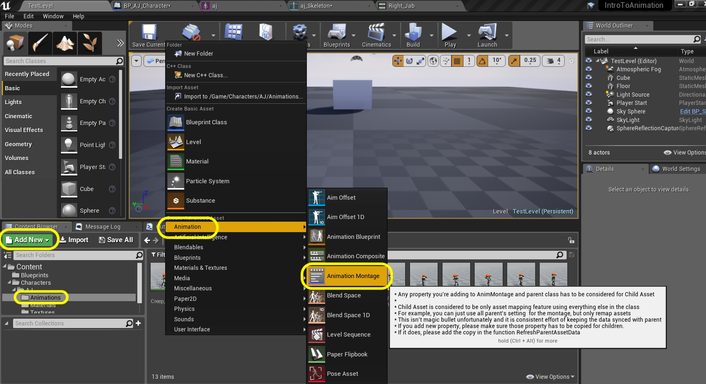
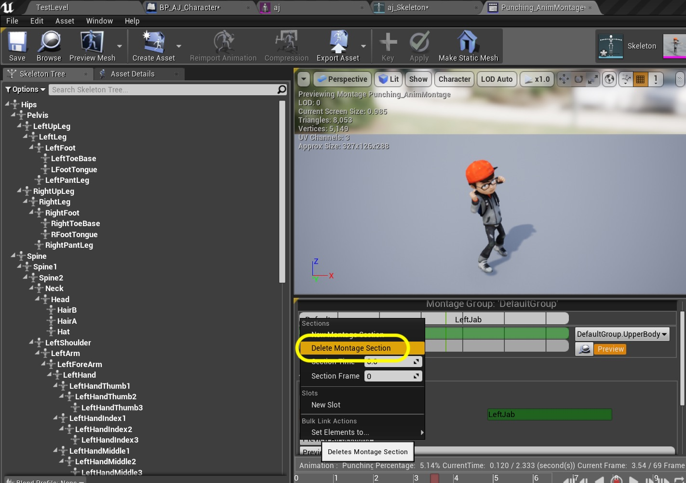
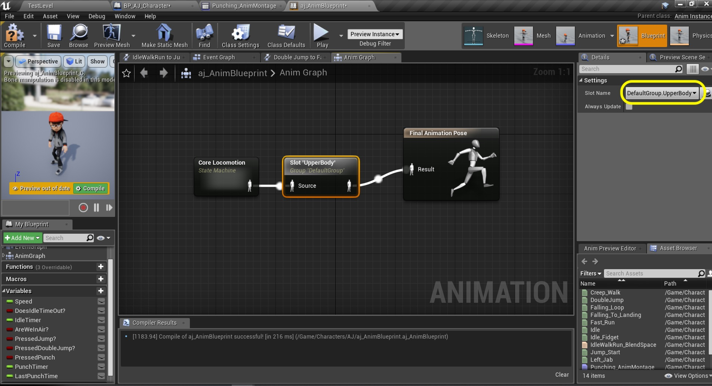
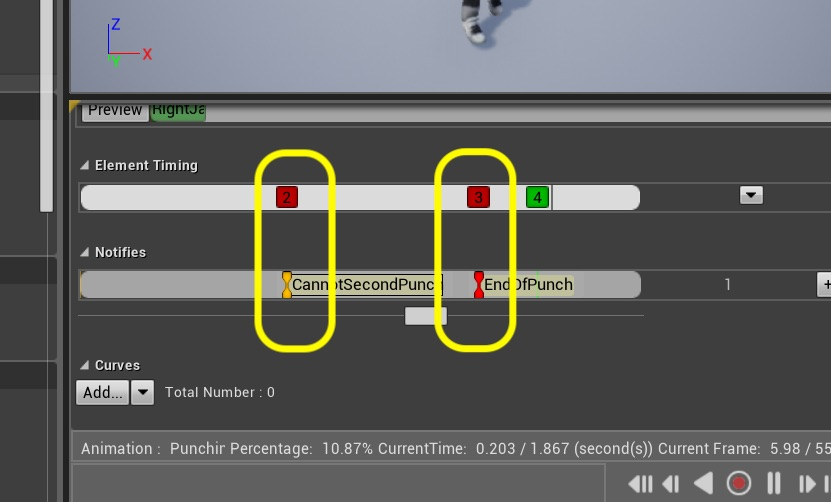

  

_____ 

### Player Attack Continued
Add the logic for the player punches.

_____ 



{:start="{{ num }}"}
{{ num }}. Since this is for attacks and is not based on game states, but based on button presses we will use an animation montage for this.  Go to the **Animations** folder and press the **Add New** button and select **Animation \| Animation Montage**.

  

_____ 


{:start="{{ num }}"}
{{ num }}. The next pop up is the **Pick Skeleton** menu.  Pick the skeleton that you are using, in my case it is `aj_Skeleton`.

  

_____ 


{:start="{{ num }}"}
{{ num }}. Name it `Punching_AnimMontage`.

  

_____ 


{:start="{{ num }}"}
{{ num }}. Our first punch will be the left jab.  Drag and drop the `Left_Jab` animation to the **Montage** timeline.

  

_____ 


{:start="{{ num }}"}
{{ num }}. Our second punch will be the right jab.  Drag and drop the `Right_Jab` animation to the **Montage** timeline.

  

_____ 


{:start="{{ num }}"}
{{ num }}. These are played back in the animation blueprint through an animation slot manager.  Left click on the **Magnifying Glass** icon just next to the **Preview** button:

  

_____ 


{:start="{{ num }}"}
{{ num }}. This brings up the **Anim Slot Manager** tab.  Press the **+ Add Slot** button to add an animation slot.

  

_____ 


{:start="{{ num }}"}
{{ num }}. We are going to give it a name called `UpperBody`. This will become evident later on why we are calling it this.

  

_____ 


{:start="{{ num }}"}
{{ num }}. Select the **Default Group Default Slot** and select `DefaultGroup UpperBody`:

  

_____ 


{:start="{{ num }}"}
{{ num }}. The model pops back into a T-Pose with no animation.  Press the **Preview Scene Set** tab on the top right:

  

_____ 


{:start="{{ num }}"}
{{ num }}. Next to the **Preview Mesh** press the **Apply to Asset** button. The player will now animate again.

  

_____ 


{:start="{{ num }}"}
{{ num }}. We want to access this as a combo.  If the player presses once, the player punches left.  If timed right they will punch right.  If they don't punch again they will punch again with their left hand.  Right click on the **Montage** timeline and select `New Montage Section` and call it `Left Jab`.

  

_____ 


{:start="{{ num }}"}
{{ num }}. We need to delete the default section.  Go to the begining and right click on the **Default** section and select `Delete Montage Section`.

  

_____ 


{:start="{{ num }}"}
{{ num }}. Right click on the **Montage** timeline between the two animations and again select `New Montage Section` and call it `Right Jab`.

  

_____ 


{:start="{{ num }}"}
{{ num }}. Adjust the **Left_Jab** section to the very begining of the timeline.  Adjust the **Right_Jab** to between the two animations.

  

_____ 


{:start="{{ num }}"}
{{ num }}. In the **Sections** tab press the **Clear** button.  This will generate two events for each section/animation.

  

_____ 


{:start="{{ num }}"}
{{ num }}. Lets assign an action for the controller. Open the **Project Settings** and add a **Action Mappings** by pressing the **+** button.  Call it `Punch` and assign the `C` button to this action.

  

_____ 


{:start="{{ num }}"}
{{ num }}. Open the **BP_AJ_Character** blueprint and go to the **Event Graph**.  At the bottom right click and select the **Action Events \| Punch** node:

  

_____ 


{:start="{{ num }}"}
{{ num }}. We need a **Boolean** variable to track this press state.  Right click on **IsDoubleJumping** and select `Duplicate`:

  

_____ 


{:start="{{ num }}"}
{{ num }}. Adjust the **Tooltip** and call the new variable `IsPunching`.  Add a `Set IsPunching` node.

  

_____ 


{:start="{{ num }}"}
{{ num }}. Connect the execution pin from the **Punch** node's **Pressed** pin to the **Set Is Punching** node.  Set the **IsPunching** to `true`:

  

_____ 


{:start="{{ num }}"}
{{ num }}. Pull off of the **Released** execution pin from the **Punch** node and add another **Set IsPunching** node and leave it as `false`.

  

_____ 


{:start="{{ num }}"}
{{ num }}. Add `Punching` comment on nodes.

  

_____ 


{:start="{{ num }}"}
{{ num }}. To string a combo we want to detect for a second punch.  We also don't want the punch to loop.  So just to be sure we will also set **IsPunching** to false a tenth of a second after the boolean is set.  Pull off of the **Set IsPunching** pin and select a **Delay** node settings the delay to `0.1`.  Pull off of the **Delay** Execution pin and select a **Set IsPunching** node and leave it as `false`.

  

_____ 


{:start="{{ num }}"}
{{ num }}. OK, now we can read this variable in our animation blueprint. Open `aj_AnimBlueprint` and duplicate one of the booleans and name it `PressedPunch?`.  Adjust the **Tooltip** to say `Punch button was pressed`. 

  

_____ 


{:start="{{ num }}"}
{{ num }}. Go to the **Set Is Jumping** section and pull off of the **Cast To BP_AJ_Character** pin.  Select the **Get Is Punching** node to get a reference to whether the button was pressed from the main character blueprint.

  

_____ 


{:start="{{ num }}"}
{{ num }}. Now set the variable in the animation blueprint to match this state.  Pull off of the **Is Punching** pin and select a **Set PressedPunch** node:

  

_____ 


{:start="{{ num }}"}
{{ num }}. Attach the output execution pin from **Set Pressed Double Jump?** to the **Set Punch** node.

  

_____ 


{:start="{{ num }}"}
{{ num }}. Add a comment to describe the punching logic we will be adding.

  

_____ 


{:start="{{ num }}"}
{{ num }}. Pull from the **Set Pressed Punch** node pin and select a **Branch** node. Connect both pins together.  We want to see if the punch button was pressed!

  

_____ 


{:start="{{ num }}"}
{{ num }}. Pull off of the **True** pin from the **Branch** node and select a **DoOnce** node.  This will make sure that we don't keep recalling Montage Play until we reset this node.  Pull off of the **Completed** pin and select a **Montage Play** node.  Select the Montage we just make `Punching_Animation` as the **Montage to Play**.  Also just to be safe untick **Stop All Montages**.

  

_____ 


{:start="{{ num }}"}
{{ num }}. We play the montages through the **Slots** we had created (remember an upper body slot?).  Go to the **Anim Graph** and right click and add a **Montage \| Slot 'DefaultSlot'** node:

  

_____ 


{:start="{{ num }}"}
{{ num }}. Place this node between the **Core Locomotion** and **Final Animation Pose** nodes and reconnect the animation pins.

  

_____ 


{:start="{{ num }}"}
{{ num }}. Change the **Settings \| Slot Name** to `Default Group UpperBody`.

  

_____ 


{:start="{{ num }}"}
{{ num }}. Now we finally have enough to test our work.  We should be able to go into the game and press the **Punch** button (c button on the keyboard) and the character should punch just one time:

<iframe class="embed-responsive-item" src="https://www.youtube.com/embed/S2kLcumUehs?autoplay=1&rel=0&controls=0&amp&showinfo=0&version=3&loop=1&playlist=S2kLcumUehs" frameborder="0" allowfullscreen></iframe>

_____ 


{:start="{{ num }}"}
{{ num }}. OK, lets string together a second punch.  Right click on one of the boolean variables and call it `CanSecondPunch?` and add an appropriate **Tooltip**.

  

_____ 


{:start="{{ num }}"}
{{ num }}. Now we are going to trigger events in this blueprint from our animation montage.  We want to give a window of when the player can re-press the punch button and string a combo.  Opn the **Punching_AnimMontage** tab and scroll down to the **Notify** section and expand the triangle to see the timeline.  Scrub the timeline to get to the end of the punch.  Right click on the Notify timeline and select **Add Notify \| New Notify**.

  

_____ 


{:start="{{ num }}"}
{{ num }}. Call this notify `CanSecondPunch`.

  

_____ 


{:start="{{ num }}"}
{{ num }}. Make sure you are happy with where this combo can start.  It should be after the punch but before the end of the anim leaving the player time to string a combo.

  

_____ 


{:start="{{ num }}"}
{{ num }}. Now we want the end of the combo window.  Right click just before the animations switch (the thin green line) and right click on the Notify timeline and select **Add Notify \| New Notify**

  

_____ 


{:start="{{ num }}"}
{{ num }}. Call it `CannotSecondPunch`.

  

_____ 


{:start="{{ num }}"}
{{ num }}. So this is the window we have to press punch again to get a double punch.

  

_____ 


{:start="{{ num }}"}
{{ num }}. Go back to the **Event Graph**.  Make some room underneath and right click and select **Event AnimNotify_CanSecondPunch** node.  Notice that we can see the notify in our menu of options.  This will only run if this part of the animation plays in game.

  

_____ 



{:start="{{ num }}"}
{{ num }}. Repeat this to add the end of the window with adding node **Event AnimNotify_CannotSecondPunch**.

  

_____ 


{:start="{{ num }}"}
{{ num }}. Drag and drop two **Set Second Punch?** nodes to the graph.  Connect the execution pins and make the **CanSecondPunch** node string set **Can Second Punch?** to `true`:

  

_____ 


{:start="{{ num }}"}
{{ num }}. Make sure you are in the **Event Graph** and add a **Sequence** node between **Branch** and **DoOnce**.  Make room if you need to.

  

_____ 


{:start="{{ num }}"}
{{ num }}. Connect the **True** pin from the **Branch** node to the **Sequence** input.  Send the **Then 0** to the **Do Once** placing this sequence node between the **Branch** and **Do Once** nodes executionally.

  

_____ 


{:start="{{ num }}"}
{{ num }}. So our logic is to play the left punch animation.  Then we need to check to see if we are in the window of a second punch. Pull off of the **Then 1** pin on the **Sequence** node and select another **Branch** node.  Add a **Get Can Second Punch** node and feed it to the **Condition** pin on this new **Branch** node.

  

_____ 


{:start="{{ num }}"}
{{ num }}. Pull off of the **True** pin on the **Branch** node and select another **DoOnce** node for the combo animation.

  

_____ 


{:start="{{ num }}"}
{{ num }}. Now we know that the Montage is already running. What we want to do here is switch to the right jab.  If you remember way back we had two sections a **LeftJab** and **RightJab**.  So pull off of the **Completed** pin on the **Do Once** node and select a **Montage JUmp to Section** node.  Select as the **Montage** `Punching_AnimMontage` and `RightJab` as the **Section Name**.

  

_____ 


{:start="{{ num }}"}
{{ num }}. If we leave it like this then the player from this point forward will always punch with the right hand.  When it hits Montage play a second time it will not reset back to the first section.  Lets solve this by copying and pasting the **Montage Jump to Section** node and putting it after the **Montage Play** node.  Set the **Section Name** to `LeftJab` and connect the execution pin with **Montage Play**.

  

_____ 


{:start="{{ num }}"}
{{ num }}. To reset our states, we need to know where we are at for the end of the animation.  We want to reset our **Do Once** nodes so we can call our punch a second time.  We need to add a notify at the end of the first punch (after the combo window) and at the end of the second animation.  Go to the **Punching_AnimBlueprint** and right click on the **Notify** timeline at the end and select a **Add Notify \| New Notify**:

  

_____ 


{:start="{{ num }}"}
{{ num }}. Call it `EndOfPunch`.

  

_____ 


{:start="{{ num }}"}
{{ num }}. Make sure this notify is close to the end of the animation.

  

_____ 


{:start="{{ num }}"}
{{ num }}. Now we need to right click at the end of the first punch. It needs to be on an empty area otherwise we will be editing another notify.  Don't worry about where it is we will change its location in the next step.  Right click and select **Add Notify \| Skeleton Notifies \| EndOfPunch**.  Notice we don't add another notify, we will use the same logic whether we get to the end of the first or second animation.

  

_____ 


{:start="{{ num }}"}
{{ num }}. Now zoom way in and make sure that **EndOfPunch** notify is after the **CannotSecondPunch** and before the 4th animation transition to the second animation (that only plays when a combo is hit.  It is critical that this ias after the end of combo window and before the animation switches.

  

_____ 


{:start="{{ num }}"}
{{ num }}. Go back to the **AJ_AnimBlueprint**'s **Event Graph** and at the bottom of the punching nodes right click and add a **AnimNotify_EndOfPunch** node:

  

_____ 


{:start="{{ num }}"}
{{ num }}. String a new **Sequence** node after the **EndOfPunch** node:

  

_____ 


{:start="{{ num }}"}
{{ num }}. Press the **Add Pin +** button on the **Sequence** node twice:

  

_____ 


{:start="{{ num }}"}
{{ num }}. Connect the first **Then 0** pin from the **Sequence** node to the first **DoOnce** node's **Reset** pin.

  

_____ 


{:start="{{ num }}"}
{{ num }}. Connect the **Sequence** node's **Then 1** pin to the **Reset** pin on the second **DoOnce** node.

  

_____ 


{:start="{{ num }}"}
{{ num }}. Connect the **Then 2** pin to the **Can Second Punch?** node that sets it to false.  This is important as we want to reset this variable so that when you punch again, it is not set to true at the begining and is reset properly.

  

_____ 


{:start="{{ num }}"}
{{ num }}. Now go in and play the game and if you double punch in the window it should switch hands.  Also if you only punch once or a combo it should start again with the left hand when punching again.  Now notice that you can still run and jump and we have a problem.  This animation is of the player standing in idle then punching.  On the next page, we will solve this issue.

<iframe class="embed-responsive-item" src="https://www.youtube.com/embed/ZPI5ODBlU1Q?autoplay=1&rel=0&controls=0&amp&showinfo=0&version=3&loop=1&playlist=ZPI5ODBlU1Q" frameborder="0" allowfullscreen></iframe>

_____ 
  

[<- Previous](Intro-To-Animation-8.html)&nbsp;&nbsp;&nbsp;[Home](../index.html)&nbsp;&nbsp;&nbsp; [Continue ->](Intro-To-Animation-10.html)
   
   
   

