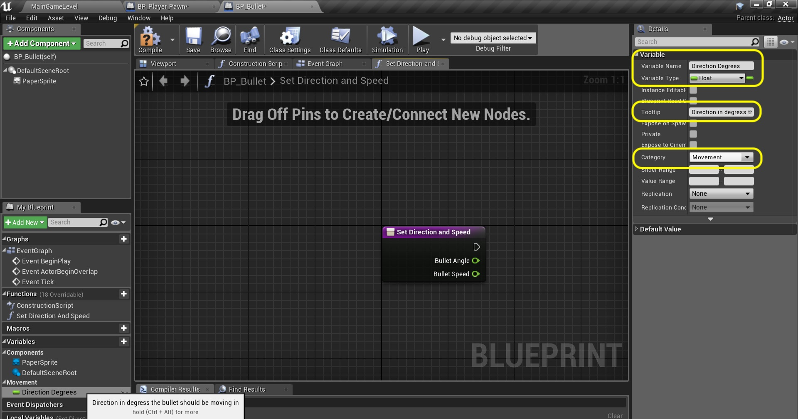

### Firing Bullets Continued

_____ 



{:start="{{ num }}"}
{{ num }}. Go back to **BP_Bullet** blueprint and press the **+** button next ot **Functions**.  Call it `Set Direction and Speed`. We will be calling this from the player blueprint.

  

_____ 


{:start="{{ num }}"}
{{ num }}. Press the **+** button next to **Inputs** twice to add two **Floats**, `Bullet Angle` and `Bullet Speed`.

  

_____ 


{:start="{{ num }}"}
{{ num }}. Add a new variable by pressing the **+** button next to Variables.  Make it a **Float** called `Direction Degrees` and put it in **Category** `Movement`.  Change the **Tooltip** to `Direction in degrees the bullet should be moving in`.

  

_____ 


{:start="{{ num }}"}
{{ num }}. Right click on the **Direction Degrees** variable and select **Duplicate**.  Name the new variable `Speed Per Second` and adjust the **Tooltip** to `Speed in units per second the bullet is travelling`.

  

_____ 


{:start="{{ num }}"}
{{ num }}. Add a **Set Direction Degrees** node and attach the execution pins and send the **Bullet Angle** to the **Direction Degrees** pin:

  

_____ 


{:start="{{ num }}"}
{{ num }}. Add a **Set Speed Per Second** node and attach the output of the preview **Set** pin to the input of the one you just added.  Send the **Bullet Speed** to the **Speed Per Second** pin.  

  

_____ 


{:start="{{ num }}"}
{{ num }}. Add a comment to the nodes `Set Direction and Speed of Bullet`.

  

_____ 


{:start="{{ num }}"}
{{ num }}. Go to the **Event Graph** Press the **+** button next to Variable and call it `Velocity`.  Select the **Variable Type** `Vector 2D`.

  

_____ 


{:start="{{ num }}"}
{{ num }}. Make sure the **Velocity** variable is **Private** an dput it in **Category** is `Movement`.  The **Tooltip** can read `Motion Vector of Bullet`.

  

_____ 


{:start="{{ num }}"}
{{ num }}. Add a **Sequence** node to the right of **Event Tick**.  Attach the execution pins.

 

_____ 


{:start="{{ num }}"}
{{ num }}. Add a large empty comment box for the nodes we are about to add.  Add the comment `Velocity for Next Frame \| Polar to Cartesian *x = r * cos(theta); y = r * sin (theta)`.

  

_____ 


{:start="{{ num }}"}
{{ num }}. Add a **Get Speed Per Second**, **Get World Delta Seconds** and **float * float** node:

  

_____ 


{:start="{{ num }}"}
{{ num }}. Attach **Get Speed Per Second** and **Get World Delta Seconds** to the input pins of the **mMultiplication** node.  Add a **Get Direction Degrees** node and a **Cosine (Radians)** node.

  

_____ 


{:start="{{ num }}"}
{{ num }}. Add a **Degrees to Radians** node.  Connect the output of **Direction Degrees** to the input of **D2R**.  Connect the output of **D2R** to the input of **COS**.  Add a **float * float** node:

  

_____ 


{:start="{{ num }}"}
{{ num }}. Connect the output of the **COS** node to the input of the **Multiplication** node.  Take the output pin of the **Multiplication** node on the Radius and put it inot the other **Multiplication** node input:

  

_____ 


{:start="{{ num }}"}
{{ num }}. Right click and add a **Set Velocity** node:

  

_____ 


{:start="{{ num }}"}
{{ num }}. Right click on the input pin of the **Set Velocity** node and select **Split Struct Pin**.  Connect the output of the **Multiplication** node to the **Velocity X** input of the **Velocity** node.

  

_____ 


{:start="{{ num }}"}
{{ num }}. Connect the **Sequence Then 0** pin to the input execution pin of the **Set Velocity** node:

  

_____ 


{:start="{{ num }}"}
{{ num }}. Add a **Sin (Radians)** node.  Take the output of the **D2R** pin and put it into the input of the new **SIN** node:

  

_____ 


{:start="{{ num }}"}
{{ num }}. Right click and add a **float * float** node.

  

_____ 


{:start="{{ num }}"}
{{ num }}. Connect the output of the **SIN** node to the input of the **Multiplication** node.  Take the output of the **Multipication** node from Radius to the input pin to the **Multiplication** pin.  Take the output and put it into the **Set Velocity** pin **Velocity Y**.

  

_____ 


{:start="{{ num }}"}
{{ num }}. Add a comment `Y Component of Velocity` around the last set of nodes.

  

_____ 


{:start="{{ num }}"}
{{ num }}. Now a bullet moves at a constant speed.  So we can just add this velocity each frame.  Add below a **Get Velocity** node.  Since this is a local position we need to add it to its world location to change it to world space.  Please add a **Get Actor Location** node.  Add a comment called `Move Bullet`.

  

_____ 


{:start="{{ num }}"}
{{ num }}. Right click on the output of the **Get Actor Location** node and select **Split Struct Pin**.  Add a **vect2d + vect2d** node.  Right click the input of the bottom side of this pin and select **Split Struct Pin**.

  

_____ 


{:start="{{ num }}"}
{{ num }}. Add a **Set Actor Location** pin.

  

_____ 


{:start="{{ num }}"}
{{ num }}. Right click on the **New Location** pin on the **Set Actor Location** and select **Split Struct Pin**.  Right click on the output of the **Addition** pin and select **Split Struct Pin**.  Connect **X** and **Y** to **New Location X** and **New Location Y** in **Set Actor Location** node.  Connect the output pin on the **GetActorLocation** node's **Return Value Z** to the **New Location Z** pin.

  

_____ 


{:start="{{ num }}"}
{{ num }}. Connect the **Sequence Then 1** execution pin to the **Set Actor Location** input pin.

  

_____ 


{:start="{{ num }}"}
{{ num }}. Now we need to call this function from the player blueprint.  Double click **BP_Player_Pawn** and add a **Float** Variable called `Bullet Speed` and set it to **Private**.  Set the **Category** to `Bullet`.  Add a **Tooltip** and write `Speed of bullet in units per second`.

  

_____ 


{:start="{{ num }}"}
{{ num }}. Press the **Compile** button and change the **Default Value** of **Bullet Speed** to `700.0`. 

  

_____ 


{:start="{{ num }}"}
{{ num }}. Pull off of the **Return Value** pin from the **Spawn Actor BP Bullet** output pin and call the function **Set Directiona and Speed**. Connect the output execution pin from the **Spawn Actor** node to the **Get Direction and Speed** node.  Also connect the **Return Value** to **Target** of the same two nodes.  Add a **Get Bullet Speed** node and connect it to the **Bullet Speed** in the **Set Direction and SPeed** node.

  

_____ 


{:start="{{ num }}"}
{{ num }}. Add a **Get Actor Rotation** node.  Right click on the **Return Value** pin and select **Split Struct Node**.

  

_____ 


{:start="{{ num }}"}
{{ num }}. Send the output on **Return Value Z (Yaw) from **Get Actor Rotation** to the **Bullet Angle** node on the **Set Direction and Speed** node. Press the **Compile** button.

  

_____ 


{:start="{{ num }}"}
{{ num }}. Play the game and now the bullets fire at will in all directions.  Press the space bar as fast as you can - right now you can fire bullets as quickly as you can press the button.  Lets add a reload time to limit how fast you can fire.

<iframe class="embed-responsive-item" src="https://www.youtube.com/embed/41mw-fqntwU?autoplay=1&rel=0&controls=0&amp&showinfo=0&version=3&loop=1&playlist=41mw-fqntwU" frameborder="0" allowfullscreen></iframe>

_____ 


{:start="{{ num }}"}
{{ num }}. Duplicate **Bullet Speed** variable in **BP_Player_Pawn**.  Call it `Reload Time` and set it to **Private** and **Instance Editable**.  Type in **Tooltip** `Time in seconds for bullet chamber to relaod`.

  

_____ 


{:start="{{ num }}"}
{{ num }}. Double click **Reload Time** and press **Duplicate**.  Call it `Can Fire Bullet` and change it to type **Boolean**.  Turn off **Instance Editable**.  The **Tooltip should read `Determine whether the gun is loaded and ready to fire`. Press the **Compile** button and set the default to `true`.

  

_____ 


{:start="{{ num }}"}
{{ num }}. Go to the **Actioni Event Shoot** node and make some room right after this node.  We want to check to see if the boolean we just created is set to **true**.  Drag a **Get Can Fire Bullet** variable into this space:

  

_____ 


{:start="{{ num }}"}
{{ num }}. Pull off of the **Can Fire Bullet** pin and select a **Branch** node.

  

_____ 


{:start="{{ num }}"}
{{ num }}. Reroute the execution pin from **Action Event Shoot Pressed** to **Branch** to **Spawn** nodes.

  

_____ 


{:start="{{ num }}"}
{{ num }}. Since this is a switch, right after we fire the bullet we set this boolean to flase then ahve a cool down time.  

  

_____ 


{:start="{{ num }}"}
{{ num }}. Drag off of the **Set Direction and Speed** pin and selectd a **Set Can Fire Bullet** node.  Make sure it is set to `false`.

  

_____ 


{:start="{{ num }}"}
{{ num }}. Now go play the game and press fire.  You can fire one bullet then no more.  This means it is working.  Lets create a custom event that reloads the bullet (chnages the bool back to true).  Right click at the very bottom of the chart and right click and select a **Add Custom Event** node.  Call this **Event** `Reload`.

  

_____ 


{:start="{{ num }}"}
{{ num }}. Pull off of the execution pin and add a **Delay** pin. Set the **Duration** to `0.2`. Add comment to the two nodes `Reload Bullet Chamber`. Add a **Get Reloat Time** variable and set its defualt to `0.1`.  Connect the pin from **Reload Time** to **Duration** in the **Delay** node.

  

_____ 


{:start="{{ num }}"}
{{ num }}. Pull off of he **Delay** node execution pin and select a **Set Can Fire Bullet** node.  Make sure you set this to `true`.

  

_____ 


{:start="{{ num }}"}
{{ num }}. Pull off of the **Set Can Fire Bullet** pin in the firing bullet section where it is set to false, and call the **Reload** function by adding its node.

  

_____ 


{:start="{{ num }}"}
{{ num }}. Run the game and press fire as quickly as you can.  You will notice that you can only fire the bullet so fast. Now look at your world outliner. Each time you fire a bullet it adds an actor to the game.  But when the bullets go off screen they are no longer in play.  Eventually with this small memory allocation the game will crash (arguably could take a long time).  Lets clean this up on the next page and delete the bullet when it leaves the screen.

<iframe class="embed-responsive-item" src="https://www.youtube.com/embed/LOiudg8yUKg?autoplay=1&rel=0&controls=0&amp&showinfo=0&version=3&loop=1&playlist=LOiudg8yUKg" frameborder="0" allowfullscreen></iframe>

_____ 
  

[<- Previous](Space-Rocks-9.html)&nbsp;&nbsp;&nbsp;[Home](../index.html)&nbsp;&nbsp;&nbsp; [Continue ->](Space-Rocks-11.html)
   
   
   

