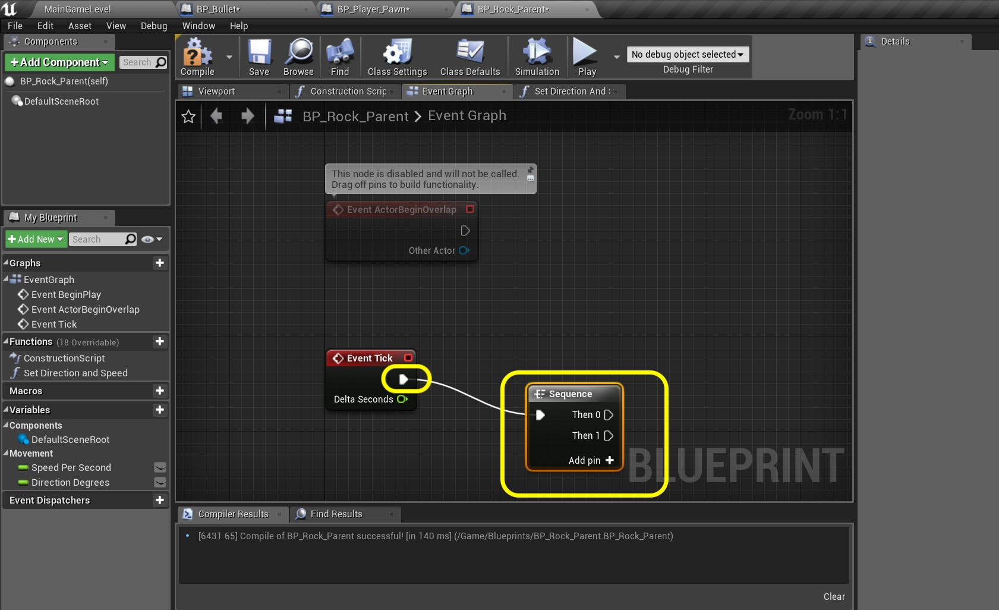

### Firing Bullets Continued - Cleaning Up Deleting Bullet Offsreen

_____ 



{:start="{{ num }}"}
{{ num }}. Now we need to check to see if the bullet is still on screen.  Now we have this information in the camera frustrum variables we set in the gamemode.  So open **BP_Bullet** and if you deleted it add the **Event Begin Play** back to the chart.  Right click and select **Get Game Mode** node.  Connect the execution pin between this and **Event Begin Play**.  Pull off of the **Return Value** pin on **Get Game Mode** and select the **Cast to BP_SpaceRoacks_Gamemode** node.  Make sure the execution and blue pins are connected.

  

_____ 


{:start="{{ num }}"}
{{ num }}. Woops we need a variable to store this reference to access it in other parts of the chart without using a long line from this node.  You can create a variable the normal way.  You can also right click on the **As BP Space Rocks Gamemode** blue exit pin in the **Cast** node and select **Promote to Variable**. 

  

_____ 


{:start="{{ num }}"}
{{ num }}. Now notice that it adds the variable to the **Variables** tab and already has the correct **Variable Type** selected!  Call it `Gamemode Target` and set it to **Private**. Set it to **Category** `Targets`.  Create a **Tooltip** stating `Reference to current game mode`.  Add a comment around these nodes saying `Get Gamemode Reference for accessing Frustum`.

  

_____ 


{:start="{{ num }}"}
{{ num }}. The first thing we need to know is the bullet's location.  So go to the bottom of the graph and right click and select a **Get Actor Location** node.  Right click on the **Return Value** pin and select **Split Struct Pin**.

  

_____ 


{:start="{{ num }}"}
{{ num }}. Drag a **Get Gamemode Target** node onto the graph.  Pull off its pin and select **Get Left Frustum**.  Add a comment and make some room that states `Destroys Bullet whjen off Screen1`.

  

_____ 


{:start="{{ num }}"}
{{ num }}. Pull off of the output of the **Left Frustum** pin and select a **float - float** node. Set the second side of the subtration to `20.0`. Right click and add a **float < float** node beneath.

  

_____ 


{:start="{{ num }}"}
{{ num }}. Connect the **Return Value X** pin from the **Get Actor Location** to the top of the **Less Than** node.  Plug the output of the **Subtraction** node to the bottom side of the **Less Than** node.  Pull off the output of the **Less Than** node and select a **Branch** node:

  

_____ 


{:start="{{ num }}"}
{{ num }}. This branch node needs its execution pin called.  Go back to the **Sequence** node next to **Event Tick** and press the **Add pin +** button.  Take the output of the **Sequence Then 2** pin and send it to the input of the newly created **Branch** node:

  

_____ 


{:start="{{ num }}"}
{{ num }}. Pull off of the **Branch True** pin and select the **Destroy Actor** node.  This will destroy the bullet object when this is true (bullet off of left wide of screen).

  

_____ 


{:start="{{ num }}"}
{{ num }}. Repeat the process for the right hand side.  Pull off of the **Gamemode Target** pin and selectd **Get Right Frustum** node.  Pull off of this pin and select a **float + float**.  Change the second side of this to `20.0`.  Add a **float > float** node:

  

_____ 


{:start="{{ num }}"}
{{ num }}. Connect the output **Return Value X** pin of the **Get Actor Location** to the top side of the **Greater Than** pin.  Connect the output of the **Addition** pin to the bottom side of the **Greater Than** pin.

  

_____ 


{:start="{{ num }}"}
{{ num }}. Pull off of the output boolean from the **Greater Than** node and add a **Branch** node.  Connect the previous **Branch** nodes exit execution pin to the input pin of the new one.  This creates an **else if** scenario.  Connect the new **Branch True** node to the **Destroy Actor** node.  This node should have to nodes accessing it:

  

_____ 


{:start="{{ num }}"}
{{ num }}. Organize and add comment to the nodes:

  

_____ 


{:start="{{ num }}"}
{{ num }}. Now lets check the top of the screen.  Drag off of the **Gamemode Target** pin and select **Get Top Frustum** node:

  

_____ 


{:start="{{ num }}"}
{{ num }}. Add a **float - float** node with the output of the **Top Frustum** on the top input and `20.0` in the bottom. Add a **float < float** node.  Connect the top pin to the output of the **Get Character Location** node's **Return Value Y** pin. Connect the bottom pin to the output of the newly created **Subtraction** node:

  

_____ 


{:start="{{ num }}"}
{{ num }}. Pull off of the boolean output pin of the **Less Than** node and add a **Branch** node.  Connect its input execution pin to the previous **Branch** nodes **False** execution pin. Send the output of **True** to the **Destroy Actor** node.  Add comments to these nodes.

  

_____ 


{:start="{{ num }}"}
{{ num }}. Now lets check the bottom of the screen.  Pull the pin from **Gamemode Target** and select the **Get Bottom Frustum** node. Send this to a **float + float** node where we add `20.0` to this value.

  

_____ 


{:start="{{ num }}"}
{{ num }}. Add a **float > float** node.  Connect the top side to the **Return Value Y** pin of the **Get Actor Location** node and the bottom side to the output of the **Addition** node you just created.

  

_____ 


{:start="{{ num }}"}
{{ num }}. Pull off of the **Greater Than** pin and add a **Branch** node.

  

_____ 


{:start="{{ num }}"}
{{ num }}. Connect this branches incoming execution node to the **False** execution noe fot he previous **Branch** node.  Connect the **Branch True** node to the **Destroy Actor** node which should have four branches coming into it for the left, right, top and bottom.  Add a comment and clean up the nodes.  Press the **Compile** button.

  

_____ 


{:start="{{ num }}"}
{{ num }}. Now fire bullets in all directions and look at the number of **Actors** in the world outliner.  It should go up when firing bullets and back down when they go off all 4 corners of the screen.  Make sure it works in all directions.

<iframe class="embed-responsive-item" src="https://www.youtube.com/embed/djq1DsBjyYk?autoplay=1&rel=0&controls=0&amp&showinfo=0&version=3&loop=1&playlist=djq1DsBjyYk" frameborder="0" allowfullscreen></iframe>

_____ 


{:start="{{ num }}"}
{{ num }}. Press **Save All** and update Github by **committing** and **pushing** all the changes made. Up next we will be spawing rocks so we have something to shoot at.

  

_____ 
## Part 4 - Rocks
Now we will move on to creating two of the three rocks.  You will be able to complete the third by yourself afterwards.  There is one smal rock, two medium rocks and three large rocks for variety.  When the small rock is hit by bullet it is destroyed.  When the medium rock is hit by bullet it spawns two small rocks after being destroyed.  When teh large rock is hit by bullet it spawns two medium size rocks after being destroyed.

_____ 

### Rock Parent
To make our lives easier we will be applying an object oriented programming principle here.  We will have a parent class called **BP_Rock_Parent**.  We can use this for collisions and cast to its children to find out if it is the small, medium or large.

_____ 



{:start="{{ num }}"}
{{ num }}. Go to the **Blueprints** folder and press the **Add New** button. Select the **Bluprint Class** option then the **Actor** blueprint class.  Call it `BP_Rock_Parent`.

  

_____ 



{:start="{{ num }}"}
{{ num }}.  Now we need two variables to calculate the **Velocity** vector with.  One for the angle and the other for the speed.  Press the **+** button next to **Variable** and call it `Speed Per Second`.  Make it type **Float** and **Private**.  Put it in **Category** `Movement`.  Add **Tooltip** `Units per second rock moves at`.

  

_____ 


{:start="{{ num }}"}
{{ num }}. Right click on **Speed Per Second** and select **Duplicate**:

  

_____ 


{:start="{{ num }}"}
{{ num }}. Call the new variable `Direction Degrees` and change the **Tooltip** to `Angle that rock moves in degrees`.

  

_____ 


{:start="{{ num }}"}
{{ num }}. We will be spawning rocks from the level bluerpint.  So we need to add a function that it can call to set up the location, direction and speed.  Press the **+** button next to **Fucntions** and call it `Set Direction and Speed`.

  

_____ 


{:start="{{ num }}"}
{{ num }}. Press the **+** button next to **Inputs** twice to add two input parameters to this function.  Call one `Rock Angle` and the other `Rock Speed`.  Make them both type **Float**.

  

_____ 


{:start="{{ num }}"}
{{ num }}. Drag two nodes of **Set Speed Per Second** and **Set Direction Per Degrees** to the graph.

  

_____ 


{:start="{{ num }}"}
{{ num }}. String the execution pins in sequence.  Connect **Rock Angle** to **Direction Degrees** and **Rock Speed** to **Speed Per Second**.  Add a comment `Set Degrees and Speed fro Rock`.

  

_____ 


{:start="{{ num }}"}
{{ num }}. Go to the **Event Graph** tab and pull off of the **Event Tick** execution pin.  Select a **Sequence Node**.

  

_____ 


{:start="{{ num }}"}
{{ num }}. Add a large comment box with the formula we will be using.  Add the comment `Velocity Polar to Cartesian ( x = r x cos(theta); y = r x sin (theta))`.

  

_____ 


{:start="{{ num }}"}
{{ num }}. Drag a **Get Speed Per Second** node onto the chart and add a **Get World Delta Seconds** node:

  

_____ 


{:start="{{ num }}"}
{{ num }}. We will add a **float * float** node and connect the inputs to **Speed Per Second** and **Get World Delta Seconds**.  Add a comment around all three nodes with `Radius`.  This represents the magnitude of the velocity that plugs into the formula.

  

_____ 


{:start="{{ num }}"}
{{ num }}. Drag a **Get Direction Degrees** variable onto the graph next to the **Radius** nodes.

  

_____ 


{:start="{{ num }}"}
{{ num }}. Pull off of the **Direction Degres** pin and select the **Degrees to Radians** node.  This formula requires the angle to be in radians. 

  

_____ 


{:start="{{ num }}"}
{{ num }}. Now we pull from the **D2R** node and selectd **Cos (Radians)**.  We want to solve for the **Velocity X** as indicated in our comments.

  

_____ 


{:start="{{ num }}"}
{{ num }}. Now we want to multply the Cos(theta) by the Radius.  Add a **float * float** pin and drag the output of **COS** node to one input and **Multiply** node to the other.

  

_____ 


{:start="{{ num }}"}
{{ num }}. Add a new Variable by pressing **+** and call it `Velocity`.  Select **Variable Type** of **Vector 2D**.

  

_____ 


{:start="{{ num }}"}
{{ num }}. Make it **Private** and put it in **Category** `Movement`.  Add a **Tooltip** `Vector for velocity of rock`.

  

_____ 


{:start="{{ num }}"}
{{ num }}. Drag a **Set Velocity** node to the chart.  Right click the blue **Velocity** pin and select the **Split Struct Pin** option.

  

_____ 


{:start="{{ num }}"}
{{ num }}. Connect the pin from the **Multiplication** node to **Velocity X**.

  

_____ 


{:start="{{ num }}"}
{{ num }}. Connect the **Sequence Then 0** execution pin to the **Set Velocity** execution pin.

  

_____ 
  

[<- Previous](Space-Rocks-10.html)&nbsp;&nbsp;&nbsp;[Home](../index.html)&nbsp;&nbsp;&nbsp; [Continue ->](Space-Rocks-12.html)
   
   
   

