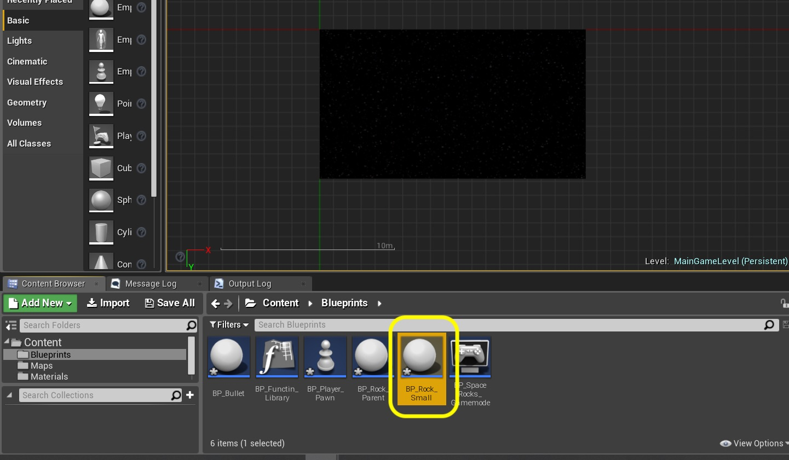
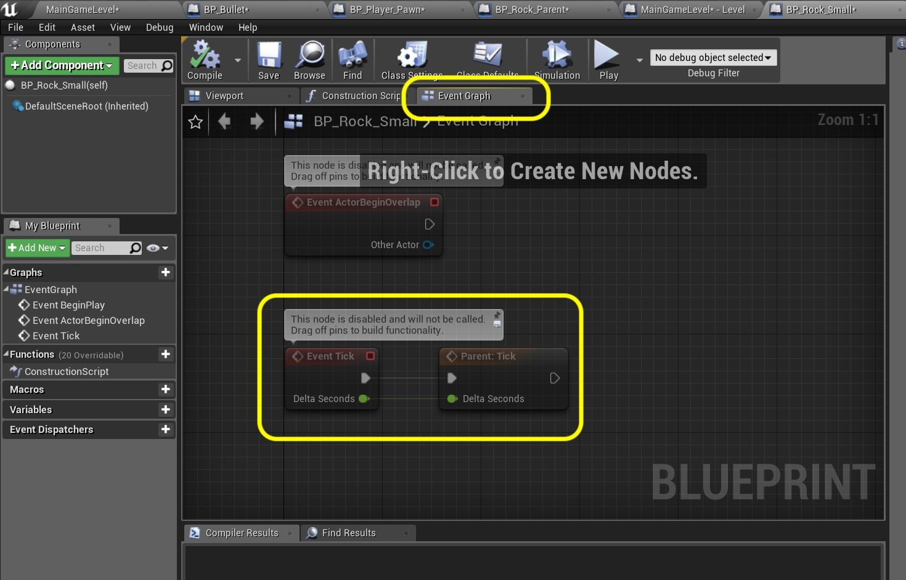
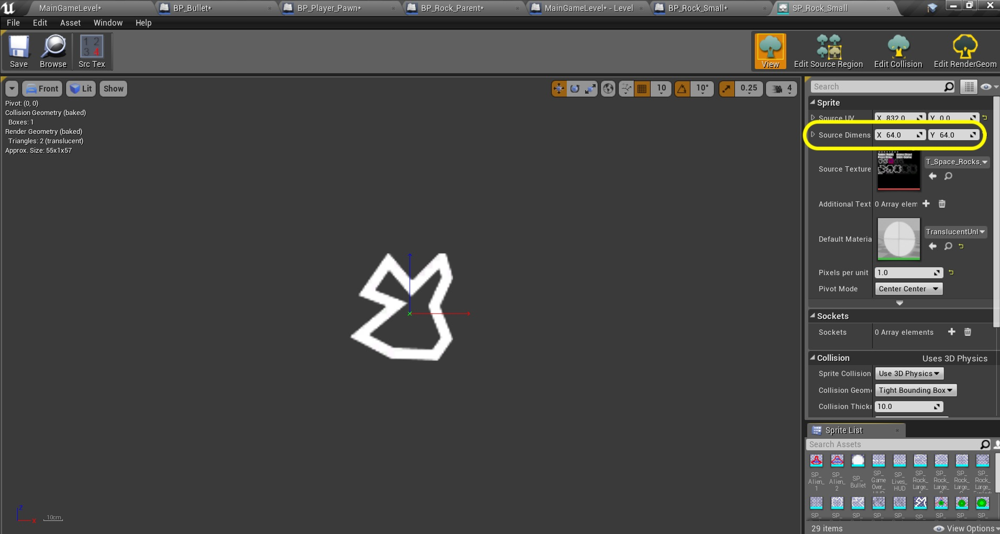
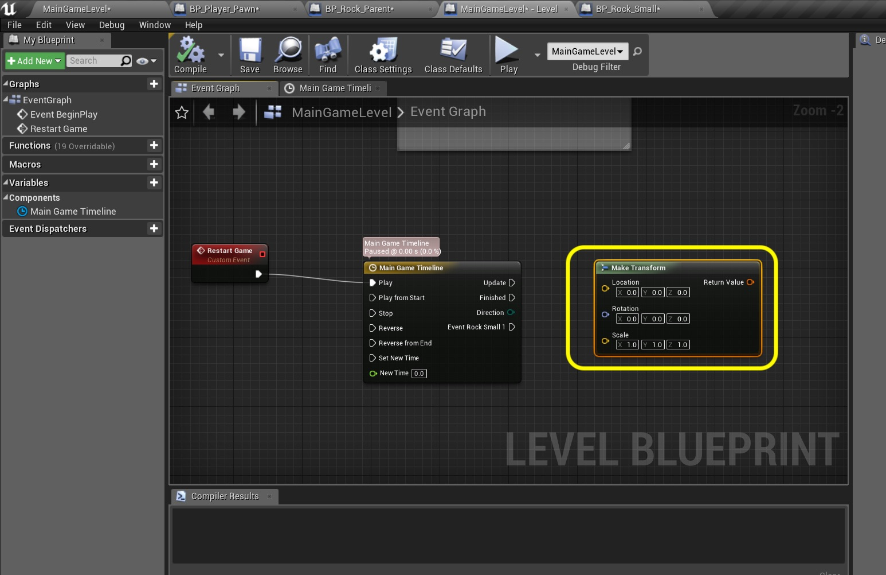
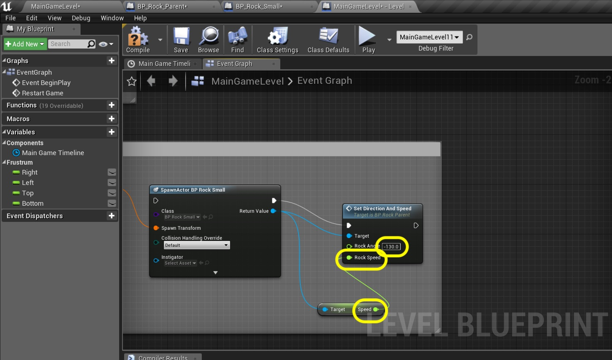

### Rock Parent Continued

_____ 



{:start="{{ num }}"}
{{ num }}. Add comment to the solving x nodes.

  

_____ 


{:start="{{ num }}"}
{{ num }}. Now we want to solve for the **Y** component of **Velocity**. Pull off of the **D2R** node and select **Sin (Radians)** node:

  

_____ 


{:start="{{ num }}"}
{{ num }}. Add a **float * float** node.  Send the output of **SIN** and the **Radius Multiplication** nodes to it.  Send the **Multiplication** output to the **Velocity Y** input in **Set Velocity**.

  

_____ 


{:start="{{ num }}"}
{{ num }}. Add comments to all uncommented areas that explains functionality.

  

_____ 


{:start="{{ num }}"}
{{ num }}. We need to cast this local vector to world space.  To do this we need to get the current location of the rock then add this vector to it.  Right click and add a **Get Actor Location** node that you can put at the bottom of the graph.

  

_____ 


{:start="{{ num }}"}
{{ num }}. We need to access each axis seperately so right click on **Return Value** and select **Split Struct Pin**:

  

_____ 


{:start="{{ num }}"}
{{ num }}. Drag the **Get Velocity** node to the graph. Then add a **vector2d + vector2d** node.

  

_____ 


{:start="{{ num }}"}
{{ num }}. Connect the output of the **Velocity** node to the input of the **Addition** node.

  

_____ 


{:start="{{ num }}"}
{{ num }}. Right click the unused pin on the **Addition** node and select **Split Struct Pin**:

  

_____ 


{:start="{{ num }}"}
{{ num }}. Connect **Return Value X** and **Return Value Y** with **X** and **Y** on the **Addition** node:

  

_____ 


{:start="{{ num }}"}
{{ num }}. Add a **Set Actor Location** node:

  

_____ 


{:start="{{ num }}"}
{{ num }}. Connect the **Sequence Then 1** execution pin to the **Set Actor Location** pin.

  

_____ 


{:start="{{ num }}"}
{{ num }}. On **Set Actor Location** node right click the **New Location** pin and select **Split Struct** pins:

  

_____ 


{:start="{{ num }}"}
{{ num }}. Connect the **X** and **Y** to the **New Location X** and **New Location Y** on the **Set Actor Location** node.

  

_____ 


{:start="{{ num }}"}
{{ num }}. Set a new variable to hold the depth of the sprite on **Z**.  Call it `Rock Z Depth` and make it a **Float** and **Private**.  Put it in **Category** `Movement` and add a **Tooltip** `Where on Z rock lies determining sort order`. Press the **Compile** button and set the **Default** to `25.0`.

  

_____ 


{:start="{{ num }}"}
{{ num }}. Drag a **Get Rock Z Depth** node to the chart.  Connect the output of this to **New Locaiton Z** pin of the **Set Actor Location** node.  Add a comment around these nodes stating the intent `Move Rock to New Location`.

  

_____ 

### Rock Small
Now we will not be using the Rock Parent blueprint in game which is why we never assigned a sprite.  What we will do in instead inherit from it which gives us all of its variables, functions and functionality.  We will then add any custom elements that are unique to the small rock like its move wrap offset and speed.  Lets get started.

_____ 



{:start="{{ num }}"}
{{ num }}. To inherit from a parent blueprint class is simple.  Right click on **BP_Rock_Parent** and select the **Create Child Blueprint Class**.

  

_____ 


{:start="{{ num }}"}
{{ num }}. Call it `BP_Rock_Small`.

  

_____ 


{:start="{{ num }}"}
{{ num }}. Now open the **Construction Script** tab.  You see that it calls the **Parent Construction Script**.  If you disconnect these pins then the parent construction scripts will not be called.  We will leave this alone.

  

_____ 


{:start="{{ num }}"}
{{ num }}. If we click on the **Event Graph** we will see all events that are in the parent.  In this case we just see an **Event Tick** call the Parents Tick Event.  Again we will leave this connected as we want it to use all the functionality we added to the parent that is common to all of its children.

  

_____ 


{:start="{{ num }}"}
{{ num }}. Pull off of the executionpin from **Parent: Tick** and add a **Move Wrap** node:

  

_____ 


{:start="{{ num }}"}
{{ num }}. If you forgot open the **SP_Rock_Small** sprite and look at the source dimensions.  They are 64 x 64 units.  So for Move wrap we want to spawn offscreen without them wrapping.  We will ive ourselves a margin.  

  

_____ 


{:start="{{ num }}"}
{{ num }}. Lets set the Input parameters on the **Move Wrap** function.  Set **Wrap Vertical** and **Wrap Horizontal** both to `true`.  Set the **X Offset** and **Y Offset** to `64.0`. Add a **Self** node and connect it to the **Actor to Wrap** input.

  

_____ 


{:start="{{ num }}"}
{{ num }}. Now each rock will have a different speed.  But they will be the same.  Lets add a **Float** variable called `Speed` and make it **Blueprint Read Only** (no other blueprint can change it) with a **Category** of `Movement` and add a **Tooltip** `Speed of rock small in units per second`. Press the **Compile** button and set the **Default Value \| Speed** to `100.0`.

  

_____ 


{:start="{{ num }}"}
{{ num }}. Woops I forgot to a step I normally do first.  There is no artwork attached to the blueprint so it will be blank. Open the **Viewport** tab and press **Add Component** button.  Select **Paper Sprite*.  Rename it to `Rock Small`.  Change the rotation so it faces the camera.  I set **Rotation X** to `90.0` and **Rotation Z** to `-90.0`.  Assign **Source Sprite** to `SP_Rock_Small`. That should be it! 

  

_____ 

### Rock Spawner
Now we will need to spawn a lot of rocks so that there is a game to play.  This will take place in the level blueprint using a special node called **Timeline**.  This will allow us to launch events on a timeline to craft our gameplay experience.

_____ 


{:start="{{ num }}"}
{{ num }}. Click on the **Blueprints** button and select **Open Level Blueprint**:

  

_____ 


{:start="{{ num }}"}
{{ num }}. Open the level blueprint.  Now we want an event that we can call not only at the beginning but when the game restarts.  Right click at the bottom and put a **Add Custom Event** node on the graph:

  

_____ 


{:start="{{ num }}"}
{{ num }}. Call this custom event `Restart Game`.

  

_____ 


{:start="{{ num }}"}
{{ num }}. Pull off of the execution pin from the **Restart Game** node and select **Add Timeline**:

  

_____ 


{:start="{{ num }}"}
{{ num }}. A timeline only needs to be called once.  It will run for the duration of the timeline and you can access data as it runs.  Double click on the **Main Game Timeline** title bar to open the editor:

  

_____ 


{:start="{{ num }}"}
{{ num }}. The editor opens and you should see a tab with the name of the timeline **Main Game Timeline**.  There are four buttons on the left.  You can add a Float, Vector, Event or Color track.  We will use the other types lates but for now we want to trigger an event.  We want to trigger a spawn small rock at say 1 second into the game.  Press the **!+** button to add an event track.

  

_____ 


{:start="{{ num }}"}
{{ num }}. Now look at the horizontal line that opens up.  It shows you the timeline in seconds.  Press **Shift Left Click** on the graph around the 1.00 second mark.  Don't worry about it being accurate.

  

_____ 


{:start="{{ num }}"}
{{ num }}. Now you can go into the **Time** value and set it to `1.0` so that it sets at 1 second.  This next step is not required, but in boolean logic 1 is true so I want to set the **Value** to `1.0` (but it will still work without doing this, it is a personal preference of mine).  Now to center the view you can press the **<- ->** and **^** buttons just left of **Time** to adjust the zoom on the chart.  You can clearly see that the trigger is at **1.0** on the Horizontal graph (time) and **1.0** on the Vertical graph (value).

  

_____ 


{:start="{{ num }}"}
{{ num }}. Right click on the title and press rename (or press F2) and change the name to `Event Rock Small 1`.

  

_____ 


{:start="{{ num }}"}
{{ num }}. Right click on the open graph and select a **Make Transform** node.  This is where we will set the initial position of the **Rock** offscreen before it moves.

  

_____ 


{:start="{{ num }}"}
{{ num }}. A blank **Transform** will have **0.0** in all Location and Rotations axis.

  

_____ 


{:start="{{ num }}"}
{{ num }}. Now we want to set this rock off screen but not so far that it triggers the screen wrap.  So for a 64 x 64 sprite whose center point is 32 I will offset it by 40 to be certain it is completely off screen.  Now instead of hard coding these numnbers, we should have them already in our camera frustum extents we created in our gamemode blueprint.

  

_____ 


{:start="{{ num }}"}
{{ num }}. Now make some room above the small rock spawning.  Press the **Add pin +** button on the **Sequence** node.  Then add a **Get Game Mode** node:

  

_____ 


{:start="{{ num }}"}
{{ num }}. Pull off of the **Get Game Mode** output pin and select **Cast To BP_Spacerodk_Gamemode**.

  

_____ 


{:start="{{ num }}"}
{{ num }}. Pull off of the cast node blue output pin four times  and select **Right Frustum**, **Left Frustum**, **Top Frustum** and **Bottom Frustum**.

  

_____ 


{:start="{{ num }}"}
{{ num }}. Attache the execution pin from the **Sequence Then 2** node to the **Cast** node. Add a comment to these nodes stating `Get Extents of Level`.

  

_____ 


{:start="{{ num }}"}
{{ num }}. Pull from the **Right Frustum** node and select at the top of the menu **Promote to variable**:

  

_____ 


{:start="{{ num }}"}
{{ num }}. Call it `Right` the type should be set correctly.  Add a **Tooltip** `Right side extent of screen`.  Make it **Private** and put it in **Category** `Frustum`.

  

_____ 


{:start="{{ num }}"}
{{ num }}. Repeat this and promote three more local variables and set them to **Left**, **Top** and **Bottom**.  Change the names and tooltips and make them all **Private**.  Connect the execution pin fomr the **Cast** node to the **Set Right** node.  Then string all execution pins from **Right** to **Left** to **Top** to **Bottom**:

  

_____ 


{:start="{{ num }}"}
{{ num }}. Drag a **Get Right** node.  Right click the **Location** pin and select **Split Struct Pin**.

  

_____ 


{:start="{{ num }}"}
{{ num }}. Pull off of the **Right** node and select a **float + float** node.  Set the second pin to `40.0` to offset by 40 units (we set the wrap at 64 and it is off screen at 32).  Plug the output of the **Addition** node to **Location X** pin on **Make Transform**.  Drag a **Get Bottom** reference and place a **float * float** node.

  

_____ 


{:start="{{ num }}"}
{{ num }}. Attach the output of **Bottom** to the top of the **Multiplication** node. Now we are off screen to the right and we want to be 3/4 of the way down the screen on the Y.  So set the **Multiplication** second pin to `0.75`.  Send the output to **Location Y** in the **Make Transform** node.  You can set the **Location Z** to `25.0`.

  

_____ 


{:start="{{ num }}"}
{{ num }}. Pull off of **Make Transform** node's **Return Value** pin and select **Spawn Actor from Class** node:

  

_____ 


{:start="{{ num }}"}
{{ num }}. Right click the **Class** on this new node and select **BP_Rock_Small**.

  

_____ 


{:start="{{ num }}"}
{{ num }}. Pull from the **Return Value** of the **Spawn Actor BP Rock Small** node and select **Set Direction and Speed**.  This is the function we wrote in BP_Rock_Parent.

  

_____ 


{:start="{{ num }}"}
{{ num }}. Now there is a **Speed** variable that we set in the **BP_Rock_Small**.  Lets get a reference to it by pulling from the **Return Value** pin of **Spawn Actor** node and select **Get Speed**:

  

_____ 


{:start="{{ num }}"}
{{ num }}. Connect the output of **Speed** to the **Rock Speed** input in **Set Direction and Speed** node.  Change the **Rock Angle** to `-130.0`.  Why -130?  The rock is spawning off of the right hand bottom side and I want it to move towards the top left of the screen. This is about 130 degrees.  Now in UE4 + angles move clockwise. So I am altering the direction 130 degrees counter clockwise by setting it to a negative value.

  

_____ 


{:start="{{ num }}"}
{{ num }}. Connect the **Timeline Level Rock Small 1** execution pin to the input of the **Sawn Actor BP Rock Small** node. Press the **Compile** button and clean up all the nodes in the blueprint.

  

_____ 


{:start="{{ num }}"}
{{ num }}. Run the game and in one second the rock should fly through your viewport. Press **Save All** and update Github by **committing** and **pushing** all the changes made. Up next we will be looking at destroying the rock with rock/bullet collision detection.

<iframe class="embed-responsive-item" src="https://www.youtube.com/embed/Yd4bCl1fdLw?autoplay=1&rel=0&controls=0&amp&showinfo=0&version=3&loop=1&playlist=Yd4bCl1fdLw" frameborder="0" allowfullscreen></iframe>

_____ 
  

[<- Previous](Space-Rocks-11.html)&nbsp;&nbsp;&nbsp;[Home](../index.html)&nbsp;&nbsp;&nbsp; [Continue ->](Space-Rocks-13.html)
   
   
   

