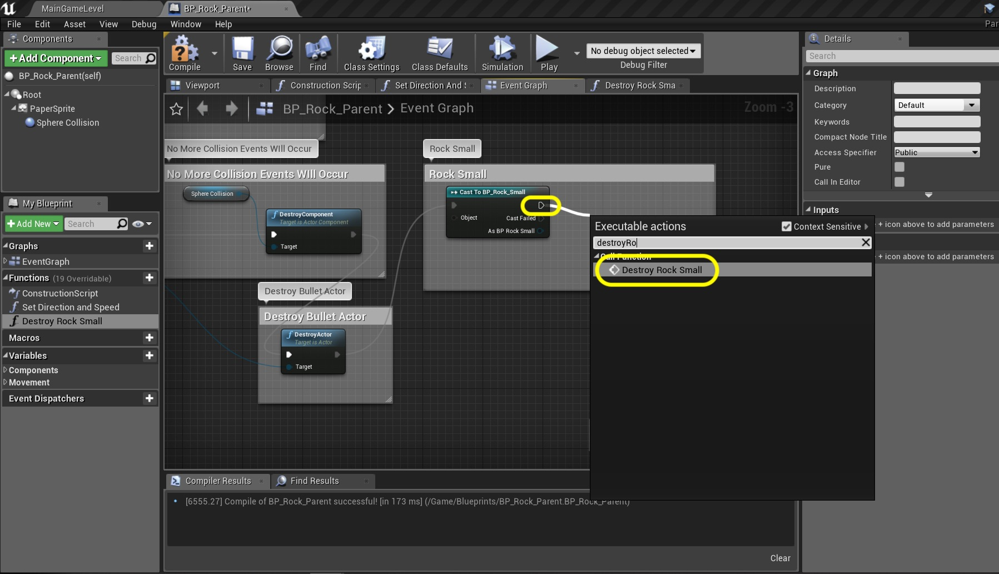

### Rock Collisions
Now we need to think about collision detection.  We will look at collisions between the rock, the ship and the bullets.  When the bullet hits the rock it destroys it and scores points.  When the rock hits the ship the ship is destroyed and the game continues. We will start by looking at setting up overlap events and collision volumes in the blueprints.  Lets get started.

_____ 



{:start="{{ num }}"}
{{ num }}. Open **BP_Rock_Parent** and lets set up a debug print on an overlap that we will replace with functionality later.  Right click at the bottom and add a **Event actor Begin Overlap** node:

  

_____ 


{:start="{{ num }}"}
{{ num }}. Pull off of the **Event Actor Begin Overlap** pin and select a **Print String** node.  Set the **In String** as `Collision with Rock Has Occured`.

  

_____ 


{:start="{{ num }}"}
{{ num }}. Now we need to add collision shapes to the game objects.  Open **BP_Rock_Parent** and go to the **Viewport.  Add a **Sphere Collision** by pressing the **Add Component** button.  Make it a child of **Paper Sprite**. Press the **Compile** button.

  

_____ 


{:start="{{ num }}"}
{{ num }}. Now open **BP_Rock_Small** and if you compiled you should see the new Sphere Collision inherited.  Now click on the scale and adjust the sensitivity to the smallest setting.  Adjust the scale to be a bit on the small side.  I would prefer to to die when grazing an object or just missing it. I prefer the collisions require a direct hit. Press the **Compile** button.

  

_____ 


{:start="{{ num }}"}
{{ num }}. Open BP_Bullet and add a **Sphere Collision** component.  Parent it to the **Paper Flipbook**. Adjust the scale so it is just on the solid edge of the circle like so:

  

_____ 


{:start="{{ num }}"}
{{ num }}. Open **BP_Player**Pawn** and add a **Sphere Collision** component.  Parent it to the **Paper Flipbook**. Adjust the scale so it is very tight to the player shape like so:

  

_____ 


{:start="{{ num }}"}
{{ num }}. Run the game and shoot at the rock.  Also fly into the rock.  In both instances you should see a debug printing of the message.

<iframe class="embed-responsive-item" src="https://www.youtube.com/embed/0lIYqw7GIV8?autoplay=1&rel=0&controls=0&amp&showinfo=0&version=3&loop=1&playlist=0lIYqw7GIV8" frameborder="0" allowfullscreen></iframe>

_____ 


{:start="{{ num }}"}
{{ num }}. Now lets deal with what to do if a bullet hits the small rock.  We first need to find out whether the overlap object is a bullet.  The **Other Actor** pin gives us a reference to the other actor that the rock has collided with.  Pull this pin and cast it to **BP_Bullet**.

  

_____ 


{:start="{{ num }}"}
{{ num }}. Now change the execution pins to go from **Event Actor Begin Overlap** to **Cast to BP_Bullet** to **Print String**.

  

_____ 


{:start="{{ num }}"}
{{ num }}. Go into the game and press play.  Now when you fly into the rock with the ship there should be no message.  It should only appear when bullets hit it!  I got it to work properly.

  

_____ 


{:start="{{ num }}"}
{{ num }}. Now we want to have a sprite of the rock exploding.  So we will not destroy this actor until it playes this animation.  So we want to stop the collisions from getting called so you don't kill a rock that is already destroyed.  Add a **Get Sphere Collision** node and select a **Destroy Component**. This will destroy the collider and prevent future overlap events from triggering.

  

_____ 


{:start="{{ num }}"}
{{ num }}. Clean up the nodes and add comments to explain what is going on here.

  

_____ 


{:start="{{ num }}"}
{{ num }}. Now we don't want the bullet to keep going and kill another rock.  We want the bullet to be destroyed without animation right away.  How do we do this?  If you look at the **Cast To BP_Bullet** node there is an exit pin that has a reference to that **Bullet_BP** instance.  Pull from this pin and select a **Destroy Actor** node.

  

_____ 


{:start="{{ num }}"}
{{ num }}. Take the execution pin coming out of the **Destroy Component** node and put it into the **Destroy Actor** node.  Add a comment to explain that this destroys the bullet actor.

  

_____ 


{:start="{{ num }}"}
{{ num }}. Now look at the class, we are in **BP_Rock_Parent**.  So this will get triggered in any of the three children.  How do we know that this object is a small rock?  Easy we cast to it, and if it succeeds then we not only can access all the child's components but we have a reference to the instance in game! Pull off of the **Destroy Actor** execution pin and select **Cast To BP_Rock_Small**.

  

_____ 


{:start="{{ num }}"}
{{ num }}. Each rock will do different things, so to keep the chart clean lets create a function to call.  Press the **+** button next to **Functions** and call it **Destroy Rock Smnall**.

  

_____ 


{:start="{{ num }}"}
{{ num }}. Now pull off of the **Cast To BP_Rock_Small** node and call the newly created function by adding **Destroy Rock Small** node:

  

_____ 


{:start="{{ num }}"}
{{ num }}. Now I add the comment `Rock Small` aroudn these two nodes then press the **Compile** button.  Woops I get a compile error and it is on the **Cast** node.  The error metinos the object is undetermined.  Well we know that this is the rock object so we can easily fix this.

  

_____ 


{:start="{{ num }}"}
{{ num }}. Since we are the object you can pull off of the **Object** pin on the **Cast To BP_Rock_Small** node and type **Self**:

  

_____ 


{:start="{{ num }}"}
{{ num }}. Test the fix out by pressing the **Compile** button.  If you get the green check mark then you have solved the error and we can move forward and start scripting the Destroy Rock Small function.

  

_____ 


{:start="{{ num }}"}
{{ num }}. Go to the **Destroy Rock Small** tab and pull off the execution pin.  Select **Set Sprite**.  This will allow us to pick the sprite that is of a destroyed rock.

  

_____ 


{:start="{{ num }}"}
{{ num }}. Now I forgot the create artwork for this.  So we will highjack one frame from the player explode animation.  Press the **New Sprite** drop down from the **Set Sprite** node and select `SP_Ship_Explode_6`.

  

_____ 


{:start="{{ num }}"}
{{ num }}. Your function node chart should look like:

  

_____ 


{:start="{{ num }}"}
{{ num }}. Run the game and try running into the rock. Nothing should happen. But if you shoot a bullet the bullet should be destroyed and the rock changes sprites but doesn't get destroyed yet.

<iframe class="embed-responsive-item" src="https://www.youtube.com/embed/wroL6ch-BYo?autoplay=1&rel=0&controls=0&amp&showinfo=0&version=3&loop=1&playlist=wroL6ch-BYo" frameborder="0" allowfullscreen></iframe>

_____ 


{:start="{{ num }}"}
{{ num }}. Go back to **BP_Rock_Parent** and go to the **Event Graph** and scroll to the bottom right click and select **Add Custom Event**:

  

_____ 


{:start="{{ num }}"}
{{ num }}. Name the node `To Destroy Rock`.

  

_____ 


{:start="{{ num }}"}
{{ num }}. Pull off of the **To Destroy Rock** node and select **Delay**.  Set the **Duration** to `0.25`.  Pull off the **Completed** execution pin and select the **Destroy Actor** node:

  

_____ 


{:start="{{ num }}"}
{{ num }}. Wrap these nodes in a comment that states `Destroy Rock After Animation Completes, 1/4 second`.

  

_____ 


{:start="{{ num }}"}
{{ num }}. Now we need to call this event.  We will do it after we switch the sprite.  Go to the **Destroy Rock Small** function and pull off the **Set Sprite** execution pin and pick the **To Destroy Rock** event node.

  

_____ 


{:start="{{ num }}"}
{{ num }}. Clean up the nodes and add a comment to the function body. Press the **Compile** button.

  

_____ 


{:start="{{ num }}"}
{{ num }}. Play the game and run into the rock to make sure nothing happens.  Then shoot the rock and this time it shoudl dissapear a quarter second after it changes sprites. Press **Save All** and update Github by **committing** and **pushing** all the changes made. Up next we will be looking at game states.

<iframe class="embed-responsive-item" src="https://www.youtube.com/embed/oJosB7NAGOU?autoplay=1&rel=0&controls=0&amp&showinfo=0&version=3&loop=1&playlist=oJosB7NAGOU" frameborder="0" allowfullscreen></iframe>

_____ 
  

[<- Previous](Space-Rocks-12.html)&nbsp;&nbsp;&nbsp;[Home](../index.html)&nbsp;&nbsp;&nbsp; [Continue ->](Space-Rocks-14.html)
   
   
   

