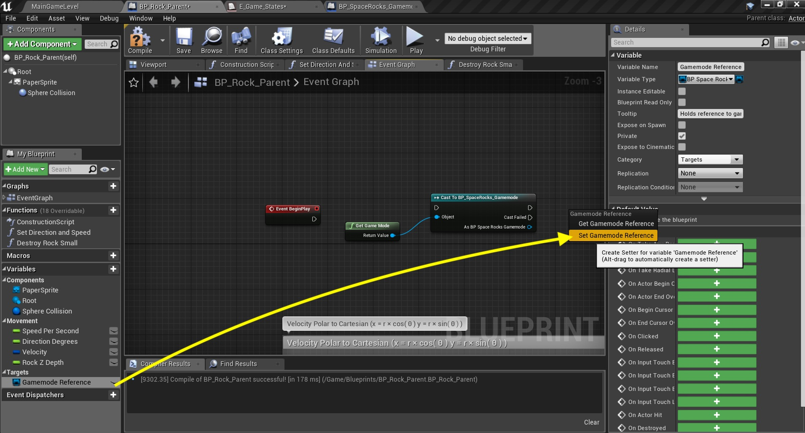
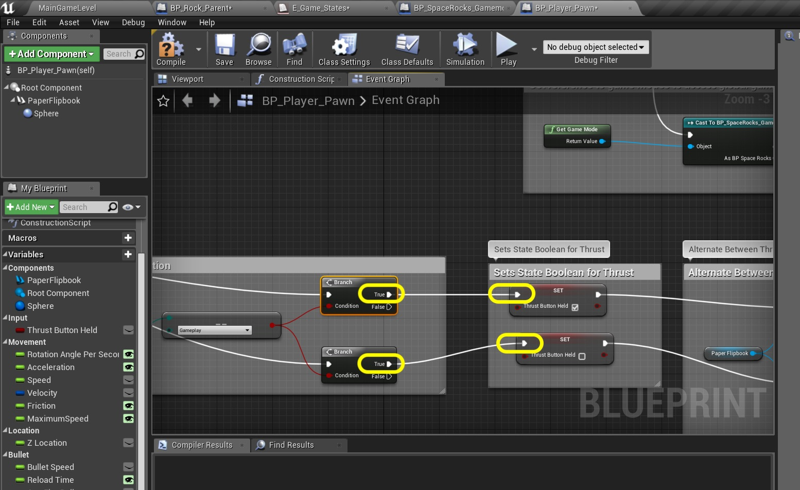
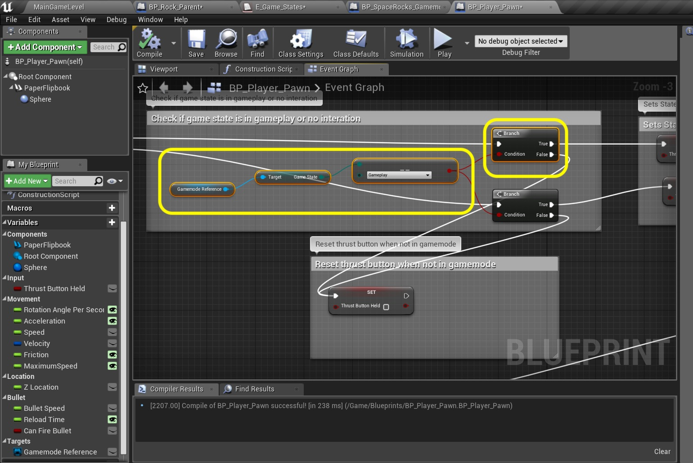
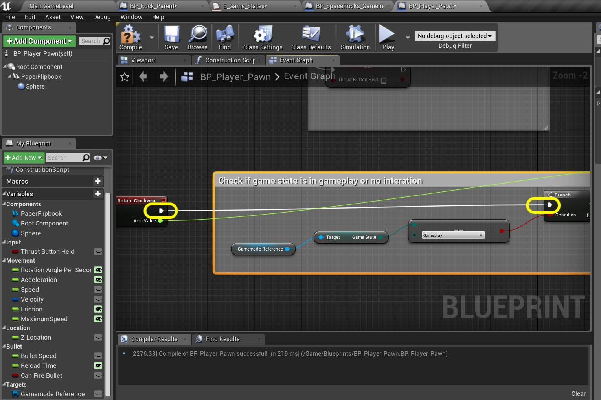

### Game State
Now before we deal with the otehr collision which is rock hitting player we need to deal with game states.  When the rock kills the player we stop checking collisions and stop taking input from the player controller.  Now we will not use the built in AI system from Unreal as this is a very simple state machine.  So lets get start by setting up our four game states.

_____ 



{:start="{{ num }}"}
{{ num }}. So lets say we have a game state called gameplay and a state called player dead.  We could keep an integer that is called **State** that is set to 0 for dead and 1 to gameplay.  But as we add states and numbers to the integer then we have to remember that 3 is for end game and 5 is for credits screen.  There is a better way to use numbers, but disguised as a name.  We will be using enumerators for this.  Go to the **Blueprints** folder and press **Add New**, select **Blueprints \|Enumeration**

  

_____ 


{:start="{{ num }}"}
{{ num }}. Call it `E_Game_States`.

  

_____ 


{:start="{{ num }}"}
{{ num }}. Start by filling in the **Enum Description** with `Enumerator holds game state`.  Press the **New** button and call the first **Display Name** `Pre Game` and the **Description** `First time game is started`.  The only time you see the full start sequence is when the game is started from scratch.  Press the **New** button again. Call the second **Display Name** `Player Dies` and the **Description** `When player is hit by rock`.

  

_____ 


{:start="{{ num }}"}
{{ num }}. Do this two more times. Call the third **Display Name** `Gameplay` and the **Description** `While game is running normally`. Call the fourth **Display Name** `Game Over` and the **Description** `When game ends`. That should do it for now.  Now PreGame is the equivalent of **0**, Player Dies **`**, Gameplay **2** and Game Over **3**.  Now we don't have to worry about what number means what as it is encoded in a name.  We know that **2** is **Gameplay** as this is the enumerator we call.  Lets put it to good use.

  

_____ 


{:start="{{ num }}"}
{{ num }}. Where should we hold the master gamestate?  In this game I think it makes sense to control this from the gamemode.  This way we can keep all things like score here.  We will create references in each actor that needs them.  Go to **BP_SpaceRocks_Gamemode** an dopen it.  Press the **+** button to add a variable.  Selecdt type `E_Game_States`.

  

_____ 


{:start="{{ num }}"}
{{ num }}. We will be reading and changing this value so we won't make it private and it is not set by the designer but by logic so it will not be instance editable.  Set the tooltip to `Stores state of game` and add a **Category** `Global Game Settings`.  Press the **Compile** buttona and select a **Default Value**.  Now we will eventually want this to be **Pre Game** but we will use **Gameplay** for now as we have not done the pregame yet.

  

_____ 


{:start="{{ num }}"}
{{ num }}. Lets start by adjusting logic based on game state on the rocks. We will be turning off collision when the game state is not in gameplay.  So open the **BP_Rock_Parent** blueprint and add a variable called `Gamemode Reference` of **Variable Type** `BP_SPaceRocks_Gamemode`.

  

_____ 


{:start="{{ num }}"}
{{ num }}. Remember, we want the **Object Reference**:

  

_____ 


{:start="{{ num }}"}
{{ num }}. Complete **Gamemode Reference** by setting it to **Private**, adding **Category** `Targets` and using **Tooltip** `Holds reference to gamemode`.

  

_____ 


{:start="{{ num }}"}
{{ num }}. Now I deleted the built in Event Begin PLay reference.  So if you did the same you will need to add it back.  Lets go to the very top of the graph and right click and add a **Event Begin Play** node:

  

_____ 


{:start="{{ num }}"}
{{ num }}. Right click next to it and add a **Get Game Mode** node.

  

_____ 


{:start="{{ num }}"}
{{ num }}. Now this is a reference to the parent class. We nee to cast to the child.  Pull from the output pin on the **Get Game Mode** node and seelecdt **Cast To BP_SpaceRocks_Gamemode**.

  

_____ 


{:start="{{ num }}"}
{{ num }}. Drag a copy of Game Mode Reference to the chart and select **Set Gamemode Reference** node:

  

_____ 


{:start="{{ num }}"}
{{ num }}. Connect the execution pin from the **Cast** node to the **Set** node.  Connect the **As BP_SpaceRocks_Gamemode** output pin to the **Gamemode Reference** input pin on the **Set** node.  Add a comment `Get reference to game modes to access global game settings`. OK, we have a reference and can access our Game State variable now.

  

_____ 


{:start="{{ num }}"}
{{ num }}. Now we want to check that we are in gameplay state when checking collisions.  Make some space after **Event Actor Begin Overlap** by moving it to the left:

  

_____ 


{:start="{{ num }}"}
{{ num }}. Drag a **Get Gamemode Reference** node in between.  Pull off of its pin and selectd **Get Game State**.  Add the comment and make some space `Do not perform collision checks unless game is in gameplay state`.

  

_____ 


{:start="{{ num }}"}
{{ num }}. Now we pull off the **Game State** pim and type `=`. We are looking for the **Enum \| Equal(Enum)** node so we can see what that variable is set to.

  

_____ 


{:start="{{ num }}"}
{{ num }}. Select from the drop down menu on the  **==** node and select `Gameplay`.

  

_____ 


{:start="{{ num }}"}
{{ num }}. Pull off of the **==** node and select a new **Branch** node.  Highjack the output execution pin from **Event Actor Begin Overlap** and send it to the input pin on the **Branch**.

  

_____ 


{:start="{{ num }}"}
{{ num }}. Take the output of this **Branch** node and send it to the input of the **Cast To BP_Bullet** node:

  

_____ 


{:start="{{ num }}"}
{{ num }}. IT is VERY IMPORTANT that you go to the game and test your work.  This should make ABSOLUTELY NO change to the game as we should always be in gameplay state.  Once you do this lets do the same thing and freeze controls when not in gameplay on the player. Open the **BP_Player_Pawn** blueprint.  Add a new variable called `Gamemode Reference` and select **Varaible Types** `BP_SPace_Rocks_Gamemode`.

  

_____ 


{:start="{{ num }}"}
{{ num }}. Make the **Gamemode Reference** variable **Private**, set the **Tooltip** to `Reference to gamemode` and put it in **Category** `Targets`.

  

_____ 


{:start="{{ num }}"}
{{ num }}. Makesome room beneath the ship possession, the only nodes attached to **Event Begin Play**.  Add a **Get Game Mode** node:

  

_____ 


{:start="{{ num }}"}
{{ num }}. Pull off of the **Get Game Mode** pin and select **Cast To BP_SpaceRocks_Gamemode**:

  

_____ 


{:start="{{ num }}"}
{{ num }}. Drag off of the output pin from **Cast To BP_SpaceRocks_Gamemode** node and select **Set Gamemode Reference**:

  

_____ 


{:start="{{ num }}"}
{{ num }}. Take the output of the **Possess** execution pin and put it into the input in **Cast** node.  Take the output of the same **Cast** node and send it to the **Set Gamemode Reference** nodel  Add comment `Get reference to game mode to access global game settings`.

  

_____ 


{:start="{{ num }}"}
{{ num }}. Make some space to the right of **Event Action Thrust**.  Add a comment box `Check if game state is in gameplay or no interaction`.

  

_____ 


{:start="{{ num }}"}
{{ num }}. Add a **Get Gamemode Reference8* node.  Drag off this pin and select **Get Game State** node.

  

_____ 


{:start="{{ num }}"}
{{ num }}. Drag off of the **Game State** pin and select **Equal (Enum)** node.

  

_____ 


{:start="{{ num }}"}
{{ num }}. Select the Enumerator `Gamemode` in the **==** node.

  

_____ 


{:start="{{ num }}"}
{{ num }}. This event has two execution pins. So add two **Branch** nodes and put them to the right of the **==** node:

  

_____ 


{:start="{{ num }}"}
{{ num }}. Connect the output boolean from the **==** node to both **Condition** inputs in the TWO **Branch** nodes:

  

_____ 


{:start="{{ num }}"}
{{ num }}. Highjack the **Event Action Thrust Pressed** pin and send it to the top **Branch** input.  Do the same for **Release** but send this to the bottom **Branch** node.

  

_____ 


{:start="{{ num }}"}
{{ num }}. Rceonnect the **Set Thrust Button Held** ndoes to the output of the two **Branch** nodes.  Make sure that the true **Set** node does actually hook up the **Pressed** on the event pin.  Don't reverse the logic by accident here.

  

_____ 


{:start="{{ num }}"}
{{ num }}. Thinking one step ahead.  I am worried about the **Thrust Button Held** setting being wrong if the mode changes.  It could get stuck in thrust is on.  We should always set this to false if it is not in gameplay state.  Lets do this.  Add a **Set Thrust Button Held** node under the check for gameplay nodes you just created:

  

_____ 


{:start="{{ num }}"}
{{ num }}. Connect the output of both **Branch** nodes to the input of the **Set Thrust Button Held** node.  Add a comment `Reset thrust button when not in gameplay state`.

  

_____ 


{:start="{{ num }}"}
{{ num }}. Copy for nodes from the game state check but only one branch node:

  

_____ 


{:start="{{ num }}"}
{{ num }}. Go to **Input Axis Rotate Clockwise** and make lots of space to the right of it.  Paste the nodes you had previously copies in that open space:

  

_____ 


{:start="{{ num }}"}
{{ num }}. Add a comment around these pasted nodes that states `Check if game state is in gameplay or no interaciton`.

  

_____ 


{:start="{{ num }}"}
{{ num }}. Highjack the output pin from **Input Axis Rotate Clockwise** and send it to the input pin of the newly pasted **Branch** node:

  

_____ 


{:start="{{ num }}"}
{{ num }}. Reconnect the **Set Actor Rotation** input pin to the output of the **Branch** node you previously pasted:

  

_____ 


{:start="{{ num }}"}
{{ num }}. Take this time to clean up the node tree in player and make sure all nodes are connected.

  

_____ 


{:start="{{ num }}"}
{{ num }}. Now copy the nodes you just created next to **Rotate Clockwise** event nodes.

  

_____ 


{:start="{{ num }}"}
{{ num }}. Our third interaction is shooting.  Lets place the check there as well.  Make room next to **Event Action Shoot** and paste the previous set of nodes.  Highjack the **Event Action Shoot Pressed** and connect it to the input of the **Branch** node you just pasted.

  

_____ 


{:start="{{ num }}"}
{{ num }}. Reconnect the Shooting input **Branch** to the output of the **Branch** you just pasted:

  

_____ 


{:start="{{ num }}"}
{{ num }}. Your chart in this area should look like:

  

_____ 


{:start="{{ num }}"}
{{ num }}. Now VERY IMPORTANT go and play the game.  You should notic no changes.  The game is always in gameplay state so this should do nothing.  This will all make more sense when we kill the player and finally switch out of gameplay state.  We will start this on the next page. Press **Save All** and update Github by **committing** and **pushing** all the changes made.

  

_____ 

  

[<- Previous](Space-Rocks-13.html)&nbsp;&nbsp;&nbsp;[Home](../index.html)&nbsp;&nbsp;&nbsp; [Continue ->](Space-Rocks-15.html)
   
   
   

