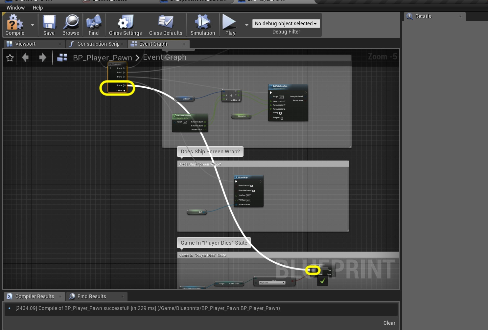

### Rock Killing Player
Now that we have the framework for the state system we can finally move to killing the player with a rock collision.  Lets get to it.

_____ 



{:start="{{ num }}"}
{{ num }}. There is an animation for the ship exploding.  Lets create a **Flipbook** as we will need it as we will switching animatins when hit.  Go to **Textures \| Sprites** folder and shift click from SP_Ship_Explode_1 to SP_Ship_Explode_9:

  

_____ 


{:start="{{ num }}"}
{{ num }}. Right click on any of the ship explode highlighted sprites and select **Create Flipbook**.

  

_____ 


{:start="{{ num }}"}
{{ num }}. Rename the flipbook to `FB_Ship_Explodes`.

  

_____ 


{:start="{{ num }}"}
{{ num }}. Double click the animatino and you will go to the flipbook viewer.  You should see the animation looping.  Change the **Frames Per Second** to `10.0` to slow it down a bit.

  

_____ 


{:start="{{ num }}"}
{{ num }}. Now we will add a check to see if the rock collides with the player and not the bullet. Open the **BP_Rock_Parent** blueprint.  Make some room beneath the rock-bullet collision but above the Destroy Rock nodes.

  

_____ 


{:start="{{ num }}"}
{{ num }}. Now we look at the **Cast_To_BP_Bullet**. There is a **Cast Failed** execution pin.  This would be called if the object that the rock has hit can't cast to any of the **BP_Rock_Parent**'s children.  This means it is not a rock that it has hit.  Pull from this pin and select **Cast To BP_Player_Pawn** and select this node.

  

_____ 


{:start="{{ num }}"}
{{ num }}. Before moving forward lets test our work.  After the **Cast To BP_Player_Pawn** node add a **Print String** with the message `Rock Hits Player`.

  

_____ 


{:start="{{ num }}"}
{{ num }}. Press the **Compile** button so we can try it in game. Oh, it is a good thing we are doing this. There is a compile error in our **Blueprint**. This node needs a reference!

  

_____ 


{:start="{{ num }}"}
{{ num }}. Pull the **Other Actor** pin from **Event Actor Begin Overlap** to the **Object** input pin in **Cast To BP_Player_Pawn** node.

  

_____ 


{:start="{{ num }}"}
{{ num }}. Press the **Compile** button again and we should get the green check mark.  All is OK.

  

_____ 


{:start="{{ num }}"}
{{ num }}. Now play the game and shoot the rock.  Do this multiple times make sure this does not display the message but instead destroys the rock.  Then run into the rock and look at the message.  Notice that it doesn't print a new one everytime the ship overlaps the rock, just when it they first enter each others collision volume.

  

_____ 


{:start="{{ num }}"}
{{ num }}. Go back to **BP_Rock_Parent** and delete the **Print String** node if it works correctly.  Drag a **Get Gamemode Reference** node in its place.  Pull off of its exit pin adn select **Set Game State** node:

  

_____ 


{:start="{{ num }}"}
{{ num }}. This is our first state change.  We are no longer in gameplay.  So select the **State** drop down and pick `Player Dies`.  This means that all of our previous state work should now kick in (no more subsequent collision events and no player control).

  

_____ 


{:start="{{ num }}"}
{{ num }}. Now connect the execution pins from the **Cast To BP_Player_Pawn** node to teh **Set Game State** node.  Now we need to change the flipbook to the new one we just created.  Pull off of the **As BP_PLayer_Pawn** pin on the **Cast To BP_Player_Pawn** node and select **Set Flipbook (Paper Flipbook)** node:

  

_____ 


{:start="{{ num }}"}
{{ num }}. Make sure the execution pins from **Set** go to **Set Flipbook**.  Change the **New Flipbbok** to `FB_Ship_Explodes`.

  

_____ 


{:start="{{ num }}"}
{{ num }}. Wrap these 5 nodes in a comment block that reads `Player Hit By Rock`.  Clean up the nodes to make them readable. 

  

_____ 


{:start="{{ num }}"}
{{ num }}. Play the game and again shoot the rock and it should destroy it as normal.  Play again and run into it.  Now it will change animation and there should be no more collision events and the exploding ship should just play over and over again.

<iframe class="embed-responsive-item" src="https://www.youtube.com/embed/kmmjsDi491k?autoplay=1&rel=0&controls=0&amp&showinfo=0&version=3&loop=1&playlist=kmmjsDi491k" frameborder="0" allowfullscreen></iframe>

_____ 


{:start="{{ num }}"}
{{ num }}. Now let add some logic to make the animation play once then disappear.  So go to **BP_Player_Pawn** and add a comment at the very bottom that reads `Game in Player Dies State`.  Copy and paste four of the nodes that we have used previously **Gameplay Reference**, **Game State**, **== Gameplay** and **Branch**.  You can grab these from the control checks we did like on the rotation axis.

  

_____ 


{:start="{{ num }}"}
{{ num }}. If there is not a free pin on the **Sequence** node coming from the **Event Tick** then press the **Add pin +** button.  Drag from **Sequence Then 4** to the **Branch** input execution pin you just created:

  

_____ 


{:start="{{ num }}"}
{{ num }}. Drag the component **Get Paper Flipbook** to teh nodechart.

  

_____ 


{:start="{{ num }}"}
{{ num }}. Pull off of the **Paper Flipbook** pin and select **Get Playback Position in Frames** node.  This will give us the position of the animation in frames.

  

_____ 


{:start="{{ num }}"}
{{ num }}. Pull off of the **Paper Flipbook** pin again and this time select **Get Flipbook Length in Frames** node. This will give us the total length.

  

_____ 


{:start="{{ num }}"}
{{ num }}. Right click in an open space next to this last node and select **integer - interger** node.  Now the game starts counting at **0** so the length is **1** longer than the count will get to.  This is the cause of many bugs and much confusion.  I figured this out by trial and error on this node.

  

_____ 


{:start="{{ num }}"}
{{ num }}. So we attach the **Return Value** pin from the **Get Flipbook Length ...** node and attach it to the top pin in the **Subtraction** node.  On the bottom put `1`.  As we want to reduce the length of the animation by one frame.  Pull off of the **Subtraction** exit pin and select **integer >= integer**:

  

_____ 


{:start="{{ num }}"}
{{ num }}. Now we can compare where we are in the animation.  I made my last frame in it a burner frame as we will be killing it when it is at the last frame.  Attach the **Get Playback Position** to the top side of the **>=** node and the **Subtraction** node to the bottom side.

  

_____ 


{:start="{{ num }}"}
{{ num }}. Since we will be adding lives and you will be restarting the game, we will not destroy the actor as we will use it again.  We will just turn off its rendering.  Pull off of the **>=** pin and select **Branch**. Pull off of the previous **Branch True** output to the input of this new **Branch**

  

_____ 


{:start="{{ num }}"}
{{ num }}. Pull off of the **Branch True** and select a **Get Actor Hidden In Game** node.

  

_____ 


{:start="{{ num }}"}
{{ num }}. Go to the game and run into the rock again. This time the animation should play once then the actor dissapears forever!

<iframe class="embed-responsive-item" src="https://www.youtube.com/embed/SyMRk_GLUZo?autoplay=1&rel=0&controls=0&amp&showinfo=0&version=3&loop=1&playlist=SyMRk_GLUZo" frameborder="0" allowfullscreen></iframe>

_____ 


{:start="{{ num }}"}
{{ num }}. Now if you play the original arcade game you will notice that when a ship gets hit by a rock it destroys it and scores the points.  A bit of a reward for being punished.  So we will do this.  The best place in the rock when we change the animation frame.  Go to **BP_Rock_Parent** and look for the rock player collision section for the **Set Flipbook** node where we change to **BP_Ship_Explodes**.  Pull off its execution pin and check to see what child class I am by selecing **Cast to BP_Rock_Small**.

  

_____ 


{:start="{{ num }}"}
{{ num }}. We have a function already written that destroys the small rock.  Pull off of the **Cast To BP_Rock_Small** execution pin and select the **Destroy Rock Small** function we wrote previously.  It behaves no differently that if a bullet collides with a rock.

  

_____ 


{:start="{{ num }}"}
{{ num }}. Make sure both the execution pins and target pins are connected and should look like:

  

_____ 


{:start="{{ num }}"}
{{ num }}. Now lets test it in game.  Press the **Compile** button.  Uh oh, we have a problem.  There is an error again.  We need to pull off of the **Object** input pin on **Cast To BP_Rock_Small** and add a **Self** node to indicate that we are the object that we want to cast to our child class.

  

_____ 


{:start="{{ num }}"}
{{ num }}. Now press the **Compile** button again and it should work.  Go to the game and run into the rock.  The animation should play once, the ship should disappear and the rock should be destroyed:

<iframe class="embed-responsive-item" src="https://www.youtube.com/embed/OHUvTwpRMkk?autoplay=1&rel=0&controls=0&amp&showinfo=0&version=3&loop=1&playlist=OHUvTwpRMkk" frameborder="0" allowfullscreen></iframe>

_____ 


{:start="{{ num }}"}
{{ num }}. OK, the final bit for this section will be to delay for a beat then continue with the game at the same point. Open **BP_Player_Pawn** and go to the last area we edited with the player doing tasks for when it is in its Player Died state.  Pull off of the **Set Actor Hidden In Game** pin and select a **Delay** node. Set the duration to `3.0` seconds.

  

_____ 


{:start="{{ num }}"}
{{ num }}. Go to the very bottom of the graph and right click on an empty portion and add a **Add Custom Event** node:

  

_____ 


{:start="{{ num }}"}
{{ num }}. Name the event `Reset Player To Start`.

  

_____ 


{:start="{{ num }}"}
{{ num }}. Before we define this new event lets go back to where we were a second ago and add a call to this new event.  Go back to the **Delay** node and add a **Reset Player to Start** node:

  

_____ 


{:start="{{ num }}"}
{{ num }}. Now go back to the **Reset Player to Start** event and pull off of its execution pin. Select **Set Actor  Location** node. Right click on **New Location** and select **Split Struct Pin**, your node should look like:

  

_____ 


{:start="{{ num }}"}
{{ num }}. We already have a variable to handAdd a **Z** value.  Add a *Get Z Location** node and plug it inot the **New Location Z** on the **Set Actor Location** node.

  

_____ 


{:start="{{ num }}"}
{{ num }}. We want to put the player in the center of the level.  We can use the screen extents for these.  Add a **Get Gamemode Reference** node.  Pull of its pin and a **Get Right Frustum** and **Get Bottom Frustum** pin. 

  

_____ 


{:start="{{ num }}"}
{{ num }}. Now we need to divide by 2 or multiply by .5 to find the center.  Add two **float * float pins** setting the bottom side to `0.5`.  Connect the **Right Frustum** to one and the **Bottom Frustum** to the other.  Connect the output of the **Right** chain to **New Location X** and the **Bottom** chain to **New Location Y** from the **Multiplication** nodes to the **Set Actor Location** node.

  

_____ 


{:start="{{ num }}"}
{{ num }}. Now the **BP_Player_Pawn** might have an existing **Velocity**.  We want to remove this.  Pull off of the **Set Actor Location** pin and select a **Set Velocity** node.  It should default to setting both axis to **0.0** which is what we want!

  

_____ 


{:start="{{ num }}"}
{{ num }}. We also want to remove any angle of rotation and have the ship facing right.  Selecdt the output of the **Set Velocity** pin an add a **Set Actor Rotation** node. Again, it defaults to **0.0** which is exactly what we want again.

  

_____ 


{:start="{{ num }}"}
{{ num }}. We need to unhide the actor now as it is hidden. Pull off of the **Set Actor Rotation** pin and add a **Set Actor Hidden In Game** node.  Again the defaults should work as the **New Hidden** checkbox should be `false` which in fact does the opposite and unhides the player.

  

_____ 


{:start="{{ num }}"}
{{ num }}. Now we need to set the flipbook back to idle just like the beginning of a game.  Drag a **Get Paper Flipbook** node from the **Components** list.  Drag off of the pin and select a **Set Flipbook** node:

  

_____ 


{:start="{{ num }}"}
{{ num }}. Set the **New Flipbook** to `BG_Ship_Idle`.

  

_____ 


{:start="{{ num }}"}
{{ num }}. Now we are one step short from completing.  I completely forgot about changing the ship state back to gameplay.  It is best to add this before we call this event.  Go back to the **Delay** node where we call the **Restart Player to Start** and make some space between these nodes.  Add a **Get Gamemode Reference** node there:

  

_____ 


{:start="{{ num }}"}
{{ num }}. Pull off of the **Gamemode Reference** pin and select the **Set Game State** node.

  

_____ 


{:start="{{ num }}"}
{{ num }}. Connect the execution pins from **Delay** to **Set Game State** to **Reset Player to Start**.  Change the **Game State** in the **Set Game State** node to `Gameplay`.  Press the **CCompile** button and clean up your nodes.

  

_____ 


{:start="{{ num }}"}
{{ num }}. Now play the game and run into the rock.  Both the ship and the rock should be destroyed and the game will continue (with nothing to shoot at) after 3 seconds.  Why such a long pause?  Well the game has no levels so you never have a break.  Dying is the only time you can take a mental break in this game, so make it a good one (but not so long the player thinks it hung).

<iframe class="embed-responsive-item" src="https://www.youtube.com/embed/mSkAwqC7Lg8?autoplay=1&rel=0&controls=0&amp&showinfo=0&version=3&loop=1&playlist=mSkAwqC7Lg8" frameborder="0" allowfullscreen></iframe>

_____ 

  

[<- Previous](Space-Rocks-14.html)&nbsp;&nbsp;&nbsp;[Home](../index.html)&nbsp;&nbsp;&nbsp; [Continue ->](Space-Rocks-16.html)
   
   
   

