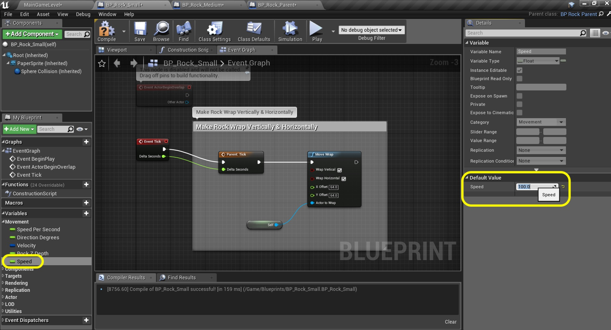
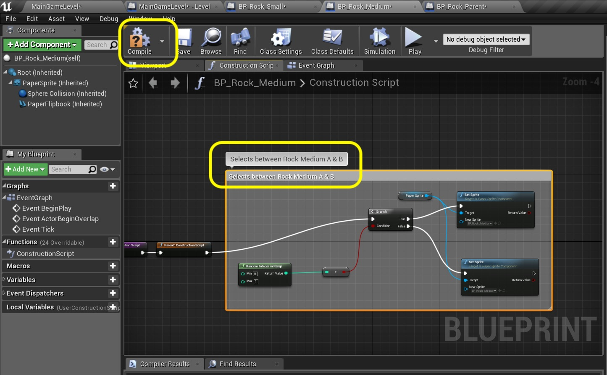
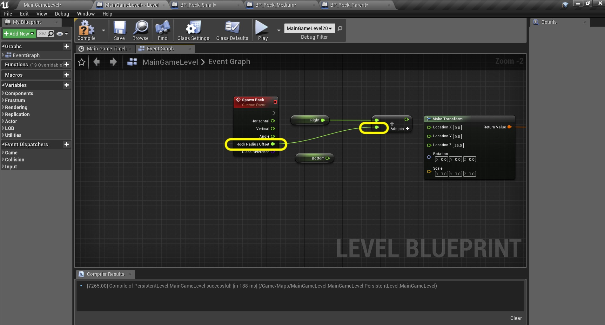
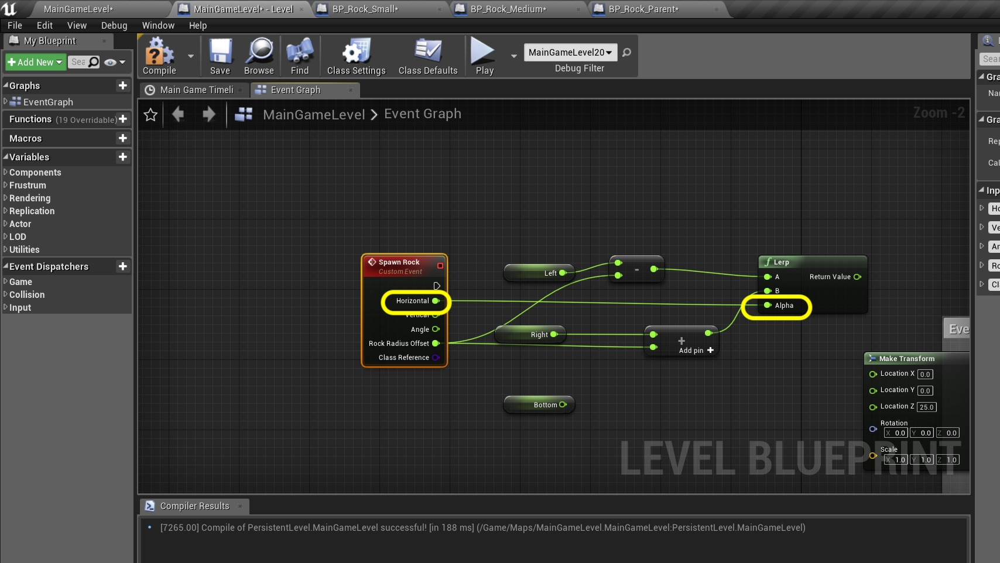

### Rock Medium
Now that we have implemented rock small. Lets implement rock medium.  The only difference with Rock Medium is that instead of just being destroyed and that's it, it spawns two rocks smalls from that location at diverging angles.  Pay attention as I will let you do rock large on your own which is following all the same steps but going from Large to Medium instead of from Medium to small. Lets get started.

_____ 



{:start="{{ num }}"}
{{ num }}. Lets look at our **BP_Rock_Small* blueprint to get an idea of what we should do for the medium version. We just added a Speed variable and a **Move Wrap** settings that reflects the size of the rock.  

  

_____ 


{:start="{{ num }}"}
{{ num }}. Go to the **Blueprints** folder and right click on **BP_Rock_Parent**.  Select **Create Child Blueprint Class**.

  

_____ 


{:start="{{ num }}"}
{{ num }}. Now rename it to `BP_Rock_Medium`.

  

_____ 


{:start="{{ num }}"}
{{ num }}. Open the **Blueprint** and open the **Event Graph** tab.  Drag off of the **Parent Tick** execution pin and select the **Move Wrap** node.

  

_____ 


{:start="{{ num }}"}
{{ num }}. Make sure that **Wrap Vertical** and **Wrap Horizontal** are both set to `true`.  Change both the **X Offset** and **Y Offset** to `128.0`. Pull off the **Actor to Wrap** pin and add a **Get a reference to self** node:

  

_____ 


{:start="{{ num }}"}
{{ num }}. OK, there is a bit of a design flaw. We should not create unique variables in each child as each rock needs a speed.  We should probably set this in the parent rock object.  Sometimes we need to refactor our design to improve it.  Lets go ahead and do this.  Open **BP_Rock_Parent** and add a new **Float** variable called `Speed`.  Set it to **Instance Editable** and put it in **Category** `Movement`.  Add a **Tooltip** `speed of rock in units per seconds`. Don't forget to press **Compile** so you can see it affect its two children.

  

_____ 


{:start="{{ num }}"}
{{ num }}. Go back to **BP_Rock_Small** and you see that it renamed our older **Speed** variable as it clashes with the parent name.  Right click on **Speed_0** and select **Delete**:

  

_____ 


{:start="{{ num }}"}
{{ num }}. Click on the new **Speed** variable that it inherited from its parent and set the **Default Value** to `100.0`.

  

_____ 


{:start="{{ num }}"}
{{ num }}. Press on the **Blueprints** button and select **Open Level Blueprint**.

  

_____ 


{:start="{{ num }}"}
{{ num }}. Now go to where we spawn **Event 1 Rock Small**.  Pull off of the **Return Value** from **Sqawn Actor BP Rock Small** and select **Get Speed** to get the new variable.

  

_____ 


{:start="{{ num }}"}
{{ num }}. Repeace the pin connections from the **Speed_0** node and replace it with the new **Speed** node:

  

_____ 


{:start="{{ num }}"}
{{ num }}. Now play the game and we should be back to where we were before with no differences.  If so we have succesfully refactored **BP_Rock_Parent** with a small improvement.

  

_____ 


{:start="{{ num }}"}
{{ num }}. Lets reopen **BP_Rock_Medium**.  Click on **Speed** at put in a slower speed than the small rock with a value of `80.0`.

  

_____ 


{:start="{{ num }}"}
{{ num }}. OK, now go back tot he **Viewport** tab and assign a **Sprite**. Notice that we have two medium size sprites!  This is OK, pick one as the default for now. Make sure it is rotated to face the **Top** (I switch to the top view just to be certain). Now resize the collision volume to match this larger sprite.  Find a size that works for both sprites by changing between A and B.  We will not bother having two collision volumes, we can find a middle ground that works for both.

  

_____ 


{:start="{{ num }}"}
{{ num }}. Now lets flip a coin and randomly pick one of the sprites.  It won't affect gameplay to randomize it as the collision volumes are identical.  This is just for pure variety.  Go to the **Construction Script** tab as we want to change this when it is instantiated.  Right click on the graph and pick a **Random Integer in Range** node:

  

_____ 


{:start="{{ num }}"}
{{ num }}. Make sure it is from **Min** `0` to **Max** `1`.  Pull from the return value pin and select a **Branch**.  Why can we do this?  We know that we are only getting two outputs out of our random integer.  A bollean is **false** when the value is **0** and **true** on any non zero value.  So UE4 will add a convert node and it will either be 0 or 1 or true or false.

  

_____ 


{:start="{{ num }}"}
{{ num }}. Right click on open graph and select the **Set Sprite (Paper Sprite)** node.

  

_____ 


{:start="{{ num }}"}
{{ num }}. Drag from the **Paper Sprite** pin and select another **Set Sprite** node:

  

_____ 


{:start="{{ num }}"}
{{ num }}. Connect the **True** and **False** Branch execution pins to each **Set Sprite** node:

  

_____ 


{:start="{{ num }}"}
{{ num }}. Lets not forget to connect the **Branch** input execution pin.  Send it to the **Parent Construction Script** output pin:

  

_____ 


{:start="{{ num }}"}
{{ num }}. On the **Set Sprite** nodes select `SP_Rock_Medium_A` and `SP_Rock_Medium_B`.

  

_____ 


{:start="{{ num }}"}
{{ num }}. Add the comment `Select between Rock Medium A and B`.  Press the **Compile** button:

  

_____ 


{:start="{{ num }}"}
{{ num }}. Press the **Blueprints** button and select **Level Blueprint**.  Now go to the spawner.  Now this is a bit ugly to add more rocks. For each rock on the timeline that is in a a different position we will have to create a seperate event.  This will make the chart unweilely.  What if we could refactor it to three events so that all small, medium and large events are on their own pin?  We can do this but will need to turn the nodes that spawn the rocks into a custom event.  Right click under where we spawn our first rock and press **Add Custom Event** node:

  

_____ 


{:start="{{ num }}"}
{{ num }}. Call the custom event `Spawn Rocks`.

  

_____ 


{:start="{{ num }}"}
{{ num }}. Press the **+** next to **Inputs** four times and create 4 **Floats**.  We will have a `Horizonal` and `Vertical` float.  These will be values from 0 to 1 where 0 is offsreen to the top or left and 1 is offscreen to the Bottom or Right.  We will lerp between these values to place the rocks.  We will also have an `Angle` that stores the direction the rock moves in, in degrees.  We will also have  `Radius Offset`.  This is to offset how far offscreen the rock will be when spawned.  It is important that this value is less than the wrapped value in the **BP_Rock_Medium** or **BP_Rock_Small** as it will then immediately wrap and so something different than planned.

  

_____ 


{:start="{{ num }}"}
{{ num }}. We will be doing something new here.  If you go to the **Spawn Actor BP Rock Small** node we hard code this to **BP Rock Small**.  Now we want the event to have an input where we can select any of the rocks that we create.  Now this is not an object reference.  An object reference is a reference to an existing instance in the game world.  Highlight over the input pin and you will see that this wants a **Actor Class Reference**.  So we will be using a different kind of reference.  The cool thing is that if we pick an Actor Class Reference of **BP_Rock_Parent** you will be able to select any of its children!

  

_____ 


{:start="{{ num }}"}
{{ num }}. Press the **+** button next to **Inputs** again and this time select **BP_Rock_Parent** and now we want a **Class Reference**:

  

_____ 


{:start="{{ num }}"}
{{ num }}. Now yoru inputs should look like:

  

_____ 


{:start="{{ num }}"}
{{ num }}. Right click on the **Spawn Actor BP_Rock_Small** execution pin and the break the link.

  

_____ 


{:start="{{ num }}"}
{{ num }}. Drag all the nodes from the Rock Small 1 Event down next to the **Event Rock** node.

  

_____ 


{:start="{{ num }}"}
{{ num }}. Now Break all the pins coming off the **Addition** node except for the connection to **Right**.  Delete the **Multiplication** node as we will be lerping.  

  

_____ 


{:start="{{ num }}"}
{{ num }}. 

  

_____ 


{:start="{{ num }}"}
{{ num }}. Now we need to calculate the left side off screen.  Add a **Get Left** node and **float - float** node above the right hand one.  Connect the **Left** node output pin to the **Subtraction** node top pin.  Connect the **Rock Radius Offset** pin to the bottom side of the **Subtraction** pin.

  

_____ 


{:start="{{ num }}"}
{{ num }}. Now take the output of the **Horizontal** pin and connect it to the **Alpha** of the **Lerp** node.  We will be sending this a value of 0 to 1 to put in anywhere from just left offscreen (0) to just right offscreen (1).

  

_____ 


{:start="{{ num }}"}
{{ num }}. Now lets do a lerp for the top and bottom.  Add a **Get Top** node and place it on top of the **Bottom** ndoe on the chart.  Add a **float - float** and **float + float** node.  Attach the **Top** node to the top of the **Subtraction** node.  Connect the **Bottom** node to the top of the **Addition** node.  Connect **Rock Radius Offset** to both the bottom side of the **Subtraction** and **Addition** nodes.

  

_____ 


{:start="{{ num }}"}
{{ num }}. Add another **Lerp** node.  Connect the **Subtraction to the **A** input and the output of hte **Addition** on the **B** input.  Take the **Vertical** output of the **Spawn Rock** node to the **Alpha** of the second **Lerp** node:

  

_____ 


{:start="{{ num }}"}
{{ num }}. Connect the **Return Value** from the first **Lerp** node (left to right) and connect it to **Location X** input pin of the **Make Transform** node.  Connect the **Return Value** of the **Lerp** node from the top bottom chain to the **Location Y&& inpu of the **Make Transform** node. Connect the output **Angle** from **Spawn Rock** all the way to the **Rock Angle** input for the *Set Direction and Speed** node.

  

_____ 


{:start="{{ num }}"}
{{ num }}. Connect the **Class Reference** output pin from the **Spawn Rock** to the **Class** input on **Spawn Actor** node.  Add a comment `Event Spawn Rock` and press the **Compile** button.

  

_____ 


{:start="{{ num }}"}
{{ num }}. Lets go back to the timeline.  The comment box that held our spawning is not correct.  Change it to `Rock Small Events`.  We wil use the timeline to feed all the values we need for a Rock Small event.

  

_____ 


{:start="{{ num }}"}
{{ num }}. Go to the **Main Game Timeline** tab and change the name of our event to `Events Rock Small`.  This will launch all small rocks.

  

_____ 


{:start="{{ num }}"}
{{ num }}. Now our timeline is only a length of 5 seconds.  We want our game to last 5 minutes.  So change the **Length** to 5 x 60 or `300.0`.

  

_____ 


{:start="{{ num }}"}
{{ num }}. Now we will be adding a few floats to fill in values we need for this event.  Press the **F+** button to add a float track and call it **Horizontal**.  Here we will enter a value between 0 and ` to adjust the lerp positioning the rock along the horizontal screen space.

  

_____ 


{:start="{{ num }}"}
{{ num }}. Press the **F+** button two more times to add float tracks. Call one `Vertical` and the other `Angle`.

  

_____ 


{:start="{{ num }}"}
{{ num }}. Now we want to place our small rock back in its original position. Hold shift and Left click on the **Horizontal** float track to add a graph point.  Set the **Time** to `1.0` and value to `1.0`.  Remember, our event track triggered a small rock at 1 second.  It was off screen to the right.  So this setting puts the rock off screen to the right at the one second mark.

  

_____ 


{:start="{{ num }}"}
{{ num }}. Shift left click on the **Vertical** float track and set **Time** to `1.0` and value to `0.75`.  This launches it from three quarters of the way down the screen.

  

_____ 



{:start="{{ num }}"}
{{ num }}. Shift left click on the **Vertical** float track and set **Time** to `1.0` and value to `0.75`.  This launches it from three quarters of the way down the screen.

  

_____ 


{:start="{{ num }}"}
{{ num }}. Shift left click on the **Angle** float track and set **Time** to `1.0` and value to `-130`. 

  

_____ 

  

[<- Previous](Space-Rocks-15.html)&nbsp;&nbsp;&nbsp;[Home](../index.html)&nbsp;&nbsp;&nbsp; [Continue ->](Space-Rocks-17.html)
   
   
   

