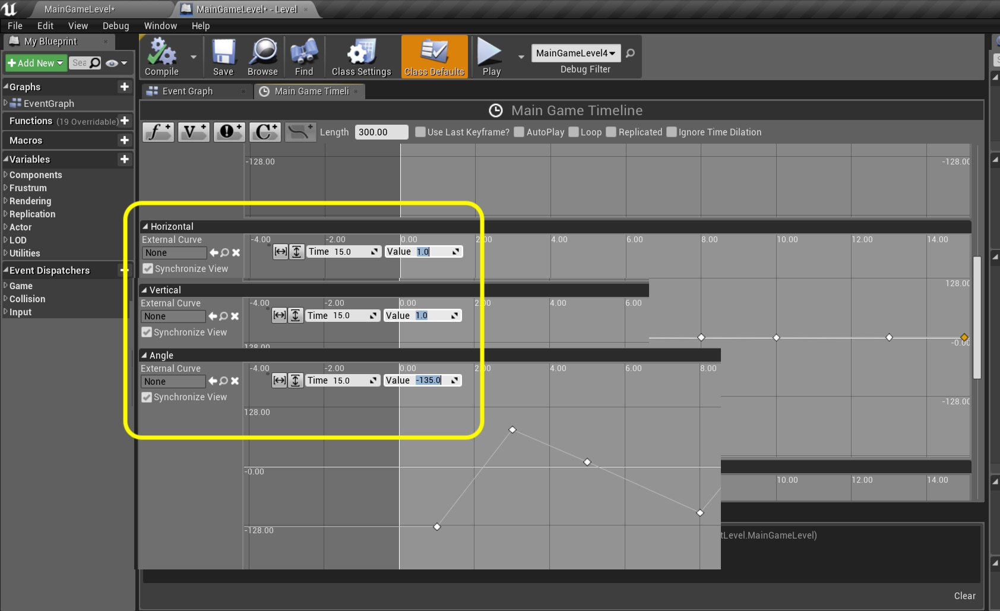
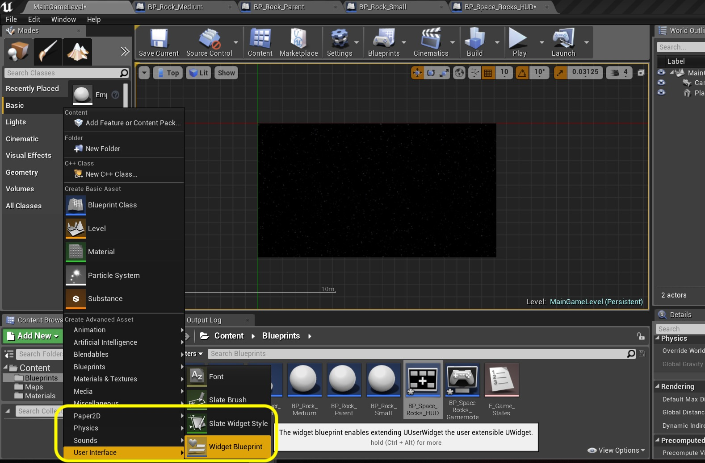

### Add More Rock Waves
To better test our game lets add some more waves.  Lets do three small and three medium rocks over 15 seconds.  Lets get started.

_____ 



{:start="{{ num }}"}
{{ num }}. Open the **Main Game Timeline** tab on the level blueprint.  Change the **Event Rock Medium** `Time` from **5** to `10` seconds. Add two new keys one at  Add two new keys one at **Time** `13.0` and **Value** `1.0` and another at **Time** `15.0` and **Value** `1.0`.

  

_____ 


{:start="{{ num }}"}
{{ num }}. Now lets add two more event triggers to the **Event Rock Small** graph. Add a **Time** `3.0` and **Value** `1.0` and another at **Time** `8.0` and **Value** `1.0`.

  

_____ 


{:start="{{ num }}"}
{{ num }}. Now lets set the second rock small.  Add a node to the **Horizontal** with **Time** `3.0` and **Value** `0.4`. Add a second node to the **Vertical** with **Time** `3.0` and **Value** `0.0`. Add a final node to the **Angle** with **Time** `3.0` and **Value** `80.0`.

  

_____ 



{:start="{{ num }}"}
{{ num }}. Now lets set the final rock small for now.  Add a node to the **Horizontal** with **Time** `8.0` and **Value** `0.8`. Add a second node to the **Vertical** with **Time** `8.0` and **Value** `1.0`. Add a final node to the **Angle** with **Time** `8.0` and **Value** `-100.0`.

  

_____ 


{:start="{{ num }}"}
{{ num }}. Now lets set the first rock medium spawn.  Add a node to the **Horizontal** with **Time** `10.0` and **Value** `0.55`. Add a second node to the **Vertical** with **Time** `10.0` and **Value** `0.0`. Add a final node to the **Angle** with **Time** `10.0` and **Value** `95.0`.

  

_____ 


{:start="{{ num }}"}
{{ num }}.  Now lets set the second rock medium spawn.  Add a node to the **Horizontal** with **Time** `13.0` and **Value** `1.0`. Add a second node to the **Vertical** with **Time** `13.0` and **Value** `0.3`. Add a final node to the **Angle** with **Time** `13.0` and **Value** `45.0`.

  

_____ 


{:start="{{ num }}"}
{{ num }}.  Now lets set the last rock medium spawn.  Add a node to the **Horizontal** with **Time** `15.0` and **Value** `1.0`. Add a second node to the **Vertical** with **Time** `15.0` and **Value** `1.0`. Add a final node to the **Angle** with **Time** `15.0` and **Value** `-135.0`.

  

_____ 


{:start="{{ num }}"}
{{ num }}. Runt the game and shoot both small and medium rocks.  Run into both small and medium rocks.  You will notice a bug that when we hit the medium rock with the player ship that the rock doesn't get destroyed as it does when hitting the smaller rock.  Lets fix this issues.

<iframe class="embed-responsive-item" src="https://www.youtube.com/embed/6ughow0j0dA?autoplay=1&rel=0&controls=0&amp&showinfo=0&version=3&loop=1&playlist=6ughow0j0dA" frameborder="0" allowfullscreen></iframe>

_____ 


{:start="{{ num }}"}
{{ num }}. Open **BP_Rock_Parent** and look for the **Player Hit By Rock** nodes.  Zoom into the end o these nodes.  You will notice that we just call the destroy function for the small rock.  Lets fix this.

  

_____ 


{:start="{{ num }}"}
{{ num }}. Pull off of the **Self** pin after the **Set Flipbook** node and select a **Cast To BP_Rock_Medium** node:

  

_____ 


{:start="{{ num }}"}
{{ num }}. Pull from the **Cast To BP_Rock_Medium** node and add a **Destroy Rock Medium** node.  Attach the **As BP_Rock_Medium** node to **Target** in the **Destroy Rock Medium** node.  Make sure that the **Call Failed** node from **Cast To BP_Rock_Small** is connected to the input of **Cast To BP_Rock_Medium**

  

_____ 


{:start="{{ num }}"}
{{ num }}. Now play the game and run into the middle size rock.  You will see that it correctly splits into two!

<iframe class="embed-responsive-item" src="https://www.youtube.com/embed/2vf-2eKUTRg?autoplay=1&rel=0&controls=0&amp&showinfo=0&version=3&loop=1&playlist=2vf-2eKUTRg" frameborder="0" allowfullscreen></iframe>

_____ 

### Rock Rotation
Now the rocks don't move very realistically.  A computer unfortunately has a lot of symmetry by default in how we approach it.  Lets start the animation at a random angle, and rotate the rocks at random speeds.  

_____ 


{:start="{{ num }}"}
{{ num }}. Add another Variable to **BP_Rock_Parent**.  Call it `Rotation Speed` and make it type **Float**.  Make it **Private** and set the **Category** to `Movement`.  Set the default to `30.0` so that we rotate 30 degrees per second. Add a **Tooltip** that state `Rotation speed in degrees per second`.

  

_____ 


{:start="{{ num }}"}
{{ num }}. Go to the **Event Begin Play** node.  Add to the very right of the nodes connected to it a **Random Float in Range** node:

  

_____ 


{:start="{{ num }}"}
{{ num }}. Add a **Get Rotation Speed** node to the event graph.  Attach the ouput to the **Max** input in the **Random Float in Range**.

  

_____ 


{:start="{{ num }}"}
{{ num }}. Lets set the minimum rotation to be the negative equivalent.  Add a **float * float** node.  Pull the output of the **Rotation Speed** to the top input. Change the bottom input to `-1.0`.  Connect the output of the **Multiplicatio** node to the **Min** input on the **Random Float in Range** node.

  

_____ 


{:start="{{ num }}"}
{{ num }}. Drag a **Set Rotation Speed** node to the graph:

  

_____ 


{:start="{{ num }}"}
{{ num }}. Connect the output of **Set Gamemode Reference** execution pin to the input of the newly created **Set Rotation Speed** node:

  

_____ 


{:start="{{ num }}"}
{{ num }}. Add to the right of this another **Random Float in Range** node and a **Set Direction Degrees** node.  In the **Random** node set the **Min** to `0.0` and **Max** to `359.0`.

  

_____ 


{:start="{{ num }}"}
{{ num }}. Connect the **Return Value** from the **Random Float in Range** node to the **Set Direction Degrees** node.  Connect the execution pin from **Set Rotation Speed** to the **Set Direction Degrees** node.

  

_____ 


{:start="{{ num }}"}
{{ num }}. Add a comment `Start at a random facing angle` to these nodes.  Zoom out and you should now have three distinct operations in the **Event Begin Play** execution pin flow.

  

_____ 


{:start="{{ num }}"}
{{ num }}. Go to the **Move Rock to New Location** section that ends with a **Set Actor Location** node.  Make some room to the right of it and add a **Get Rotation Speed** node and a **Get World Delta Seconds** node.

  

_____ 


{:start="{{ num }}"}
{{ num }}. Right click and select a **Set Actor Rotation** node.

  

_____ 


{:start="{{ num }}"}
{{ num }}. Right click on the **New Rotation** pin and select **Split Struct Pin**:

  

_____ 


{:start="{{ num }}"}
{{ num }}. Add a **Get Actor Rotation** node. Right click on the **Return Value** pin and select **Split Struct Pin**.

  

_____ 


{:start="{{ num }}"}
{{ num }}. Add a **float + float** node. Connect the output of the **Multiplication** pin and the **Return Value Z(Yaw)** pin to the inputs of the **Addition** node.  Send the **Addition** node to the **New Rotation Z(Yaw)** in the **Set Actor Rotation** node:

  

_____ 


{:start="{{ num }}"}
{{ num }}. We are not changing **Rotation X** and **Rotation Y** so hook up the **X** and **Y** pins together from the **Get Actor Rotation** to the **Set Actor Rotation** pins.

  

_____ 


{:start="{{ num }}"}
{{ num }}. Connect the output execution pin from **Set Actor Location** to the input pin in **Set Actor Rotation**.

  

_____ 


{:start="{{ num }}"}
{{ num }}. Now go and play the game.  You will notice that the rocks rotate at different speeds and start at different angles.  It looks a lot more organic - subtle but meaningful change.  Press **Save All** and update Github by **committing** and **pushing** all the changes made. Next up we will start building the HUD.

<iframe class="embed-responsive-item" src="https://www.youtube.com/embed/qyMK8x221Bg?autoplay=1&rel=0&controls=0&amp&showinfo=0&version=3&loop=1&playlist=qyMK8x221Bg" frameborder="0" allowfullscreen></iframe>

_____ 

## Part 5 - HUD and Front End
Now lets build a HUD.  The game starts with a prompt to start the game.  There is an in game HUD with score and lives.  There is an end game screen where you can restart the game.  Lets get started.

_____ 

### 10. [HUD Score
Lets start by building the score.  But before we build the widget, we need a genearl HUD class.  Lets start by creating this.
_____ 



{:start="{{ num }}"}
{{ num }}. Press the **Blueprints** button and select **GameMode: Edit... \| HUD HUD \| + Create \| HUD**:

  

_____ 


{:start="{{ num }}"}
{{ num }}. Call it `BP_Space_Rock_HUD`.

  

_____ 


{:start="{{ num }}"}
{{ num }}. Go to **Project Settings** and **Maps and Modes**.  Look at the **Selected GameMode* and press the triangle to expand it. Check out the **HUD Class**.  Notice that it has already placed **BP_Space_Rocks_HUD** there based on how we created it through the menu.  We are good to start.

  

_____ 


{:start="{{ num }}"}
{{ num }}. Press the **Add New** button and select a new **User Interface \| Widget Blueprint** class. 

  

_____ 


{:start="{{ num }}"}
{{ num }}. Rename it to `BP_Ingame_Widget`.

  

_____ 


{:start="{{ num }}"}
{{ num }}. Open **BP_Ingame_Widget**.  Drag a **Text** from the **Palette** menu and drag it into the screen: 

  

_____ 


{:start="{{ num }}"}
{{ num }}. Change the name to to `Score` in the **Hierarchy** tab.  Change the **Content \| Text** to `0`.  Change the **Font \| Size** to `45`.  Change the **Justification** to **Centered** text.  Fit the Green box around the text and center it on the top center of the screen.

  

_____ 


{:start="{{ num }}"}
{{ num }}. Press the **Anchor** button and select the top middle selection:

  

_____ 


{:start="{{ num }}"}
{{ num }}. Make final adjustments to the position of the Score text.

  

_____ 


{:start="{{ num }}"}
{{ num }}. Now go back to **BP_Space_Rock_HUD** and create or alter the function and call it `Create In Game HUD`:

  

_____ 


{:start="{{ num }}"}
{{ num }}. Pull off of the **Create In Game HUD** execution pin and select a **Create Widget** node:

  

_____ 


{:start="{{ num }}"}
{{ num }}. Press the **Class** and select `BP_Ingame_Widget`.

  

_____ 


{:start="{{ num }}"}
{{ num }}. Pull off the **Return Value** pin and put a **Add to Viewport** node on the graph.  Connect the execution pins.  Add a comment `Adds Ingame HUD to Widget`.

  

_____ 


{:start="{{ num }}"}
{{ num }}. We will activate this widget in the level blueprint.  Selecdt **Blueprints \| Level Blueprints**.  Go to the custom event **Restart Game**.  Make some space to the right of it.  Add a **Get Player Controller** node.

  

_____ 


{:start="{{ num }}"}
{{ num }}. Pull off of the **Return Value** pin and select **Get HUD** node.

  

_____ 


{:start="{{ num }}"}
{{ num }}. Drag off the **Get HUD \| Return Value** pin and select a **Cast To BP_SPace_Rocks_HUD**.

  

_____ 


{:start="{{ num }}"}
{{ num }}. Pull off the **As BP_Space_Rocks_HUD** pin and call the function you just created **Create Ingame HUD**:

  

_____ 


{:start="{{ num }}"}
{{ num }}. Highjack the **Restart Game** node's executioon pin and send to **Cast to BP_Space_Rock_HUD** then **Create In Game HUD** then the **Timeline**.

  

_____ 


{:start="{{ num }}"}
{{ num }}. Run the game and a score appears. Now it stays at zero as we are not adding up a score. On the next page we will create and update a variable for this.

  

_____ 

  

[<- Previous](Space-Rocks-17.html)&nbsp;&nbsp;&nbsp;[Home](../index.html)&nbsp;&nbsp;&nbsp; [Continue ->](Space-Rocks-19.html)
   
   
   

