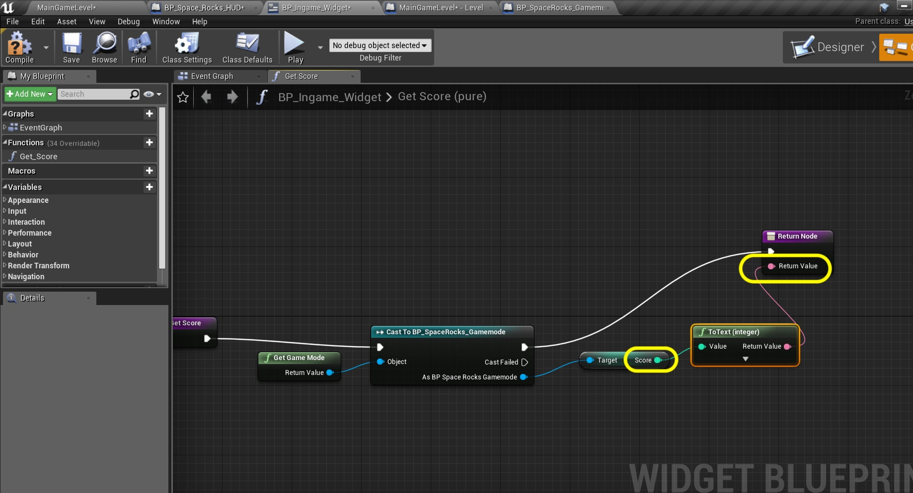
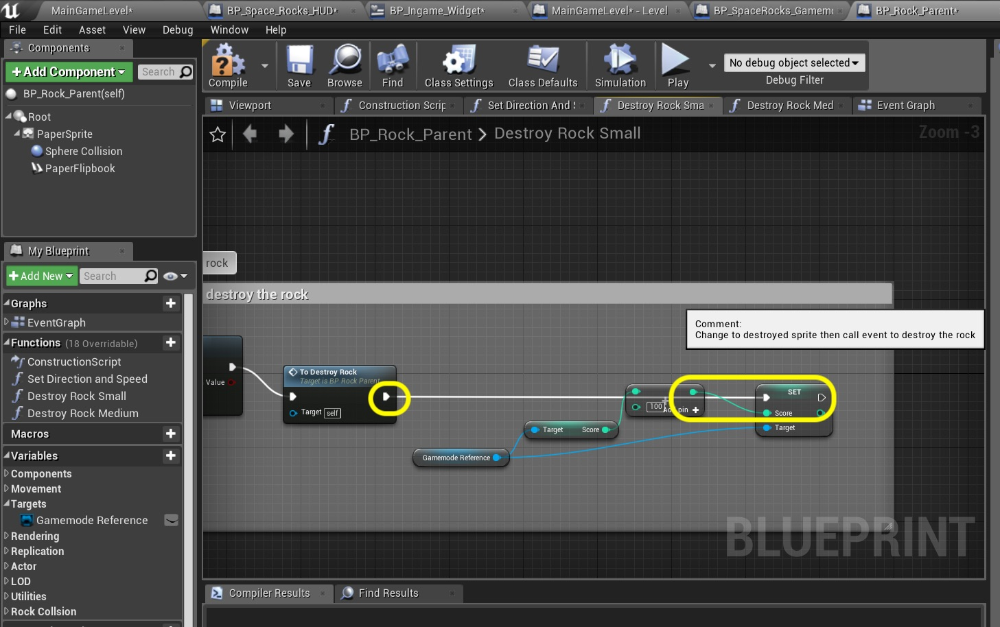
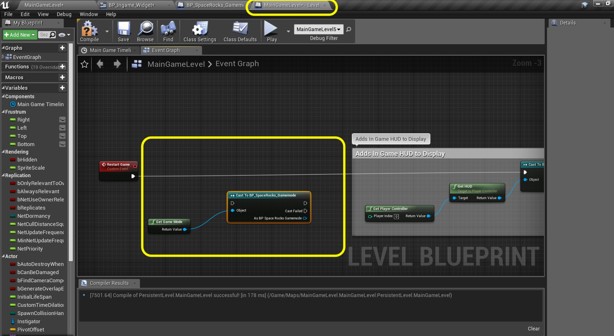
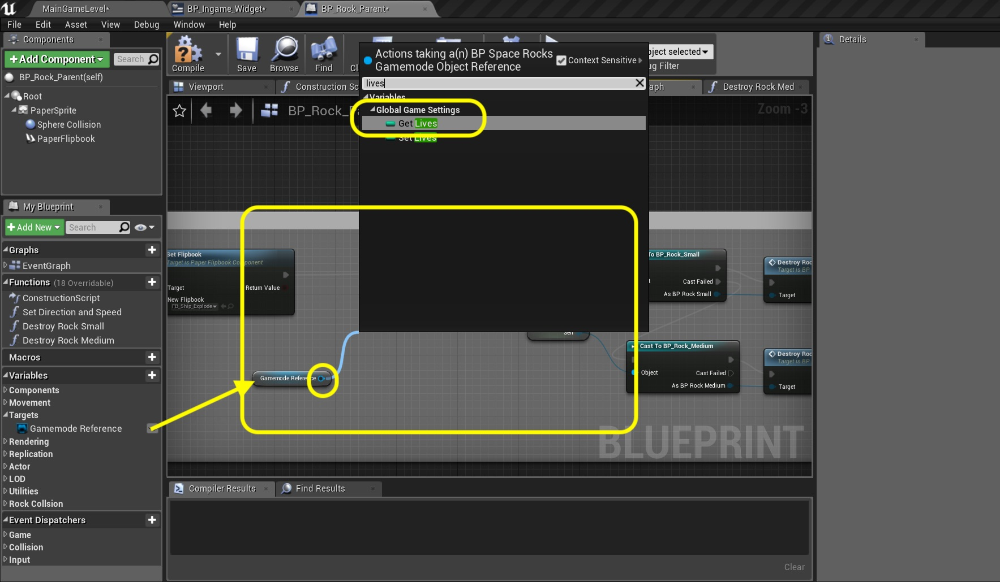

### HUD Score Continues

_____ 



{:start="{{ num }}"}
{{ num }}. The best place to store our global variables is in the game mode.  Open **BP_Spacerocks_Gamemode**.

  

_____ 


{:start="{{ num }}"}
{{ num }}. Add an **Integer** variable type called `Score` in **Category** `Global Game Settings` with a tooltip `Tracks Score of Game`.

  

_____ 


{:start="{{ num }}"}
{{ num }}. Go back to **BP_Ingame_Widget** and seledt the **Score** text.  Press the **Bind** button and create a bind.  This will take you from the Designer view to the Graph view:

  

_____ 


{:start="{{ num }}"}
{{ num }}. I dind't like the default name of the function so I renamed it to `Get_Score`.

  

_____ 


{:start="{{ num }}"}
{{ num }}. Add a **Get Game Mode** node. Pull off the **Return Value** pin and select a **Czst To BP_SpaceRocks_Gamemode** node.

  

_____ 


{:start="{{ num }}"}
{{ num }}. Pull off the **As BP SpaceRocksGamemode** pin and select **Get Score**.

  

_____ 


{:start="{{ num }}"}
{{ num }}. Take the output of **Score** and put it to the **Return Value**.  UE4 adds a **To Text** node to convert the format for us. 

  

_____ 


{:start="{{ num }}"}
{{ num }}. Add comment to the nodes `Gets Score and sends to Widget`.

  

_____ 


{:start="{{ num }}"}
{{ num }}. Open **BP_Rock_Parent** and lets adjust the scores.  Open the **Destroy Rock Small** tab and go to the far right and make some room in the comment box. Add a **Get Gamemode Reference** node:

  

_____ 


{:start="{{ num }}"}
{{ num }}. Pull off the **Gamemode Reference** pin and select a **Get Score** node:

  

_____ 


{:start="{{ num }}"}
{{ num }}.  Add a **int + int** node to increment the score.

  

_____ 


{:start="{{ num }}"}
{{ num }}. Connect the output pin from **Score** to the top in of the **Addition** node.  Set the bottom to `100`.

  

_____ 


{:start="{{ num }}"}
{{ num }}. Pull off **Gamemode Reference** and select the **Set Score** node.

  

_____ 


{:start="{{ num }}"}
{{ num }}. Connect the output execution pin from **To Destroy Rock** to the **Set Score** node.  Attach the output of the **Addition** node to teh **Score** pin in the **Set** node.

  

_____ 


{:start="{{ num }}"}
{{ num }}. Add comment `Adjust Score`.

  

_____ 


{:start="{{ num }}"}
{{ num }}. Select the adjust score nodes including the comment and press copy (cntl C).

  

_____ 


{:start="{{ num }}"}
{{ num }}. Go to tab **Destroy Rock Medium** and make room to the far right of the nodes.  Paste the adjusted score you just copied:

  

_____ 


{:start="{{ num }}"}
{{ num }}.  Connecdt the output execution pin from **To Destroy Rock** to the **Set Score** node

  

_____ 


{:start="{{ num }}"}
{{ num }}. Change the added score to `50` in the **Addition** node.

  

_____ 


{:start="{{ num }}"}
{{ num }}. Play the game and shoot rocks. The score should increase by 100 for small rocks and 50 for medium ones.   Press **Save All** and update Github by **committing** and **pushing** all the changes made. Next up we will implement lives to the HUD and game logic.

<iframe class="embed-responsive-item" src="https://www.youtube.com/embed/2XFk0bvMF2k?autoplay=1&rel=0&controls=0&amp&showinfo=0&version=3&loop=1&playlist=2XFk0bvMF2k" frameborder="0" allowfullscreen></iframe>

_____ 

### HUD and Lives

_____ 



{:start="{{ num }}"}
{{ num }}. Now we will show our lives on the screen.  We will use the progress bar to show it.  Even though this is not continual health we can hide parts of a graphic with three lives to alter.  Open **BP_Ingame_Widget** and drag a **Progress Bar** into the top left corner of the sceen:

  

_____ 


{:start="{{ num }}"}
{{ num }}. Go to **Style \| Fill Image \| Image** and select `SP_Lives_HUD` that we created at the very begining of this exercise. Notice that this is covered by the background color.

  

_____ 


{:start="{{ num }}"}
{{ num }}. Double click the **Background Color** and set the **Alpha** to `0.0`, making it transparent.

  

_____ 


{:start="{{ num }}"}
{{ num }}. Click the **Tint** under the **Fill Image**.  Select a light blue. Now we see the fill image and it is blue, but nothing shows up on screen.  

  

_____ 


{:start="{{ num }}"}
{{ num }}. You don't see any graphics as it is set to 0.  Think of this as a health bar that is normalized where 0 is empty and 1 is 100%.  So change the **Progress \| Percent** to `1.0` and you now see the planes but they are squished.

  

_____ 


{:start="{{ num }}"}
{{ num }}. The images in the HUD don't get imported at scale.  Change the **Size X** to the original `128.0` and **Size Y** to `32.0` to get back to a 1:1 scale with the original artwork. Now it looks much better. 

  

_____ 


{:start="{{ num }}"}
{{ num }}. We will change this widget by having percent at `1.0` for three lives, `0.6` for 2, `0.3` for one life and `0` for when the game is over and no lives are left.

  

_____ 


{:start="{{ num }}"}
{{ num }}. We need a variable to track lives. We will go to the same place we keep the score.  Open **BP_SpaceRock_Gamemode** and right click on **Score** and select **Duplicate**:

  

_____ 


{:start="{{ num }}"}
{{ num }}. Change the name to `Lives` and **Tooltip** to `Track Lives in Game`.

  

_____ 


{:start="{{ num }}"}
{{ num }}. Open the **Level Blueprint** and make some room to the right of the **Event Restart Game** node.  Add a **Get Game Mode** node and pull off the **Return Value** pin and select a **Cast To BP_SpaceRocksGamemode** node:

  

_____ 


{:start="{{ num }}"}
{{ num }}. Pull off the **As BP SpaceRocks_Gamemode** pin and select **Set Lives** node.  Highjack the execution pin from **Restart Game** send it to **Cast** then **Set** then to the final **Cast** node.

  

_____ 


{:start="{{ num }}"}
{{ num }}. In the **Set Lives** node change the **Lives** to `3`.  Add a comment `Make sure score is set to 3 when game restarts` around these new nodes we just created.

  

_____ 


{:start="{{ num }}"}
{{ num }}. Now we need to subtract the lives by one when the player dies.  Zoom into the last portion of the Player Hit by Rock section in the **BP_Rock_Parent** Event Graph.

  

_____ 


{:start="{{ num }}"}
{{ num }}. Add some room after the **Set Flipbbok** node. Add a **Get Gamemode Reference** node.  Pull of its pin and select a **Get Lives** node.

  

_____ 


{:start="{{ num }}"}
{{ num }}. Right click on an empty areea and select an **integer - integer** node:

  

_____ 


{:start="{{ num }}"}
{{ num }}. Pull off the **Gamemode Reference** node again and select **Set Lives**.

  

_____ 


{:start="{{ num }}"}
{{ num }}. Connect the output of **Lives** to the top input of the **Subtraction** node.  Leave the default to subtracing by `1`. Send the output to the **Set Lives** node:

  

_____ 


{:start="{{ num }}"}
{{ num }}. Highjack the output execution pin from **Set Flipbook** and send it to **Set Lives** node then to the **Cast To BP_Rock_Small** node:

  

_____ 


{:start="{{ num }}"}
{{ num }}. Open the **BP_Ingame_Widget** and press the **Bind** button next to the **Percent** bar to allow us to affect its value.

  

_____ 


{:start="{{ num }}"}
{{ num }}. Rename the function `Display Lives`.  Add a **Get Game Mode** node.  Pull off the **Return Value** and select a **Cast To BP_SpeedRocks_Gamemode** node:

  

_____ 


{:start="{{ num }}"}
{{ num }}. Pull off of the **As BP SpaceRocks_Gamemode** pin and add a **Get Lives** node: 

  

_____ 


{:start="{{ num }}"}
{{ num }}. Add a **Equal (integer)** node:

  

_____ 


{:start="{{ num }}"}
{{ num }}. Copy and paste the **Equal** node twice.

  

_____ 


{:start="{{ num }}"}
{{ num }}. Connet the output of the **Lives** pin into the top node of all three **Equal** nodes.  Set the top one to `3`, middle one to `2` and bottom one to `1` as the second value.

  

_____ 


{:start="{{ num }}"}
{{ num }}. Press the **+** button in **Variables** add a **Float** called `Health Bar Amount` with a tooltip of `A scale between 0 and 1`.

  

_____ 


{:start="{{ num }}"}
{{ num }}. Pull off the first **Equal** node and add a **Branch** node.  Add a **Set Bar Amout** node.  Connect the **True** from **Branch** to the **Set Health Bar Amount** execution node.  Set the value to `1.0`.

  

_____ 


{:start="{{ num }}"}
{{ num }}. Copy and paste the **Branch** and **Set** nodes twice.  Connet **False** form the first **Branch** to the input of the second **Branch** node.  Set the middle value to `0.60`.

  

_____ 


{:start="{{ num }}"}
{{ num }}. Daisy chain the **False** to input nodes below.  Change the bottom node to `0.30` and pull of the last **False** pin.  Select another **Set Health Bar Amount** node and set the value to `0.0`. We will finish this off on the next page.

  

_____ 

  

[<- Previous](Space-Rocks-18.html)&nbsp;&nbsp;&nbsp;[Home](../index.html)&nbsp;&nbsp;&nbsp; [Continue ->](Space-Rocks-20.html)
   
   
   

