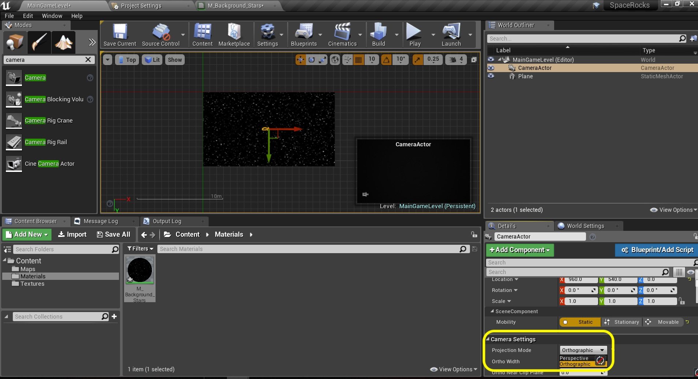
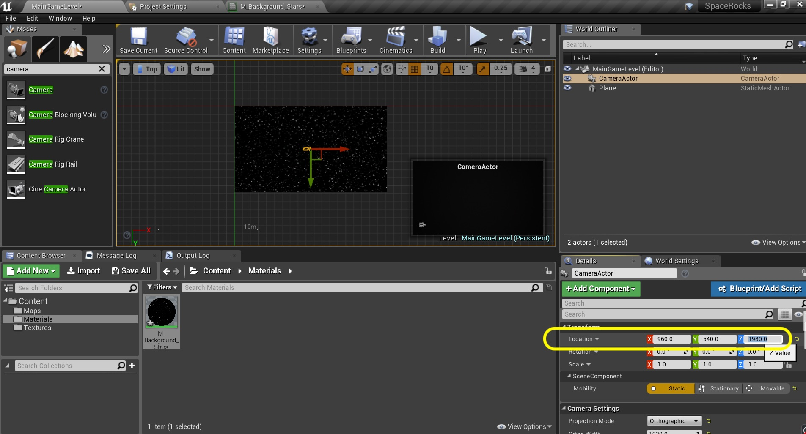
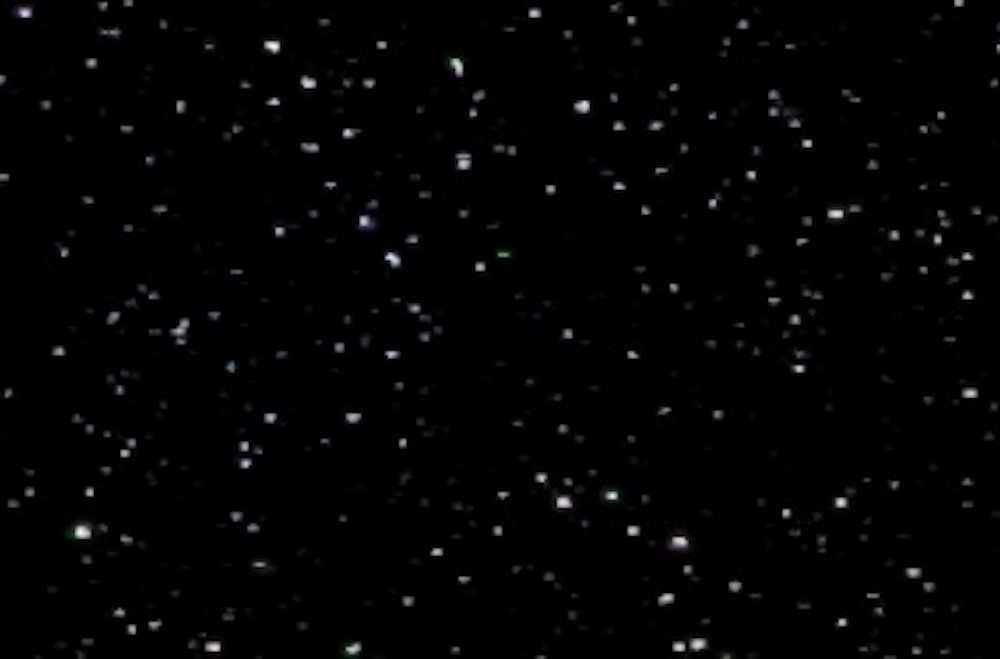

### In Game Camera
Now before we can see this material for the background of the Space Rocks game, we need a camera.  Now we will be using an [orthographic](https://en.wikipedia.org/wiki/Orthographic_projection) camera.  This means that regardless of where the object is on the **Z** axis that it will be the same size.  With a **perspective** projection the objects get smaller the further they are away in **Z** from the camera (in our top down view).  The sorting still works though, objects closer to the camera will be rendered in front but will not chnage in size.

_____ 



{:start="{{ num }}"}
{{ num }}. Select the **MainGameLevel** game view and change from **Wireframe** to **Lit** view node so we can see the material we are about to assign.

  

_____ 


{:start="{{ num }}"}
{{ num }}. Now go to the **Materials** folder and select the **M_Background_Stars** material.  Select the background plane and press the **Arrow** button in the **Materials** tab in the **Details** panel:

  

_____ 


{:start="{{ num }}"}
{{ num }}. Now you should see the new plane with the starfield material in game:

  

_____ 


{:start="{{ num }}"}
{{ num }}. We need to add a **Camera** to the game.  Go to the **Modes** panel and type in **Camera**.  Drag one into the game scene:

  

_____ 


{:start="{{ num }}"}
{{ num }}. Go to the **Details** panel and set the **Camera Settings \| Projection Mode** to `Otrhographic`:

  

_____ 


{:start="{{ num }}"}
{{ num }}. Now the distance of the camera from the background does nothing because of the orthographic projection.  So we want it to be **1920** wide.  There is a setting under the **Projection Mode** called **Ortho Width** which you will set to `1920.0`.

  

_____ 


{:start="{{ num }}"}
{{ num }}. Now we need to do a bit of math.  We want the camera to be in the dead center of the background.  So we want it to be located at 1920/2 (or 960) on the **X** and 1080/2 (or 540) on the **Y**.  The **Z** doesn't matter, but to keep the camera out of the way and for we will put it at 1980.  So set the location of the **Camera** to `960.0`, `540.0`, `1980.0`. Now look at the **Camera Actor** in the game view.  It is the picture in picture box at the bottom right of the game area.  It is not showing the background.

  

_____ 



{:start="{{ num }}"}
{{ num }}. So switch to **Perspective** view and go on top of the camera.  I can see why we don't see the stars.  It needs to rotate downwards and paralell to the background.

  

_____ 


{:start="{{ num }}"}
{{ num }}. For me rotating the **X** and **Y** axis by `-90.0` degrees works.  Now I can see the stars in the **Camera Actor** window.

  

_____ 


{:start="{{ num }}"}
{{ num }}. Since we will not be moving the camera we will set this actor to **Static** so the game engine can optimize.

  

_____ 


{:start="{{ num }}"}
{{ num }}. Hit the **Play** button to try it out.  Uh oh, the screen is still black. Look at the **World Outliner** the game has added another camera.  Normally unreal expects a camera to be tied to the **Player Pawn** either in 1st or 2rd person view.  So the engine is adding a camera and selecting it.  Lets fix this. 

  

_____ 


{:start="{{ num }}"}
{{ num }}. Select the **Camera** in the **World Outliner** and scroll down the **Details** panel. Stop when you hit the **Auto Player Activation** tab.  Set the **Auto Activate for Player** to `Player 0`.

  

_____ 


{:start="{{ num }}"}
{{ num }}. Now hit the **Play** button.  Wow, now we are seeing the view from the **Camera** we added and tested.  All is good.  But look at the **World Outliner** and you can see that it is still adding an extra camera actor we are not using.  Now we could go into the C++ and see where the engine is adding the camera and stop it, we will fix it in blueprints instead - since we are making this game 100% in blueprints.

  

_____ 


{:start="{{ num }}"}
{{ num }}. Now we will remove this extra camera just as the game loads. Press the **Blueprints** button and select **Open Level Blueprint**:

  

_____ 


{:start="{{ num }}"}
{{ num }}. Make sure you are on the **Event Graph** and right click on the open area and select a **Get All Actors Of Class** node:

  

_____ 


{:start="{{ num }}"}
{{ num }}. We use the **Begin Play** and not the constructor as the game only adds the camera when we run the game.  Hopefully it adds it before out **Begin Play** event does in the level blueprint.  Pull off of the execution pin from **Event Begin Play** and attach it to the input of **Get All Actor Of Class**.  Select the **Actor Class** `Camera Actor`.  We will be going through the array output and looking for a camera that doesn't match the one in game then deleting it.

  

_____ 


{:start="{{ num }}"}
{{ num }}. Now the output is an array.  This means that to access each item we will need to pull off of the output pin and add a **For Each Loop**:

  

_____ 


{:start="{{ num }}"}
{{ num }}. Pull off of the **Array Element** pin and select the **Not Equal** node.  We want to check if this element is not the one we added into the level ourselves that we want to keep.

  

_____ 


{:start="{{ num }}"}
{{ num }}. Go to the game screen and select the **CameraActor** as we want to get a reference for this in the level blueprint.

  

_____ 


{:start="{{ num }}"}
{{ num }}. Select **Create a Reference to CameraActor** node at the top of the menu:

  

_____ 


{:start="{{ num }}"}
{{ num }}. Connect the **Camera Actor** node to the bottom pin of the **!=**.  By the way != means "not equal" in english:

  

_____ 


{:start="{{ num }}"}
{{ num }}. So if the output of the not equals is true then we want to delete the actor as it is not the one we put in the level.  I usually type in **if** in the node selection menu and UE4 picks **Branch** which is the node that acts as an if statement:

  

_____ 


{:start="{{ num }}"}
{{ num }}. Connect the **Loop Body** output pin from the **For Each Loop** node and attach it to the input pin of the **Branch** node:

  

_____ 


{:start="{{ num }}"}
{{ num }}. Drag off of the **Branch** node's **True** execution pin and select a **Destroy Actor** node:

  

_____ 


{:start="{{ num }}"}
{{ num }}. We can't leave this node alone.  If we destroy **Self** then it would destroy the level blueprint (not sure this would even compile) but we want to destroy the stray camera.  So grab the **Array Element** pin from the **For Each** node and connect it to the **Target** input node on **Destroy Actor**:

  

_____ 


{:start="{{ num }}"}
{{ num }}. Clean up the nodes and add the comment `Find Extra Camera and Remove it From Level`.  Press the **Compile** button:

  

_____ 


{:start="{{ num }}"}
{{ num }}. Go back in the game and press play.  And not only do we have the correct camera again but there is only one in the scene and we have freed up some memory for something that we will actually use!

  

_____ 

### Starfield Background Part 2
Now lets go back to the Material and make it way cooler.  Lets add some more layers, a small color treatment and animation.

_____ 


{:start="{{ num }}"}
{{ num }}. Go back to **M_Background_Stars** material and add a **Panner** node:

  

_____ 


{:start="{{ num }}"}
{{ num }}. Connect the output of the **Panner** into the **UVs** input pin in the **Texture Sample** node.  Set the **Speed X** to `.001` and **Speed Y** to `.002`.

  

_____ 


{:start="{{ num }}"}
{{ num }}. Press the **Apply** button and compile the material. Go into the game and hit run.  The stars move slowly at an angle that works.

  

_____ 


{:start="{{ num }}"}
{{ num }}. Add another **Texture Sample** node and assign the **TExture** `T_StarColorMap`.

  

_____ 


{:start="{{ num }}"}
{{ num }}. Multiply the Star Texture by the Color Texture and feed it into the input of the other **Multiply** node:

  

_____ 


{:start="{{ num }}"}
{{ num }}. Run the game and look at the stars.  At first site it looks the same but if you zoom in you can see that a bit of color is introduced to the stars:

  

_____ 


{:start="{{ num }}"}
{{ num }}. Copy and paste the **Panner** and **Texture Sample** node beneath the existing one:

  

_____ 


{:start="{{ num }}"}
{{ num }}. Highlight the new **Texture Sample** node.  Change the **Texture** to `T_Stars_2`, another star field of the same size.

  

_____ 


{:start="{{ num }}"}
{{ num }}. Now we want this star field to move slower and be further away.  So we want these stars to be smaller.  Lets adjust the UVs on the texture to accomplish this. Right click an open area and add a **Texture Coordinate** node.

  

_____ 


{:start="{{ num }}"}
{{ num }}. Set both the **UTiling** and **VTiling** to `1.6`. Connect the output node of **TextCoor** to the **Panner** input **Coordinate**.

  

_____ 


{:start="{{ num }}"}
{{ num }}. Preview **T_Stars_1** and look at the stars:

  

_____ 


{:start="{{ num }}"}
{{ num }}. Preview **T_Stars_2** node and look at the stars.  They are sparser and smaller; exactly what we wanted!.

  

_____ 


{:start="{{ num }}"}
{{ num }}. Highlight the second panner.  Since these stars are farther away we want them to animate slower.  Chance **SpeedX** to `.0009` and **SpeedY** to `.0008`.

  

_____ 


{:start="{{ num }}"}
{{ num }}. Now we want to add the two star fields together.  Add an **Add** node and input both starfield textures.  Send the output to the first **Multiply** node.

  

_____ 


{:start="{{ num }}"}
{{ num }}. Run it in game.  It is pretty impressive but a bit too dominant.  It is supposed to be a background.  Adjust the Scalar multiplier to a value that works for you. I am OK with `1.0`.

  

_____ 


{:start="{{ num }}"}
{{ num }}. Clean up the nodes and add comments.  Press the **Apply** button and check it out in game.

  

_____ 


{:start="{{ num }}"}
{{ num }}. Play the game and mine looks like this video.  Press **Save All** and update Github by **committing** and **pushing** all the changes made. On the next page we will add all the **Paper 2D** sprites we will need in the game.

<iframe class="embed-responsive-item" src="https://www.youtube.com/embed/ctWpyyNLXgw?autoplay=1&rel=0&controls=0&amp&showinfo=0&version=3&loop=1&playlist=ctWpyyNLXgw" frameborder="0" allowfullscreen></iframe>

_____ 

  

[<- Previous](Space-Rocks-1.html)&nbsp;&nbsp;&nbsp;[Home](../index.html)&nbsp;&nbsp;&nbsp; [Continue ->](Space-Rocks-3.html)
   
   
   

