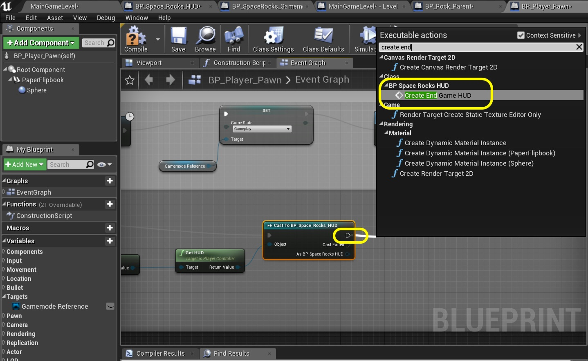

### Start Game Flow Continued

_____ 



{:start="{{ num }}"}
{{ num }}. Now it is very important with the **Destroy Actor** to understand what object we are destroying.  We are in the level blueprint and we don't want to destroy ourselves.  We want to destroy the rock in the loop.  Make sure you connect the **Array Element** in the **For Each** loop to the **Target** in the **Destroy Actor** node.  

  

_____ 



{:start="{{ num }}"}
{{ num }}. Add comment `Destroy Pre Game Rocks` around these new nodes.  Now it is time to reconnect the execution flow.  Connect **Restart Game** to **Get Actors of Class** to **For Each Loop** to **Spawn Player** to **Cast** nodes.  Now from the **For Each Loop** we pull from the **Completed** pin.  If we pulled from the Destroy actor then it would perform those nodes for as many times as there are pre game rocks.

  

_____ 


{:start="{{ num }}"}
{{ num }}. Now go play the game and press the **Enter** key.  Uh oh, we have a problem.  Now we have two widgets displaying.  It would be a good idea at this time to do some housecleaning to fix this.  

  

_____ 


{:start="{{ num }}"}
{{ num }}. Make some room to the right of the **Restart Game** node.  Right click and select `Remove All Widgets` node.

  

_____ 


{:start="{{ num }}"}
{{ num }}. Select the **Get Player Controller** node.

  

_____ 


{:start="{{ num }}"}
{{ num }}. Pull off of the **Return Value** pin and select the **Get HUD** node.  Then pull of the **Get HUD Return Value** pin and select **Cast To BP_Space_Rocks_HUD** node:

  

_____ 


{:start="{{ num }}"}
{{ num }}. Pull off of the **As BP Space_Rocks_HUD** and select the function **Create In Game HUD**:

  

_____ 


{:start="{{ num }}"}
{{ num }}. Highjack the pins from **Restart Game** execution node and go to **Remove All Widgets** to **Cast To BP_Space_Rocks_HUD** to **Create in Game HUD** to **Get All Actors Of Class**.

  

_____ 


{:start="{{ num }}"}
{{ num }}. Highlight these nodes and add a `Destroy All Widgets and Create in Game HUD`.

  

_____ 


{:start="{{ num }}"}
{{ num }}. So your node tree should look something like:

  

_____ 


{:start="{{ num }}"}
{{ num }}. Now go play the game.  Wait for a bit then press the **Enter** button.  You should enter the game and it should start properly.

<iframe class="embed-responsive-item" src="https://www.youtube.com/embed/6gNsWhGdqv4?autoplay=1&rel=0&controls=0&amp&showinfo=0&version=3&loop=1&playlist=6gNsWhGdqv4" frameborder="0" allowfullscreen></iframe>

_____ 

### End Game Flow
Now we need to get from the end of game (losing three lives) to the end game screen.  Then time out of the end game screen back to the start up sequence.

_____ 


{:start="{{ num }}"}
{{ num }}. First things we are going to do is fix a problem that I spotted reviewing the nodes that will definitely cause a bug.  Look at the level Bluerpint where we set the **Lives** variable to `3.0`. We also want to reset the score to **0**.  Go to the nodes where the comment says **Make sure score is set to 3 when game restarts**.  Pull off of the **As BP Space Rocks Gamemode** pin and select a **Get Score** node. 

  

_____ 


{:start="{{ num }}"}
{{ num }}. It should have a default value of `0` which is exactly what we want. Highjack the execution pin from the **Set Lives** and send it to the **Set Score** node which you will then feed to the input of **Cast To BP_Space_Rocks_HUD**.  There we go, bug averted.

  

_____ 


{:start="{{ num }}"}
{{ num }}. Open **BP_Space_Rocks_HUD** and add a new **Function** by pressing the **+** button.  Call it `Create End Game HUD` a **Create Widget** node and select the `BP_Game_Over_Widget` **Class**.  Connect this to a **Add to Viewport HUD**.  The entire function should look like:

  

_____ 



{:start="{{ num }}"}
{{ num }}. Now lets end the game if th eplayer is out of health. Open **BP_Player_Spawn** and go to the section that runs the **Player In Dies** state.  Disconnect the execution pins (alt left click) the nodes between **Get Actor Hidden In Game** and **Delay**.

  

_____ 


{:start="{{ num }}"}
{{ num }}. Add a **Get Gamemode Reference** node and pull off its pin and select the **Get Lives** node.

  

_____ 


{:start="{{ num }}"}
{{ num }}. Take the disconnected nodes on the right and add a comment saying `Player Has Lives Left`.  We will include the player has no lives left logic below:

  

_____ 


{:start="{{ num }}"}
{{ num }}. Pull off of the **Lives** pin and select the **integer < integer** node.

  

_____ 


{:start="{{ num }}"}
{{ num }}. Change the value in the bottom of the **Less Than** node to `1`.

  

_____ 


{:start="{{ num }}"}
{{ num }}. Now if the player has more than one life left then we can return to our original flow.  Connect the **Branch False** pin to the **Delay** node:

  

_____ 


{:start="{{ num }}"}
{{ num }}. Add a **Get Player Controller** node.  Pull off the **Return Value** pin and select the **Get HUD** class:

  

_____ 


{:start="{{ num }}"}
{{ num }}. Pull off the return value of **Get HUD** node and add a **Cast To BP_Space_Rocks_HUD**.

  

_____ 


{:start="{{ num }}"}
{{ num }}. Connect the output of the **Branch True** pin to the **Cast To BP_Space_Rocks_HUD**.

  

_____ 


{:start="{{ num }}"}
{{ num }}. Pull off of the **Cast To BP_Space_Rocks_HUD** execution pin and select the **Create End Game HUD** node.

  

_____ 


{:start="{{ num }}"}
{{ num }}.Connect the **As BP_Space_Rocks_HUD** pin to the **Target** input pin in the **Create End Game HUD** node.

  

_____ 


{:start="{{ num }}"}
{{ num }}. Pull from the execution pin from the **Create End Game HUD** node and add a **Delay** node. Set the **Duration** to `5.0`.

  

_____ 


{:start="{{ num }}"}
{{ num }}. Now we need to run the custom event in the level blueprint called `Restart Game`.  Now there is not a player in the **World Outliner** that we can reference in the level blueprint. It is spawned in blueprint.  We cannot directly access functions in it.  So we need to use an event dispatcher that sends an event call to any possible class.  Press the **+** button next to **Event Dispatcher** and call it `Restart Space Rock Game`.  Nothing else needs to be added.

  

_____ 


{:start="{{ num }}"}
{{ num }}. Pull off the execution pin from **Delay Complete** node and add a **Call Restart Spawn Rock Game** node to trigger the event for the event dispatcher.

  

_____ 


{:start="{{ num }}"}
{{ num }}. Pull from the **Call Restart Space Rock Game** node and attach it to join the input on the **Set Game State** node.  We still need to change the state back to gameplay as well as recenter the player and reset all its positions.

  

_____ 


{:start="{{ num }}"}
{{ num }}. Add comments to these nodes that say `Player Has No Lives Left` and clean up the nodes.

  

_____ 


{:start="{{ num }}"}
{{ num }}. Open the **Main Game Level**  Level Blueprint and look at the **Restart Game** flow.  Notice that we spawn the player here.  So when we call this we will spawn a second player.  Now we could delete the player at the end of the game in the player.  I think, since we already turn the rendering on and off the player when she dies that we can follow this pattern.  Look for the **Spawn Actor BP_PawnPawn**.

  

_____ 


{:start="{{ num }}"}
{{ num }}. Disconnect both the in and out execution pins from the **Spawn Actor BP_PlayerPawn** node.

  

_____ 


{:start="{{ num }}"}
{{ num }}. Move it to the **Event Begin Play** flow.  Put it after the **Create Pre Game Rocks** node.  Connect their execution pins:

  

_____ 


{:start="{{ num }}"}
{{ num }}. In its place we will need to turn this player's rendering back on.  So we will need a reference to it.  Right click on the **Return Value** pin from the **Spawn Actor BP_PlayerPawn** node and select `Promote to Variable`.

  

_____ 


{:start="{{ num }}"}
{{ num }}. Call this new variable `Player Target`.  Make it **Private** and give it a **Tooltip** saying `Holdes reference to player`. Pull from the output pin and select **Set Actor Hidden In Game** node.

  

_____ 


{:start="{{ num }}"}
{{ num }}. Connect both the execution and blue pins from **Set Player Target** node to **Set Actor Hidden In Game**.  Set the **New Hidden** to `true`.

  

_____ 


{:start="{{ num }}"}
{{ num }}. Go back to the area where you had the spawning nodes in the first place.  There is a blank spot there.  Drag a `Player Target` reference and select **Get Player Target** node.  Pull off of the pin and select **Set Actor Hidden In Game**.

  

_____ 


{:start="{{ num }}"}
{{ num }}. Connect the **Destroy Actor** node to the **Set Actor Hidden In Game** to **Cast To BP_SpaceRocks_Gamemode**. 

  

_____ 


{:start="{{ num }}"}
{{ num }}. Go to the **Event Restart Game** node.  Add above a **Get Player Target**.  Now we need a custom event that is bound the the event dispatch we made in the player pawn.  Pull off the **Player Target8* pin and select **Bind Event To Restart_Space_Rock_Game**.

  

_____ 


{:start="{{ num }}"}
{{ num }}. Add a **Add Custom Event** node and call it `End To Begin`.  Attach the red pin to the red pin **Event** in the **Bind Event to Restart_Space_Rock_Game**.

  

_____ 


{:start="{{ num }}"}
{{ num }}. Connect the exit from **End To Begin** node to **Remove All Widgets**.

  

_____ 


{:start="{{ num }}"}
{{ num }}. We want to bind this at the beginning of the game.  Go to where the **Event Begin Play** node lives and press **Add pin +** on the **Sequence** node.

  

_____ 


{:start="{{ num }}"}
{{ num }}. Connect the added **Sequence** pin to the input of the custom **Bind Event to Restart Space Rocks Game** node.  It is a long way so you can zoom out with the middle wheel on the mouse.

  

_____ 


{:start="{{ num }}"}
{{ num }}. Add a comment around these three nodes to remind us of where the **Event Dispatch** originates.  Call it `Bind Event From Player Pawn`.

  

_____ 


{:start="{{ num }}"}
{{ num }}. Play the game and kill yourself by flying into rocks and get to 0 lives.  The **Game 0ver** menu comes up.  Then the game restarts.  Uh oh, there are no rocks - what is happening here?

<iframe class="embed-responsive-item" src="https://www.youtube.com/embed/ByHtegcNxkU?autoplay=1&rel=0&controls=0&amp&showinfo=0&version=3&loop=1&playlist=ByHtegcNxkU" frameborder="0" allowfullscreen></iframe>

_____ 


{:start="{{ num }}"}
{{ num }}. Go to the **Timeline** in the level blueprint.  It is plugged into the **Play** pin.  So the timeline will just keep going where it left off.  Since ours is only 15 seconds long and I died after that there were no rocks.  But we want it to start from the beginning.  Reroute the execution pin from **Create In Game HUD** to **Play From Start** pin on the **Main Game Timeline**.

  

_____ 


{:start="{{ num }}"}
{{ num }}. Now run the game and kill yourself again.  Now the rocks start again from the beginning.  Bug solved. The flow isn't right I don't want to go right to restart game.  Lets go back to the pre game sequence. Lets do that on the next page.

<iframe class="embed-responsive-item" src="https://www.youtube.com/embed/A-vH1czHNn4?autoplay=1&rel=0&controls=0&amp&showinfo=0&version=3&loop=1&playlist=A-vH1czHNn4" frameborder="0" allowfullscreen></iframe>

_____ 

  

[<- Previous](Space-Rocks-20.html)&nbsp;&nbsp;&nbsp;[Home](../index.html)&nbsp;&nbsp;&nbsp; [Continue ->](Space-Rocks-22.html)
   
   
   

