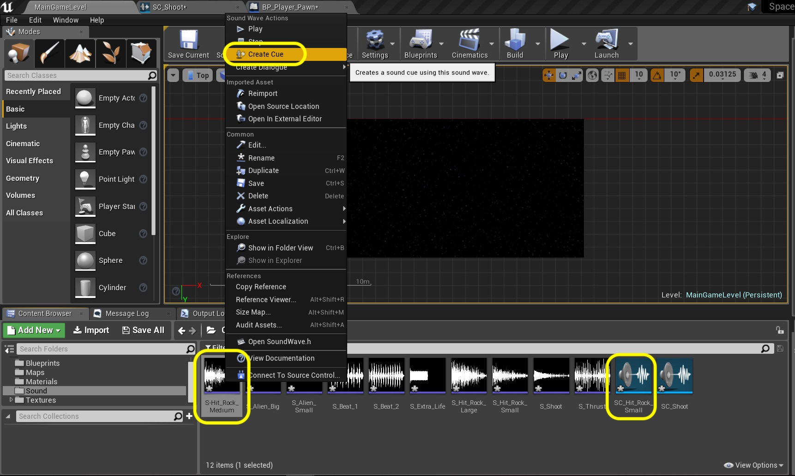

### End Game Flow Continued

_____ 



{:start="{{ num }}"}
{{ num }}. Go back to **BP_Player_Pawn** to the end of the player dies section.  Disconnect **Call Restart Space Rock Game** exit execution pin.  It will no longer change back to the gameplay state.  Take the nodes that it is disconnected from and move it closer to the left top nodes where the player dies with lives left.

  

_____ 



{:start="{{ num }}"}
{{ num }}. Copy the **Gamemode Reference**, **Set Game Mode** and **Reset Player to Start Node** and paste them below to the right.

  

_____ 


{:start="{{ num }}"}
{{ num }}.  Change the **Set Game State** to `Pre Game`.

  

_____ 


{:start="{{ num }}"}
{{ num }}. Connect the **Call Restart Space Rock Game** node to **Set Game State** execution pin.

  

_____ 


{:start="{{ num }}"}
{{ num }}. Pull off the execution pin from **Reset Player to Start** and select the **Remove All Widgets** node to get rid of the huds.

  

_____ 


{:start="{{ num }}"}
{{ num }}. Pull from the **As BP_Space_Rocks_HUD** and pull all the way to an open spot on the right and select a **Create Pre Game HUD** node.

  

_____ 


{:start="{{ num }}"}
{{ num }}.  Connect the output of the **Remove All Widgets** execution pin into the input of the **Create Pre Game HUD** pin.

  

_____ 


{:start="{{ num }}"}
{{ num }}. Pull off of the **Create Pre Game HUD** node execution pin and select a **Set Actor Hidden In Game** node set **New Hidden** to `true`.

  

_____ 


{:start="{{ num }}"}
{{ num }}.  Go back to the level blueprint.  Now we will not restart each game when this event is called, it will instead go to the pre game state. Disconnect the custom event **Begin To End** node's **Bind Event to Restart Space Rock Game** output execution node.  Move it to the **Begin Play** secdtion to the right of **Spawn Player In Center of Level** nodes:

  

_____ 


{:start="{{ num }}"}
{{ num }}. Find the **Destroy Pre Game Rocks** nodes and copy them.

  

_____ 


{:start="{{ num }}"}
{{ num }}.  Paste the nodes after the Bind Event From Player Pawn nodes. Connect the execution pin from **Bind Event Restart Space Rock Game** to **Get All Actors Of Class**.

  

_____ 


{:start="{{ num }}"}
{{ num }}. Pull off of the **For Each Loop Complete** pin and add a **Create Pre Game Rocks** node.

  

_____ 
-4U

{:start="{{ num }}"}
{{ num }}.  Play the game and lose all three lives.  Now you will notice that it goes from game over to pre game just like we wanted to.  Now lets move to the final stage and implement some sound before we finish this exercise.

<iframe class="embed-responsive-item" src="https://www.youtube.com/embed/WARpbMUe-4U?autoplay=0&rel=0&controls=0&amp&showinfo=0&version=3&loop=0&playlist=WARpbMUe-4U" frameborder="0" allowfullscreen></iframe>

_____ 

## Part 6 

### Audio
Now the final portion of this execise is to add audio to the game.

_____ 


{:start="{{ num }}"}
{{ num }}. Go back to the main game tab.  Press the **Add New** button and add a folder called `Sounds`.

  

_____ 



{:start="{{ num }}"}
{{ num }}. Press the **Import** button and go to the **Source** folder and import all `.wav` files:

  

_____ 


{:start="{{ num }}"}
{{ num }}.  You should end up with all the sounds you need for the game.  Don't be afraid to click on them and listen to them.

  

_____ 


{:start="{{ num }}"}
{{ num }}. Lets start with the shooting sound.  Now we don't want to play it raw.  We want to add a variety of tone and volume shifts to give it less repetitive repeating sound since it will play so much.  Right click on **S_Shoot** and select **Create Cue**.

  

_____ 


{:start="{{ num }}"}
{{ num }}.  Rename this cue to `SC_Shoot`.

  

_____ 


{:start="{{ num }}"}
{{ num }}. Double click the **SC_Shoot** and get to the sound cue editor.  Looks very similar to blueprints and materials.  Right click in the graph and add a **Modulator** node:

  

_____ 


{:start="{{ num }}"}
{{ num }}.  Connect the **Modulate** node pins between the **Wave Player S_Shoot** and the **Output** nodes.

  

_____ 


{:start="{{ num }}"}
{{ num }}. Play with different values in the modulator and listen to them.  For the game I am going to stick with the defaults.

<iframe class="embed-responsive-item" src="https://www.youtube.com/embed/k_9VN8AFcLI?autoplay=0&rel=0&controls=0&amp&showinfo=0&version=3&loop=0&playlist=k_9VN8AFcLI" frameborder="0" allowfullscreen></iframe>

_____ 


{:start="{{ num }}"}
{{ num }}.  Go to the **BP_Player_Pawn** blueprint and zoom out.  Look for the shooting nodes:

  

_____ 


{:start="{{ num }}"}
{{ num }}. Go to the very end of those nodes.  Pull off of the **Reload** execution pin and look for the **Play Sound 2D** node.

  

_____ 


{:start="{{ num }}"}
{{ num }}.  Click on the **Sound** dropdown and select the `SC_Shoot` sound cue.

  

_____ 


{:start="{{ num }}"}
{{ num }}. So the graph should look like:

  

_____ 


{:start="{{ num }}"}
{{ num }}.  Now go to the game and play it.  Hit the shoot button and we should trigger the sound every time you shoot.

<iframe class="embed-responsive-item" src="https://www.youtube.com/embed/I8Pcw8Q2rnA?autoplay=0&rel=0&controls=0&amp&showinfo=0&version=3&loop=0&playlist=I8Pcw8Q2rnA" frameborder="0" allowfullscreen></iframe>

_____ 


{:start="{{ num }}"}
{{ num }}. Now go back to the **Sounds** folder and right click on **S_Hit_Rock_Small** and select **Create Cue**.

  

_____ 


{:start="{{ num }}"}
{{ num }}.  Call it `SC_Hit_Rock_Small`.  Repeat for **S_Hit_Rock_Medium** by right clicking and selecdting **Create Cue**.  Call this one `SC_Hit_Rock_Medium`.

  

_____ 


{:start="{{ num }}"}
{{ num }}. Double click the **SC_Hit_Rock_Medium** and add a **Modulator** node.  I played with the **Pitch Min** and **Pitch Max** and widened it a bit to my liking.

  

_____ 


{:start="{{ num }}"}
{{ num }}.  Repeat the exact same procedure for **SC_Hit_Rock_Small**:

  

_____ 


{:start="{{ num }}"}
{{ num }}. Open up **BP_Rock_Parent**.  Lets look for the best place to put this sound.  I think the functions where we destroy the rocks looks best as it will have past all the checks.  The sound should occur when the rock is destroyed as well.

  

_____ 


{:start="{{ num }}"}
{{ num }}.  Go to the **Destroy Rock Small** tab (or double click the function to reopen the tab).  Go to the very end and pull off the **Set Score** execution pin and select another **Play Sound 2D** node.  Press **Sound** and select `SC_Hit_Rock_Small`.

  

_____ 


{:start="{{ num }}"}
{{ num }}. So your nodes should look like:

  

_____ 


{:start="{{ num }}"}
{{ num }}.  Go to the **Destroy Rock Medium** function and add a **Play Sound 2D** node at the end of it.

  

_____ 


{:start="{{ num }}"}
{{ num }}. Press **Sound** and select `SC_Hit_Rock_Medium`.

  

_____ 


{:start="{{ num }}"}
{{ num }}.  

<iframe class="embed-responsive-item" src="https://www.youtube.com/embed/amef4v-fWyI?autoplay=0&rel=0&controls=0&amp&showinfo=0&version=3&loop=0&playlist=amef4v-fWyI" frameborder="0" allowfullscreen></iframe>

_____ 


{:start="{{ num }}"}
{{ num }}. Now lets make a thrust sound every time the player holds the thrust button.  Open **BP_Player_Pawn** and add some space beneath **Event Begin Play**.  In this space add a **Spawn Sound 2D** node.  We need a reference to this sounds as we will be turning it on and off.

  

_____ 


{:start="{{ num }}"}
{{ num }}.  Pull off of the **Return Value** pin and select the **Promote to variable** option:

  

_____ 


{:start="{{ num }}"}
{{ num }}. Call it `Thrust Target`.  Make it **Private** and add it to **Category** `Targets`.  Set the **Tooltip** to `Accesses thrust sound`.

  

_____ 


{:start="{{ num }}"}
{{ num }}.  Now we don't want this sound to play so pull off of the **Set Thrust Target** output pin and selecdt **Set Active**.

  

_____ 


{:start="{{ num }}"}
{{ num }}. Connect the execution pins by connecting **Spawn Sound 2D** to **Set Gamemode Reference**. Add a comment around these nodes called `Get Thrust Sound Reference and Deactivate`.

  

_____ 


{:start="{{ num }}"}
{{ num }}.  Click **Sound** on the **Spawn Sound 2D** node and select `S_Thrust`.

  

_____ 


{:start="{{ num }}"}
{{ num }}. Zoom out on the blueprint and look for the three times we set the **Thrust Button Held** boolean.  We can use this to determine when the play these sounds.  Lets start with the Reset Thrust when Not In Gamemode and just turn the sounds off there.

  

_____ 


{:start="{{ num }}"}
{{ num }}.  Drag a **Get Thrust Target** node to the right of **Set Thrust Button Held** (that is set to **false**). Pull off the pin and look for **Set Active**.  Lets continue adding the thrust sound on the next page.

  

_____ 
  

[<- Previous](Space-Rocks-21.html)&nbsp;&nbsp;&nbsp;[Home](../index.html)&nbsp;&nbsp;&nbsp; [Continue ->](Space-Rocks-23.html)
   
   
   

