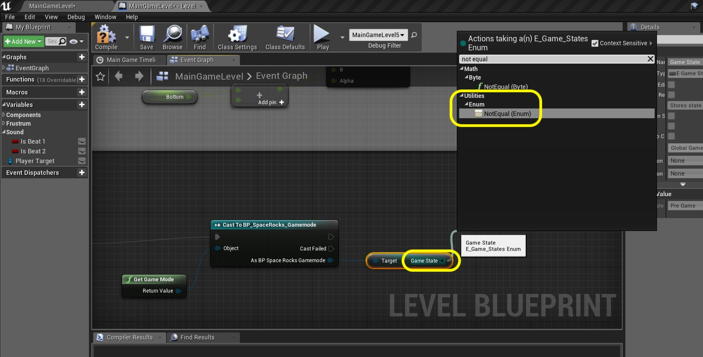

### Audio Continued

_____ 



{:start="{{ num }}"}
{{ num }}. This will ensure the thrust sound doesn't play if we exit gameplay state.

  

_____ 



{:start="{{ num }}"}
{{ num }}. Now scroll over to where we chnage ship flipbooks.  Add to the right of **Set Flipbook** add a **Get Thrust Target** node.  Add a **Set Active** node and set **New Active** to `true`.

  

_____ 


{:start="{{ num }}"}
{{ num }}. Add another **Set Active** node beneath it and set **New Active** to `false`.

  

_____ 



{:start="{{ num }}"}
{{ num }}. Connect the **Set Flipbook** that sets to the thrust animation to the **Set Active** node that is set to **True**.  Connect the **Set Flipbook** that sets to the idel animation to the **Set Active** node that is set to **False**. 

  

_____ 



{:start="{{ num }}"}
{{ num }}. Add comment to these nodes `Turn On and Off Thrust Sound`.

  

_____ 



{:start="{{ num }}"}
{{ num }}. Run the game and press the thrust button.  Uh oh, I don't hear anything.  Leave the game and look at the **Output Log** tab.  I see there are some errors. It says that this object is pending kill.  It is possible that when we spawned it that the game doesn't try and keep it around.

  

_____ 



{:start="{{ num }}"}
{{ num }}. Go back to the **Spawn Sound 2D** node and press the small triangle at the bottom to get the advanced features of that node. Look at **Auto Destroy** and it is set to `true`.  Now we want this sound to stick around for the game we need to set it to false.

  

_____ 



{:start="{{ num }}"}
{{ num }}. Set the **Audo Destroy** to `false` then close the node back up by pressing the triangle again.

  

_____ 



{:start="{{ num }}"}
{{ num }}. Go to the game and play it.  The thrust sound plays once. But if we hold the button it doesn't continue playing.  Lets fix that.

<iframe class="embed-responsive-item" src="https://www.youtube.com/embed/n6nhICCQhzA?autoplay=0&rel=0&controls=0&amp&showinfo=0&version=3&loop=0&playlist=n6nhICCQhzA" frameborder="0" allowfullscreen></iframe>

_____ 



{:start="{{ num }}"}
{{ num }}. Open the **S_Thrust** sound file and set **Sound Wave \| Looping** to `true`:

  

_____ 



{:start="{{ num }}"}
{{ num }}. Now the sound will keep looping until it is disactivated.

  

_____ 


{:start="{{ num }}"}
{{ num }}. Play the game.  You will now notice that when you play the game that the thrust sound will keep playing as long as you are holding down the **Thrust** button.

<iframe class="embed-responsive-item" src="https://www.youtube.com/embed/1kcs1E153Hs?autoplay=0&rel=0&controls=0&amp&showinfo=0&version=3&loop=0&playlist=1kcs1E153Hs" frameborder="0" allowfullscreen></iframe>

_____ 



{:start="{{ num }}"}
{{ num }}. Now we want a heart bead sound to play at any point when the game state is not in **Pre Game** mode.  Lets open the **Level Blueprint** and create a new Variable.  Call is `Is Beat 1` and set the **Variable Type** is `Boolean` and set **Private** to `true`.  Set the **Category** to `Sound`.  Add a **Tooltip** that says `Toggles heartbeat sound1 on and off`.

  

_____ 



{:start="{{ num }}"}
{{ num }}. Right click on **Is Beat 1** and select **Duplicate**.  Change the **Tooltip** to adjust **sound 1** to `sound 2`.

  

_____ 



{:start="{{ num }}"}
{{ num }}. Go to the bottom of the level blueprint and add a **Event Tick** node.

  

_____ 



{:start="{{ num }}"}
{{ num }}. Next to **Event Tifck** add a **Get Game Mode** node.  Pull off the **Return Value** and cast it to **Cast To BP_SpaceRocks_Gamemode**.

  

_____ 


{:start="{{ num }}"}
{{ num }}. Pull off of the **As BP SpaceRocks_Gamemode** node and select a **Get Game State** node:

  

_____ 


{:start="{{ num }}"}
{{ num }}. Pull the output of the **Game State** node and look for **Enum \| Not Equal (Enum)**.  We want the not equal node because we want it to play in any state escept for **Pre Game**.

  

_____ 


{:start="{{ num }}"}
{{ num }}. Make sure the state in the **Not Equal** node is set to `Pre Game`.  Pull of the **Cast** pin and add a **Branch Node**.  Connect the end of the **Not Equal** node to the input boolean pin on the **Branch** node.

  

_____ 


{:start="{{ num }}"}
{{ num }}. Drag a **Get Is Beat 1** node to the right of the **Branch** node.

  

_____ 


{:start="{{ num }}"}
{{ num }}. Pull off the **Is Beat 1** node and select a `Branch` node.  Connect its **Not Equal True** output and put in the **Branch** input.

  

_____ 


{:start="{{ num }}"}
{{ num }}. Pull off of the **Branch False** and select a **Play Sound 2D** node.  Set the sound to `S_Beat_1`.

  

_____ 


{:start="{{ num }}"}
{{ num }}. Pull off of the **Play Sound 2D** true and select a **Set Is Beat 1** node and set it to `true`.  This stops this sound from triggering again until after the delay when it is set back to **false**.

  

_____ 


{:start="{{ num }}"}
{{ num }}. Pull off of the **Set Is Beat 1** exit execution pin and select a **Delay** node. Add a **Duration** of `1.4`.  Then add a **Set Is Beat 1** node and set it to `false`.

  

_____ 


{:start="{{ num }}"}
{{ num }}. Add a `Heartbeat Sound` comment around these nodes.  Drag a **Get Is Beat 2** node beneath the **Is Beat 1** node.

  

_____ 


{:start="{{ num }}"}
{{ num }}. Add a **Branch** node and pull off the **False** pin and add a **Delay** node.  Now we want to have the sound come half way between the previous one.  Alter the **Duration** to `.7`.  This is half the total duration of the Is Beat 1 nodes.

  

_____ 


{:start="{{ num }}"}
{{ num }}. Pull off of the **Delay Complete** node and select a **Play Sound 2D** node.  Now I forgot to set **Is Beat 1** back to true.  Inbetween **Branch** and **Delay** add a **Set Is Beat 2** node:

  

_____ 


{:start="{{ num }}"}
{{ num }}. Connect the execution pins of the **Set Is Beat 2** node to **Branch** and **Delay** as well as set the boolean to `True`.

  

_____ 


{:start="{{ num }}"}
{{ num }}. Set the **Play Sound 2D** node's **Sound** list to `S_Beat_2`.

  

_____ 


{:start="{{ num }}"}
{{ num }}. Add a **Delay Node** and set the **Duration** to `0.7`.  Then string a **Set Is Beat 2** node and set it to `True`. 

  

_____ 


{:start="{{ num }}"}
{{ num }}. Go back to the begining of the Heartbeat Sound nodes.  Add a **Sequence** node between the two **Branch** nodes.

  

_____ 


{:start="{{ num }}"}
{{ num }}. Connect the **Sequence** input execution node.  Connect the **Then 1** to the top **Branch** input and the **Then 2** to the bottom **Branch** node.

  

_____ 


{:start="{{ num }}"}
{{ num }}. Play the game and we should have the framework complete.  I will let you add a large rock and finish the game all on your own.

<iframe class="embed-responsive-item" src="https://www.youtube.com/embed/EHVEDmyV3Vs?autoplay=0&rel=0&controls=0&amp&showinfo=0&version=3&loop=0&playlist=EHVEDmyV3Vs" frameborder="0" allowfullscreen></iframe>

_____ 

## The End

_____ 
  

[<- Previous](Space-Rocks-22.html)&nbsp;&nbsp;&nbsp;[Home](../index.html)
   
   
   

