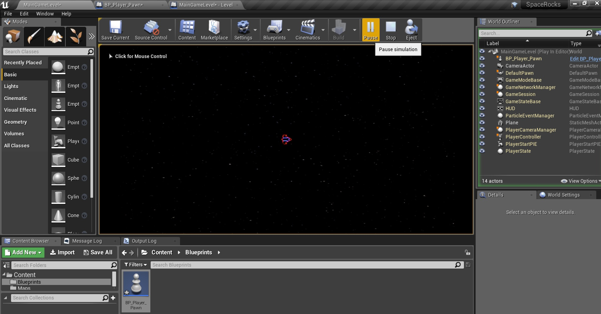

### Import Sprites

_____ 



{:start="{{ num }}"}
{{ num }}. I have included **SpaceRocksSpriteSheet.psd** to show you how the main sprite sheet is set up.  The grid is set to `32` by `32` and you can see all the assets we will need in the game including two ship sprites, two aliens, 1 small rock, 2 medium rocks and 3 large rocks.  There are ship and rock explosions as we as various HUD messages and elements.  We will not be using the numbers that are in this sprite sheet.  Please look at the channels to see that I have put a **true** alpha in these sprites as shown in the first **Material** walk throughs. If you want to refresh your memory link to [Decals Step 14](../Lesson-2/Intro-To-Materials-10.html#decals). 

  

_____ 


{:start="{{ num }}"}
{{ num }}. Now there is a TGA of this same file that we will be importing.  Go to the **Textures** folder and press the **Import** button.  Select **T_Spacerocks_Sprite_Sheet.tga** and then press **Open**.

  

_____ 


{:start="{{ num }}"}
{{ num }}. Double click the texture and it now loses its black background as the **Alpha** is being processed by the engine.  Since this is a 2D sprite we do not want it to MipMap and behave like a normal texture.  In fact with the camera we are using it will use the incorrect version and you will get fuzzy sprites.  We turn it off by changing the **Compression Settings** to `UserInterface2D (RGBA)`.

  

_____ 


{:start="{{ num }}"}
{{ num }}.  Change **Mip Gen Settings** to `NoMipMaps`.

  

_____ 



{:start="{{ num }}"}
{{ num }}. Change **Texture Group** to `UI`. Now in game it will be loading the entire sprite sheet. We will have to tell the engine how to split up the sheet into indidual frames. So it will load the texture but we will have multiple sprites that will just be a UV index into this texture.

  

_____ 



{:start="{{ num }}"}
{{ num }}. To do this we need to right click on the newly imported texture and select **Sprite Actions \| Extract Sprite**.  We don't use **Create Sprite** as this would make this entire bitmap one sprite.

  

_____ 


{:start="{{ num }}"}
{{ num }}. The **Extract Sprite** pop up appeas and it defaults to **Sprite Extract Mode**.  UE4 does its best to auto cut up the sprites.  I can see that there are a few issues.  Some of the explosions are combined.  One of the sprites is cut up into what looks like 20 pieces.  The HUD is cut up by letter as opposed to by Sentence (the game engine can't suss my meaning in these words).  But don't fret there is a manual work around.  Press the **Sprite Extract Mode** Auto drop down.

  

_____ 


{:start="{{ num }}"}
{{ num }}. Select the `Grid` option and you see that it sees the entire texture as 1 grid piece.

  

_____ 


{:start="{{ num }}"}
{{ num }}. So I will import the first row of sprites that are all **64** by **64** pixels. Set the **Cell Width** and **Cell Height** to `64`. Now there are 14 sprites all on the first row I want to extract so set the **Num Cells XZ** to `14` which selects 14 columns. Now this sets all rows to 1 by setting **Num Cells Y** to `1`.  So it should look like this. Once yours matches mine press the green **Extract** button:

  

_____ 


{:start="{{ num }}"}
{{ num }}. Open up any of the **Sprites** you just imported and look at it in the editor.  Notice the **Source UV's** on the top right and dimensions.  This indicates where in the **Source Texture** the sprite is located.  If you have to adjust the sprite sheet and reimport it, if the texture moves you will have to adjust these UV's.  Notice that the **Pixels per unit** is equal to **1.0**.  This is what we want for this game. Some displays do have a different pixel ratio especially on handheld.  Also the **Pivot** which can be seen in the preview window centers it on the sprite.  This is probably what we want as it rotates around this point. You can close this sprite now.

  

_____ 


{:start="{{ num }}"}
{{ num }}. Now I renamed all the **Sprites** except for 2.  I gave them all a `SP_` prefix.  The sprites that are meant to be one animation, I gave the same name with a numbered suffix. Rename the sprites to match the wording in the photo:

  

_____ 


{:start="{{ num }}"}
{{ num }}. Create a new folder under **Textures** called **Sprites** and drag the files with **SP_** in the suffix to this folder.

  

_____ 


{:start="{{ num }}"}
{{ num }}. Select **Move Here** as we don't want multiple copies lying around different folders.

  

_____ 


{:start="{{ num }}"}
{{ num }}. If you click on the **Sprites** folder they should all be neetly organized there.

  

_____ 


{:start="{{ num }}"}
{{ num }}. Go back to the **Textures** folder and right click on the master Sprite Texture and select **Sprite Actions \| Extract Sprite** again:

  

_____ 


{:start="{{ num }}"}
{{ num }}. Lets extract the HUD messages so change **Sprite Extract Mode** to `Grid` and change **Cell Width** to `448` and **Cell Height** to `64`.  It should now separate the HUD elements **Space Rocks**, **Game Over!**, **Press Enter** and **Start Game**.

  

_____ 


{:start="{{ num }}"}
{{ num }}. Now there are only two rows and columns that we want to extract for the HUD.  So change **Num Cells X** and **Num Cells Y** to `2`.  Notice though that is the top two lines.  We need a margin on the **Y** axis to offset this selector.

  

_____ 


{:start="{{ num }}"}
{{ num }}. It is two rows down of 64 pixel high artwork.  So, set the **Margin Y** to `128`, confirm that it now selects just the HUD text, then press the green **Extract** button:

  

_____ 


{:start="{{ num }}"}
{{ num }}. Rename the four HUD sprites and the two sprites I forgot to rename last step and **Move** them to the **Sprites** folder.

  

_____ 


{:start="{{ num }}"}
{{ num }}. Now lets extract the medium size rocks and the large alien ship.  Go back to the **Textures** folder and right click on the master Sprite Texture and select **Sprite Actions \| Extract Sprite** again. Change **Sprite Extract Mode** to `Grid` and change **Cell Width** to `128` and **Cell Height** to `128`. Set **Num Cells X** to `5` and **Num Cells Y** to `1`.  Set the **Margin Y** to `256`. Press the green **Extract** button:

  

_____ 


{:start="{{ num }}"}
{{ num }}. Now lets extract the medium size rocks and the large alien ship.  Go to the **Textures** folder and right click on the master Sprite Texture and select **Sprite Actions \| Extract Sprite** again. Change **Sprite Extract Mode** to `Grid` and change **Cell Width** to `192` and **Cell Height** to `192`. Set **Num Cells X** to `0` and **Num Cells Y** to `1`.  Set the **Margin Y** to `416`. Press the green **Extract** button:

  

_____ 


{:start="{{ num }}"}
{{ num }}. Now lets do the final sprite extraction.  Our HUD has 3 lives and we have a small icon for this.  Go to the **Textures** folder and right click on the master Sprite Texture and select **Sprite Actions \| Extract Sprite** again. Change **Sprite Extract Mode** to `Grid` and change **Cell Width** to `112` and **Cell Height** to `32`. Set **Num Cells X** to `1` and **Num Cells Y** to `1`.  Set the **Margin Y** to `608`. Press the green **Extract** button:

  

_____ 


{:start="{{ num }}"}
{{ num }}. Rename the sprites and move them to the **Sprites** folder.  Make sure you check that the **Medium** and **Large** rocks are correct.  It is hard to tell by the icon alone.

  

_____ 


{:start="{{ num }}"}
{{ num }}. Now you should click on the **Sprites** folder and should have this texture sheet cut up to represent all the sprites you will need in this game! Press **Save All** and update Github by **committing** and **pushing** all the changes made.

  

_____ 

### Getting BP Setup
Now we need to start with the spaceship.  Lets get the blueprint setup.  Figure out how to spawn the player.  Get a state switch in the ship animation by adding an input action.  Lets get started.

_____ 


{:start="{{ num }}"}
{{ num }}. Go to the **Sprites** folder.  Now I want to make a small addition.  It is possible that I would want animation on the ship and not have a static single frame (Sprite). This is called a **Flipbook**.  So I am doing this so we can add frames later without changing any blueprinting.  So right click on **SP_Ship_Idle** and select **Create Flipbook**.  Call it `FB_Ship_Idle`.

  

_____ 


{:start="{{ num }}"}
{{ num }}. Repeat for the **SP_Ship_Thrust** and make it into a flipbook as well and name it `FB_Ship_Thrust`.  Now you should have two files with the prefix **FB_** for the ship!

  

_____ 


{:start="{{ num }}"}
{{ num }}. Now go the **Blueprints** folder and press the **Add New** button and select **Blueprint Class**.  Now in the options which class matches our game the closest. We do not have a humanoid character and the physics are simple.  All we need to do is possess a controller so select the **Pawn** class:

  

_____ 


{:start="{{ num }}"}
{{ num }}. Call it `BP_Player_Pawn`:

  

_____ 


{:start="{{ num }}"}
{{ num }}. Open the newly created blueprint and press the **Add Component** button and select **Paper Flipbook**:

  

_____ 


{:start="{{ num }}"}
{{ num }}. Select the ***Flipbook** `FB_Ship_Idle`.  Now since the camera is pointing downwards we need to rotate the sprite so it is parallel to the ground.  Change the **X Rotation** to `-90.0`.  Now I want it to start pointing right so I am making a guess and rotate around the **Z** to `-90` as well.

  

_____ 


{:start="{{ num }}"}
{{ num }}. We will add the player to the level by blueprint.  But just to test our work, lets drag the **BP_Player_Pawn** into the game scene.  OK, the player is pointing at the camera but you can just see behind the root sphere that it is pointing to the left.  We want the front of the ship to be pointing positive **X** (in the direction of the red arrow).

  

_____ 


{:start="{{ num }}"}
{{ num }}. Go back to the tab and change the **Z** rotation to positive `90.0` to make the player face along the positive **X** direction.  Press compile and make sure it is pointing to the right in game.  When it is delete the player.  We will be addit it to the game through code: 

  

_____ 


{:start="{{ num }}"}
{{ num }}. We will spawn the player blueprint through the level blueprint.  Press the **Blueprints** button and select **Level Bluprint**:

  

_____ 


{:start="{{ num }}"}
{{ num }}. To keep a clean graph lets add the blueprint nodes below the camera deletion nodes.  Lets add a **Sequence** node.  Highjack the **Event Begin Play** execution pin and send it to the **Sequence** input.  Take the **Then 0** pin and attach it to the **Get All Actors Of Class**:

  

_____ 


{:start="{{ num }}"}
{{ num }}. Pull of the **Then 1** pin and add the **Spawn Actor from Class** node:

  

_____ 


{:start="{{ num }}"}
{{ num }}. In this node select the **Class \| Select Class** drop down menu and pick the **BP_Player_Pawn**.

  

_____ 


{:start="{{ num }}"}
{{ num }}. We need to put the player in the middle of the room and need to put it in a specific **Location**.  Right click on the **Spawn Transform** and select **Split Struct Pin**:

  

_____ 


{:start="{{ num }}"}
{{ num }}. Now the background is at **Z** location **0** and the Camera is at **Z** location **1980**.  Lets put the **Spawn Transform Location** to **Z** `10.0`.  Now remember with the **Orthographic** camera this will not affect the scale or size, just the sorting putting it between the background and the camera.

  

_____ 


{:start="{{ num }}"}
{{ num }}. Now the level is 1920 units wide.  We want to spawn in the center of this.  As opposed to doing the division in your head or a calculator, you can type in the formula into the node.  Go to the **Spawn Transform Location** and in the **X** box type `1920/2` then press enter:

  

_____ 


{:start="{{ num }}"}
{{ num }}. Notice that it changes to **960.0**.  Now enter in the **Y** field `1080/2` to get the center of the height of the screen.

  

_____ 


{:start="{{ num }}"}
{{ num }}. The **Spawn Transform Location** should now have `960.0`, `540.0` and `10.0`. Add the comment `Spawn Player in Center of Level` aroudn the **Spawn** node.  Press the **Compile** button.

  

_____ 


{:start="{{ num }}"}
{{ num }}. Press the play button and the player should spawn in the middle of the screen facing right. On the next page we will add basic controls for the player.

  

_____ 

  

[<- Previous](Space-Rocks-2.html)&nbsp;&nbsp;&nbsp;[Home](../index.html)&nbsp;&nbsp;&nbsp; [Continue ->](Space-Rocks-4.html)
   
   
   

