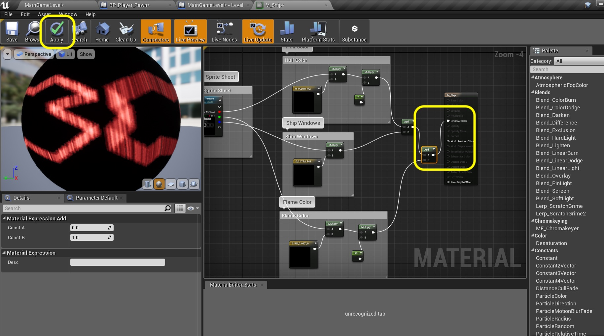

### Getting BP Setup Continued

_____ 



{:start="{{ num }}"}
{{ num }}. Now the player does nothing so we need to add some player input.  Lets do this globally by opening **Edit \| Project Settings**:

  

_____ 


{:start="{{ num }}"}
{{ num }}. Lets add the thrust action of giving the ship acceleration and switching sprites to show the flame.  Go to **Engine \| Input** and press the **+** button next to **Action** mappings.  Open the triangle and call the **Action** `Thrust`.  Press the **+** button next to this and open the arrow. Select **Keyboard \| W** as one of the keys.  

  

_____ 


{:start="{{ num }}"}
{{ num }}. Press the **+** button next to thrust again and now assign the **Keyboard \| Up** key.

  

_____ 


{:start="{{ num }}"}
{{ num }}. So your input mappings should look like:

  

_____ 


{:start="{{ num }}"}
{{ num }}. Now before we can add controls to the player pawn the blueprint needs to possess the controller.  Open **BP_Player_Pawn** and go to the **Event Graph**.  Next to the greyed out **Event Begin Play** right click and add a **Get Player Controller** node:

  

_____ 


{:start="{{ num }}"}
{{ num }}. This is a single player game and there is only one player so we will leave the **Player Index** at **0**.  Pull off of the **Return Value** and select the node **Possess**:

  

_____ 


{:start="{{ num }}"}
{{ num }}. Connect the execution pins between **Event Begin Play** and **Possess**.  Notify as soon as you connect it the **Event Begin Play** is no longer in its greyish inactive state.  Add a comment that explains the node:

  

_____ 


{:start="{{ num }}"}
{{ num }}. Now look the **Possess** node there is an **In Pawn** pin with nothing attached.  We want the blueprint we are in to be in possession.  Right click on the open graph and select the **Self** node.  Connect the pin to the **In Pawn** pin in Possess.  Press the **Compile** button:

  

_____ 


{:start="{{ num }}"}
{{ num }}. Now the event that we will use will only create a key press and key release but I want to detect a key held. So we are going to create a boolean to keep track of this state for the ship.  Press the **+** button next to **Variable** and call it `Thrust Button Held`.  Make it type **Boolean**, **Private** and set the **Category** to `Input`.  Add a **Tooltip** that says `True if thrust button is pressed and not released`,

  

_____ 


{:start="{{ num }}"}
{{ num }}. Now we crated an action event called thrust in the project settings inputs.  So right click on the open graph and select the **Action Event \| Thrust** event which I found easiest by typing event thrust in the search bar:

  

_____ 


{:start="{{ num }}"}
{{ num }}. Drag two **Set Thrust Button Held** nodes to the graph.

  

_____ 


{:start="{{ num }}"}
{{ num }}. Connect the **Pressed** pin to the first **Set** node and make sure the boolean has a check mark setting it to `true`.  Connect the **Released** node to the second **Set** node and leave the boolean unchecked at `false`.

  

_____ 


{:start="{{ num }}"}
{{ num }}. Add a comment around the two **Set** nodes that states `Sets State Boolean for Thrust**.

  

_____ 


{:start="{{ num }}"}
{{ num }}. We will do the physics later and make the ship move.  For now lets just change the animation frame.  So when it is pressed we will see the **Thrust** flipbook and when it isn't the **Idle** flipbook.  Pull off of the **Set Thrust Button Held** node for the **Pressed** flow and select the **Set Flipbook(Paper Flipbook)** node:

  

_____ 


{:start="{{ num }}"}
{{ num }}. Press on the **New Flipbook** list and select the **FB_Ship_Thrust** option:

  

_____ 


{:start="{{ num }}"}
{{ num }}. Copy and paste the **Set Flipbook** node.  Connect the output of the **Paper Flipbook** pin to the **Target** pin in the pasted **Set Flipbook** node.  Change the **New Flipbook** to `BP_Ship_Idle`:

  

_____ 


{:start="{{ num }}"}
{{ num }}. Connect the execution pin from the **Set** node from the **Released** flow to the **Set Flipbook** for the idle animation.  Add a comment over the three nodes that states `Alternate Between Thrust and Idle Ship Anims`. Press the **Compile** button.

  

_____ 


{:start="{{ num }}"}
{{ num }}. Play the game and press the **W** and **Up** keys and release them.  The flipbook should change when this happens. Press **Save All** and update Github by **committing** and **pushing** all the changes made.

<iframe class="embed-responsive-item" src="https://www.youtube.com/embed/pdrzJ--3mZw?autoplay=1&rel=0&controls=0&amp&showinfo=0&version=3&loop=1&playlist=pdrzJ--3mZw" frameborder="0" allowfullscreen></iframe>

_____ 

### Create Space Ship Material

Now that we have the base animation in we can create a custom material.  The colors in the ship are not to be the colors of the texture in game.  They are using the RGB channels so that we can set the colors in a material.  

_____ 


{:start="{{ num }}"}
{{ num }}. Go to the **Materials** folder and press the **Add New** button.  Select **Material** and call it `M_Ship`.

  

_____ 


{:start="{{ num }}"}
{{ num }}. Open the Material.  Select the main node and change the **Shading Model** to `Unlit`.

  

_____ 


{:start="{{ num }}"}
{{ num }}. Now we don't use the standard texture sample node.  Since we are using them as sprites we want to add a **Sprite Texture Sampler** node:

  

_____ 


{:start="{{ num }}"}
{{ num }}. Now we don't target the individual sprites, but the entire sprite texture sheer.  Press **Texture \| Default Texture** and then select `T_Space_Rocks_Sprite_Sheet`.

  

_____ 


{:start="{{ num }}"}
{{ num }}. Select a **Vector3** node and choose the color pink by double clicking on the black swatch.  This is the color of the hull of the ship.

  

_____ 


{:start="{{ num }}"}
{{ num }}. Drag off of the **Red Pin** on the **Source Texture** node as this is the hull of hte ship.  Add a **Multiply** node: 

  

_____ 


{:start="{{ num }}"}
{{ num }}. Connect the pin out of the **Vector 3** pink node to the **B** input of the **Multiply** node:

  

_____ 


{:start="{{ num }}"}
{{ num }}. Add a **Multiply** node and a **Scalar** node set to `2.0`.

  

_____ 


{:start="{{ num }}"}
{{ num }}. Connect the output of the first **Multiply** node into the **A** input of the second **Multiply** node.  Send the scalar output into the **B** side of the second **Multiply** node:

  

_____ 


{:start="{{ num }}"}
{{ num }}. Connect the output of the second **Multiply** node to the input of the **Emissive** node on the main material node.  Also, add a comment naming the part of the ship that this is affecting, primarilly the hull.

  

_____ 


{:start="{{ num }}"}
{{ num }}. Now lets look at it on the ship. Press the **Apply** button then go to **BP_Player_Pawn** and select the **Viewport** and highlight the **PaperFlipbook** component.  On the right hand side **Details** panel assin the **M_Ship** material to the Material slot:

  

_____ 



{:start="{{ num }}"}
{{ num }}. Now we see that the Red hull that was originally there is replaced with the pink hull we just added to the Material:

  

_____ 


{:start="{{ num }}"}
{{ num }}. Run the game and you should see the pink ship.

  

_____ 


{:start="{{ num }}"}
{{ num }}. Copy and paste the **Vector 3** and **Multiplication** nodes underneath.  Attach the **Blue** pin to the **A** side of this new pasted **Multiply** node.  It should look like:

  

_____ 


{:start="{{ num }}"}
{{ num }}. Now this will be for the windows.  Since they don't overlap with the hull, we can just add the outputs together.  Right click and add an **Add** node:

  

_____ 


{:start="{{ num }}"}
{{ num }}. Connect the output of both **Multiply nodes to the two *Add** node inputs.

  

_____ 


{:start="{{ num }}"}
{{ num }}. Connect the output of the **Add** node to the **Emissive Color** input on the main material node.  Add a comment saying `Ship Windows` to the two nodes.  Press the **Apply** button:

  

_____ 


{:start="{{ num }}"}
{{ num }}. Play the game, and you should now see a pink hull with green windows.

  

_____ 


{:start="{{ num }}"}
{{ num }}. Go back to **M_Ship** material and copy and paste to the bottom all **Hull Color** nodes:

  

_____ 


{:start="{{ num }}"}
{{ num }}. Take the output **green** pin from the **Sprite Texture Sample** node and put it to the **A** side of the first **Multiply** node in the pasted work.  Change the comment to `Flame Color`.

  

_____ 


{:start="{{ num }}"}
{{ num }}. Change the flame color to a **Red**.  Change the **Scalar** to `25.0`.

  

_____ 


{:start="{{ num }}"}
{{ num }}. Add a second **Add** node next to the first one.  Take the output of the first node and place it into the **A** input of the second **Add** node. Take the output of the last **Multiply** node from the ship flame to the **B** side of this **Add** node:

  

_____ 


{:start="{{ num }}"}
{{ num }}. Take the output of the second **Add** node and send it to the **Emissiv Color** node.  Press the **Apply** button.

  

_____ 


{:start="{{ num }}"}
{{ num }}. Select to preview the material on a flat plane as opposed to a sphere.  Check out the ship sprite with the flame to see the final result on the sprite sheet.

  

_____ 


{:start="{{ num }}"}
{{ num }}. Go to the game and play it.  Press the thrust button and see all the material colors at play. Press **Save All** and update Github by **committing** and **pushing** all the changes made. On the next page we will add physics to the ship starting with implementing rotation.

  

_____ 

  

[<- Previous](Space-Rocks-3.html)&nbsp;&nbsp;&nbsp;[Home](../index.html)&nbsp;&nbsp;&nbsp; [Continue ->](Space-Rocks-5.html)
   
   
   

