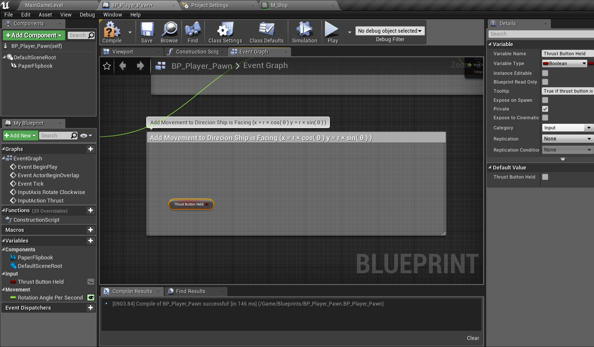
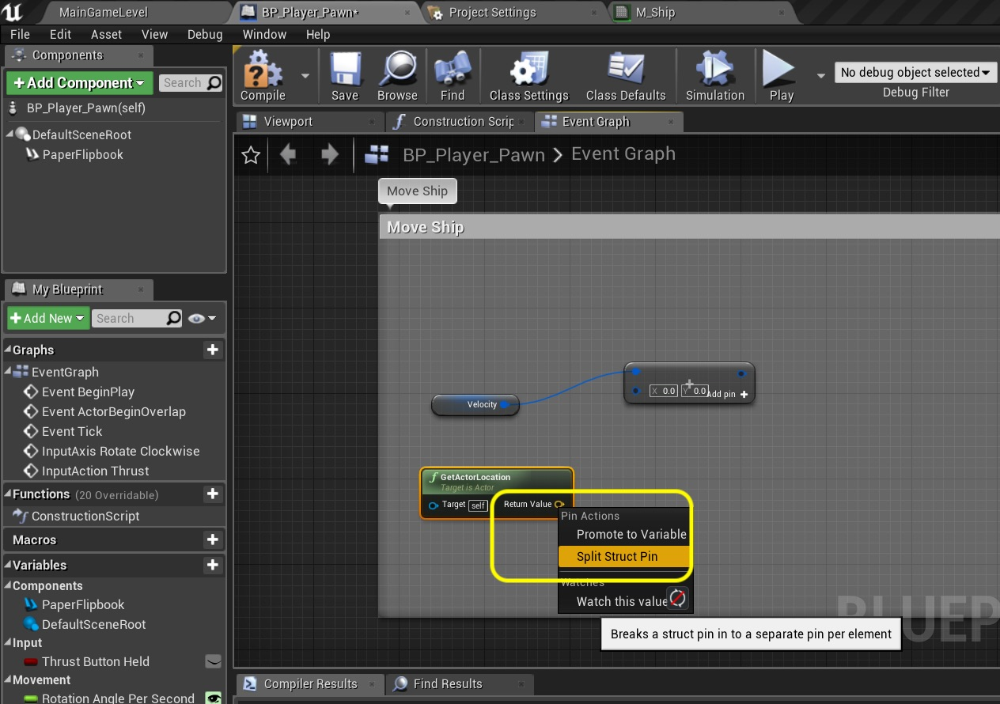

### Ship Rotation
The A and D or Left and Right key will controll ship rotation.  We will be adding a new axis mapping input for this. 
_____ 



{:start="{{ num }}"}
{{ num }}. Now we need to add some more global input controls.  Got to **Edit \| Project Settiungs**:

  

_____ 


{:start="{{ num }}"}
{{ num }}.  Go to **Engine \| Input** and press the **+** button next to **Axis Mappings**.  Press the arrow to expand and name the new mapping `Rotate Clockwise`.  Press the **+** next to **Rotate Clockwise**:

  

_____ 


{:start="{{ num }}"}
{{ num }}. Assign the **Keyboard \| Right** and **Keyboard \| D** key for clockwise with the **Scale** set to `1.0`.  

  

_____ 


{:start="{{ num }}"}
{{ num }}.  To rotate in the othe direction uses a negative number.  So set the controls to **Keyboard \| Left** and **Keyboard \| A** to a **Scale** of `-1.0`.  We don't need a separate axis as we can just multiply the turn rate by the left axis (-1) and get a counter clockwise direction.

  

_____ 


{:start="{{ num }}"}
{{ num }}. Go back to **BP_Player_Pawn** and right click at the bottom of the open graph.  Type **Event Rotate Clockwise** and selecxt the **Axis Event \| Rotate Clockwise** node:

  

_____ 


{:start="{{ num }}"}
{{ num }}. Add a new **Float** variable called `Rotation Angle Per Second`.  Set it to **Instance Editiable** and **Private**.  Put it in **Catergory** `Movement`.  Give it a **Tooltip** `Degrees per second for ship rotation`.

  

_____ 


{:start="{{ num }}"}
{{ num }}. We don't want the default to be **0** so we need to set it for the **Rotation Angle Per Second** variable.  You need to press the **Compile** button then set the **Default Value** to `100.0`.

  

_____ 


{:start="{{ num }}"}
{{ num }}.  Drag and drop a **Get Rotation Angle Per Second** node and place it next to the **Axis Event Rotate Clockwise**:

  

_____ 


{:start="{{ num }}"}
{{ num }}. Pull off the **Rotation Angle Per Second** pin and select a **FLoat * Float**node.  Multiply this by the **Axis Value** from the **Axis Event** node (the axis value will return a number ranging from -1 to 1).

  

_____ 


{:start="{{ num }}"}
{{ num }}.  Now we can't use degrees per second but need degrees per frame.  We also don't know the length of time since the last frame.  To accomplish this pull the pin from the output of the **Multiply** node and select another **Float * Float** node.  Drag the reference to the **Event Tick** (or add it if you deleted it) to be closer.

  

_____ 


{:start="{{ num }}"}
{{ num }}. Multiply this by the **Delta Seconds** pin coming off of the **Event Tick**.  This converts it from degrees per second to degrees since last frame.

  

_____ 


{:start="{{ num }}"}
{{ num }}.  Add a **Get Actor Rotation** node to get the ship's current angle in degrees.

  

_____ 


{:start="{{ num }}"}
{{ num }}. We are only rotating on the **Z** axis and don't need to use a 3 float rotator.  We can right click the **Return Value** pin of the **Get Actor Rotation** node na dselect **Split Struct Pin**.

  

_____ 


{:start="{{ num }}"}
{{ num }}. Now add a **Float + Float** node and add the **Return Value Z Yaw** from the **Set Actor Rotation** node to the output of the **Multiply** node that gives us the delta degress to rotate this frame:

  

_____ 


{:start="{{ num }}"}
{{ num }}. Right click on the open graph and add a **Set Actor Rotator** node.  Connect the execution pin to the **Axis Event Rotate Clockwise**:

  

_____ 


{:start="{{ num }}"}
{{ num }}.  We are just updating the **Yaw** so right lcick the **New Rotation** pin on **Set Actor Rotation** and select **Split Struct Pin**:

  

_____ 


{:start="{{ num }}"}
{{ num }}. Connect the output of the **Addition** node to the **New Rotation Z (Yaw)** pin in the **Set Actor Rotation** node.

  

_____ 


{:start="{{ num }}"}
{{ num }}.  Claen up the work and make the nodes look neat, add a comment over these nodes and press the **Compile** button.

  

_____ 


{:start="{{ num }}"}
{{ num }}. Run the game.  You should be able to rotate with the left and right keys or the a and d keys. You can also still thrust and it will change the animation.  Press **Save All** and update Github by **committing** and **pushing** all the changes made. Next up we will add the physics for pressing thust!

<iframe class="embed-responsive-item" src="https://www.youtube.com/embed/dlAKLhQzv48?autoplay=1&rel=0&controls=0&amp&showinfo=0&version=3&loop=1&playlist=dlAKLhQzv48" frameborder="0" allowfullscreen></iframe>

_____ 

## Ship Thrust
Now we will be adding thrust to the physics model where the ship will move based on its facing direction.  We will need to convert from the cartesian coordinate system (anlge in degrees and radius) back to a 2D vector in local space.  Lets get started.
_____ 


{:start="{{ num }}"}
{{ num }}. Open **BP_Player_Pawn** blueprint.  Drag a reference to add the **Get Thrust Button Held** node onto the bottom of the graph chart: 

  

_____ 


{:start="{{ num }}"}
{{ num }}. Add a comment and make some space for some more nodes. Add a comment that has the formula for getting the point on the circumpherance of a circle which we will need to figure out the vector for movement.  Write `Add Movement to Direction Ship is Facing (x = r x cos(theta); y = r x sin(theta))`.

  

_____ 


{:start="{{ num }}"}
{{ num }}.  Now we need to set up some variables that we will be using.  First is how much acceleration should the thrust button add per second.  Add a **Float** variable called `Acceleration` that is **Instance Editable** and **Private**.  Put it in **Category** `Movement`.  Set the **Tooltip** to `Units per second for ship to add acceleration in ue4 units`. Press the **Compile** button so you can set the **Default Value** for **Acceleration** to `3.0`:

  

_____ 


{:start="{{ num }}"}
{{ num }}. Add a **Float** variable called `Speed` that is  **Private**.  Put it in **Category** `Movement`.  Set the **Tooltip** to `Magnitude of the Velocity Vector 2D`. 

  

_____ 


{:start="{{ num }}"}
{{ num }}. Now add a new variable called `Velocity`.  This is a struct with an **X** and **Y** location for a 2D Vector.  Press the **Variable Type** and look for a **Vector 2D** struct.

  

_____ 


{:start="{{ num }}"}
{{ num }}. Make this vector **Private** and put it in **Category** `Movement`.  The **Tooltip** should read the `Vector of velocity in local space`.

  

_____ 


{:start="{{ num }}"}
{{ num }}.  Now we only want to calculate a new Acceleration if the thrust button is pressed.  So pull off of the **Thrust Button Held** node and select a **Branch** node (logical if statement):

  

_____ 


{:start="{{ num }}"}
{{ num }}. Drag a reference of **Get Acceleration** node onto the graph.  Pull off of this pin and select a **Float * Float** node:

  

_____ 


{:start="{{ num }}"}
{{ num }}. Connect the **Delta Seconds** pin from the **Event Tick** to the other side of the **Multiplication** node.  This translates the Acceleration from units per second to units since last frame.

  

_____ 


{:start="{{ num }}"}
{{ num }}. Add a comment to these two nodes that come after the branch and write `Radius`.  Essentially this frame we want to accelerate by this amount in the angle the ship is pointing.  We can get the angle with the **Get Actor Rotation** node and we now know the radius.  We just need to get the 2D point for this spot on the radius of a circle.

  

_____ 


{:start="{{ num }}"}
{{ num }}.  Lets start by getting the angle.  Add a **Get Actor Rotation** node:

  

_____ 


{:start="{{ num }}"}
{{ num }}. Right click the **Return Value** pin of the **Get Actor Rotation** node and select **Split Struct Pin**. We only need to rotate around **Z** as there is only a single axis of rotation in this 2-D game.

  

_____ 


{:start="{{ num }}"}
{{ num }}.  Now this formula for finding the point on the circumpherance of a circle is with degrees in Radians.  I know this node is sending out degrees.  So we need to convert it to Radians.  Pull off of the **Return Value Z (Yaw)** pin on the **Get Actor Rotation** node and select **Trig \| Degree to Radians** node.

  

_____ 


{:start="{{ num }}"}
{{ num }}. To solve for **X** we need to multiply the radius by the cosign of the angle in radians.  So lets add a **Cos (Radians)** node.

  

_____ 


{:start="{{ num }}"}
{{ num }}.  Attach the **D2R** output to the **COS** input.

  

_____ 


{:start="{{ num }}"}
{{ num }}. Pull off of the **COS** output pin and add a **Float * Float** multiplication node.  Connect the bottom side with the output of the **Multiplication** node for the Radius.  Add a comment called `X Component of Acceleration`.

  

_____ 


{:start="{{ num }}"}
{{ num }}. To solve for the **Y** component of Velocity we do the same thing except with the sine instead of cosine. Right click on the graph and add a **Sin (Radians)** node. 

  

_____ 


{:start="{{ num }}"}
{{ num }}. Connect the output of the **D2R** node to the input of the **SIN** node.  Add a  new**Float * Float** node:

  

_____ 


{:start="{{ num }}"}
{{ num }}.  Add the output of the Radius **Multiplication** node and the output of the **SIN** node to the input of this new **Multiplication** node.  Now that you have the value for **Y** component of **Acceleration** add a comment on these nodes that says `Y Component of Acceleration`.

  

_____ 


{:start="{{ num }}"}
{{ num }}. To get the updated Velocity we have to add the current Acceleration to it.  Add a **Get Velocity** node.  Pull off of the output pin and select a **Vector 2D + Vector 2D** node.  Right click on the input pin and select **Split Struct Pin**:

  

_____ 


{:start="{{ num }}"}
{{ num }}.  Connect the output of the two **Multiplication** nodes to the **Add Node**.  Send the output of the solved **X** value to **X** input and do the same for **Y**.  Pull off of the output of the **Addition** node and select a **Set Velocity** node:

  

_____ 


{:start="{{ num }}"}
{{ num }}. Connect the output of the **Branch True** node execution pin to the input execution pin in **Set Velocity** node:

  

_____ 


{:start="{{ num }}"}
{{ num }}.  We have the movement the ship needs to make in local space for this frame.  We need to cast this to world space then move the player to this new location.  Drag a **Get Velocity** node to the graph:

  

_____ 


{:start="{{ num }}"}
{{ num }}. Now add a comment that is called `Move Ship` and make lots of space.  To translate to world space we just have to add its current world position.  Add a **Get Actor Location** node:

  

_____ 


{:start="{{ num }}"}
{{ num }}.  Pull from the output pin of the **Velocity** node and select a **vector2d + vector2d** node:

  

_____ 


{:start="{{ num }}"}
{{ num }}. Right click on the **Return Value** of the **Get Actor Location** pin and select **Split Struct Pin** to only access the **X** and **Y** components of this three float output.

  

_____ 


{:start="{{ num }}"}
{{ num }}. Right click on the input of the **vector 2d addition** node and select **Split Struct Pin**.

  

_____ 


{:start="{{ num }}"}
{{ num }}. Now we can connect the **Return Value** pins from the **Get Actor Location** node to the second side of the vector 2D addition. Connect the **X** and **Y** pins and leave the **Z** value disconnected. We will not alter the actor's position in **X**.

  

_____ 


{:start="{{ num }}"}
{{ num }}. Add a **Set Actor Location** node.  Right click on the output of the **Addition** node  and  select **Split Struct Pin**:

  

_____ 


{:start="{{ num }}"}
{{ num }}. Now select the **New Location** pin on the **Set Actor Location** with a right mouse click and select **Split Struct Pin**:

  

_____ 


{:start="{{ num }}"}
{{ num }}. Connect the output of **X** and **Y** from the **Addition** node to the **New Location X** and **New Location Y** on the **Set Actor Location** node. On the next page we will look at dealing with **Z**.

  

_____ 

  

[<- Previous](Space-Rocks-4.html)&nbsp;&nbsp;&nbsp;[Home](../index.html)&nbsp;&nbsp;&nbsp; [Continue ->](Space-Rocks-6.html)
   
   
   

