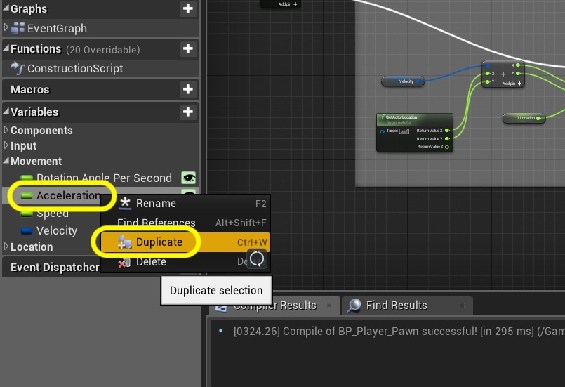
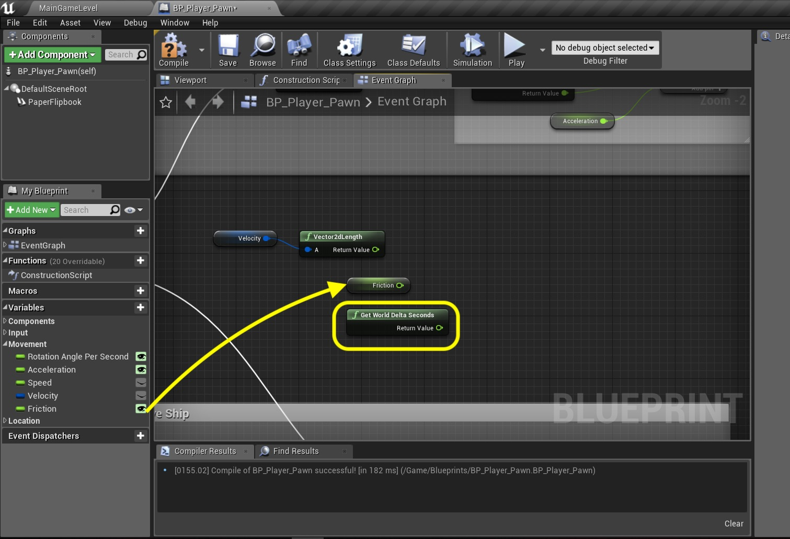

### Ship Thrust Continued
_____ 



{:start="{{ num }}"}
{{ num }}. Now we started by placing the ship in **Z** `10`.  now we could hard code this number but may need to access it elsewhere.  Lets add a **Float** variable called `Z Location` that is **Private** and is of **Category** `Location`.  Add a **Tooltip** that states `Where on the Z axis the ship lives`. Drag a **Get Z Location** node onto the graph and connect it to the **New Location Z** pin on the **Set Actor Location** node.  Press the **Compile** button.  Set the default value of this variable to `10.0`.

  

_____ 


{:start="{{ num }}"}
{{ num }}.  So our node chart should look like:

  

_____ 


{:start="{{ num }}"}
{{ num }}. Now we want to run this off of the **Event Tick** so lets add a new **Sequence** node and place right after **Event Tick**.  Attach it's input to the outpuf of the **Event Tick** execution pin.  Connect ***Seuqnece Then 0** pin to **Branch** node input:

  

_____ 


{:start="{{ num }}"}
{{ num }}. Grab the **Sequence Then 1** Execution pin and attach it to the **Set Actor Location** execution pin:

  

_____ 


{:start="{{ num }}"}
{{ num }}. Run the game and press thrust.  The ship should now fly around and add acceleration when thrust is pressed in the direction the ship is running.  In my case it is all backwards.  This is because my settings were changed, the plane is starting pointing left and it needs to start pointing right at 0 degrees.

  

_____ 



{:start="{{ num }}"}
{{ num }}.  I had to go back to **BP_Player_Pawn** and make sure that the **Paper Flipbook** component's **Z Rotation** is set to `90,0` and not **-90.0**.  Yours might be correct so no change is nessary.

  

_____ 


{:start="{{ num }}"}
{{ num }}. Now I noticed another problem when flying around.  My plane went behind a blank object.  I noticed that the GameMode is creating a player pawn we don't want.  Lets create our own **GameMode** blueprint. Go to the **Blueprints** folder and press **Add New** and select **Blueprint Class**.  Press the **Game Mode Base** button:

  

_____ 



{:start="{{ num }}"}
{{ num }}.  Call the blueprint `BP_SpaceRocks_Gamemode` and open it. Change the **Default Pawn Class** to `None`.

  

_____ 


{:start="{{ num }}"}
{{ num }}. Go to **Edit \| Project Settings** and go to **Maps and Modes** and change the **Default GameMode** to `BP_SpaceRoacks_Gamemode`.  Click the arrow and make sure the **Default Pawn Class** is set to `none`.

  

_____ 



{:start="{{ num }}"}
{{ num }}.  Play the game and turn the ship and press the **Thrust** keys (up arrow or W key) to fly around.  There are three obvious problems.  The plane flies off the screen and is hard to steer back, there is no maximum speed and there is no friction the ship just keeps going at the same velocity in a complete frictionless envrionment.  Lets add friction to the game.

<iframe class="embed-responsive-item" src="https://www.youtube.com/embed/Ho30SKpsCzk?autoplay=1&rel=0&controls=0&amp&showinfo=0&version=3&loop=1&playlist=Ho30SKpsCzk" frameborder="0" allowfullscreen></iframe>

_____ 


{:start="{{ num }}"}
{{ num }}. Press **Save All** and update Github by **committing** and **pushing** all the changes made.

  

_____ 

### Ship Friction
Now we have a ship that flies around nicely.  But if you let go of the button it keeps going in a frictionless environment.  We want the ship to slow down to a halt.  Friction is just a loss of **Velocity** which we will slowly be removing each frame.  Lets get started.

_____ 


{:start="{{ num }}"}
{{ num }}.  There is one housecleaning exercise I want to perform.  Open **BP_Player_Pawn** and look at **Event Tick**.  We will be using the **Delta Seconds** pin a lot more for this blueprint.  Now we can use a node that represents the exact same value.  Go to the rotation nodes where the **Delta Seconds** feeds the multiply node.  Right click on a blank spot and add the **Get World Delta Seconds** node:

  

_____ 


{:start="{{ num }}"}
{{ num }}. Replace the link from **Event Tick** with the output of **Get World Delta Seconds**.  Test bu running the game, just to confirm that the game should behave exactly the same as before.

  

_____ 



{:start="{{ num }}"}
{{ num }}.  Add the same **Get World Delta Seconds** node just left of where the **Radius** is calculated for the thrust.

  

_____ 


{:start="{{ num }}"}
{{ num }}. Now attach the output to the **Multiply** input replacing the pin coming from **Event Tick**:

  

_____ 



{:start="{{ num }}"}
{{ num }}.  We need a variable to store the amount of friction we want to apply per second.  Right click onthe **Acceleration** variable and select **Duplicate**:

  

_____ 


{:start="{{ num }}"}
{{ num }}. Call this new variable `Friction` and make sure it is of type **Float**, **Instance Editable** and **Private**.  Update the tooltip that this is units per second being applied.  Press the **Compile** button so you can set the **Default Value \| Friction** to `0.5`.

  

_____ 



{:start="{{ num }}"}
{{ num }}.  We want to calculate friction after we figure out the **Velocity** of the ship but before we move it.  Make some room for this new functionality above **Move Ship**:

  

_____ 


{:start="{{ num }}"}
{{ num }}. Press the **Add pin +** on the **Sequence** node.  Remove the connection between the **Set Actor Location** and **Then 1**.  Instead connect it to the new **Then 2**.  This frees up **Then 1** for friction.

  

_____ 



{:start="{{ num }}"}
{{ num }}.  Now what we want to do it adjust the length the of vector of Velocity while mainting its direction.  It will be easiest to normalize the vector (make it length 1), then subtract the the friction for the last frame from the speed.  Lets start by adding a **Get Velocity** node to the graph:

  

_____ 


{:start="{{ num }}"}
{{ num }}. Pull off of the **Velocity** node and select **Vector2DLength**.  This gives us how many units we will be traveling, or the Speed:

  

_____ 



{:start="{{ num }}"}
{{ num }}.  Now we want to subtract the friction from this length.  But first we have to convert it to per second to since last frame.  Add a **Get Friction** node and a **Get World Delta Seconds** node:

  

_____ 



{:start="{{ num }}"}
{{ num }}.  Add a **float * float** node and connect the four pins to multily **Friction** times **Delta Seconds**:

  

_____ 


{:start="{{ num }}"}
{{ num }}. Add a **float - float** node and a **Set Speed** node:

  

_____ 



{:start="{{ num }}"}
{{ num }}.  Connect the output of the **Friction Multiply** node to the bottom subtract pin. Put the **Return Value** of the **Vector2dLength** node to the top of the **Subtraction** pin.  We are subtracting friction from the existing speed (length of Velocity vector).  Send the output of the **Subtraction** node to the **Set Speed** node.

  

_____ 


{:start="{{ num }}"}
{{ num }}. Connect the **Then 1** from the **Sequence** node's execution pin to the input execution pin of **Set Speed** node:

  

_____ 



{:start="{{ num }}"}
{{ num }}.  Add a `Friction` comment around these nodes like so:

  

_____ 


{:start="{{ num }}"}
{{ num }}. Now we need to resize the magnitude (length) to take into account the reduced speed. To the right of friction add a **Get Velocity** node:

  

_____ 



{:start="{{ num }}"}
{{ num }}.  Pull off of the **Velocity** pin and add a **Normalize2D** node.  This will return a vector with a magnitude (length) of 1 unit but preserves the direction (angle).

  

_____ 


{:start="{{ num }}"}
{{ num }}. Add a comment to the nodes with `Change Length (Magnitude) of Velocity Vector`.  Add a **Get Speed** node.  Pull off of the **Normalize2D** output and select a **vector2d * float** node:

  

_____ 



{:start="{{ num }}"}
{{ num }}. Connect the ouput of the **Speed** node with the output of the **Normalize2D** node to the multiply node.  Drag off of the output pin and select the **Set Velocity** node: 

  

_____ 


{:start="{{ num }}"}
{{ num }}. Connect the output execution pin from **Set Speed** to the input pin of **Set Velocity**:

  

_____ 



{:start="{{ num }}"}
{{ num }}.  Play the game and fly around.  Let go of the thrust button and watch the ship slow to a halt.

<iframe class="embed-responsive-item" src="https://www.youtube.com/embed/mgQPfTVPa4M?autoplay=1&rel=0&controls=0&amp&showinfo=0&version=3&loop=1&playlist=mgQPfTVPa4M" frameborder="0" allowfullscreen></iframe>

_____ 


{:start="{{ num }}"}
{{ num }}. Press **Save All** and update Github by **committing** and **pushing** all the changes made. Up next we will be having the ship wrap from the edges of the screen to always stay in the viewport.

  

_____ 

  

[<- Previous](Space-Rocks-5.html)&nbsp;&nbsp;&nbsp;[Home](../index.html)&nbsp;&nbsp;&nbsp; [Continue ->](Space-Rocks-7.html)
   
   
   

