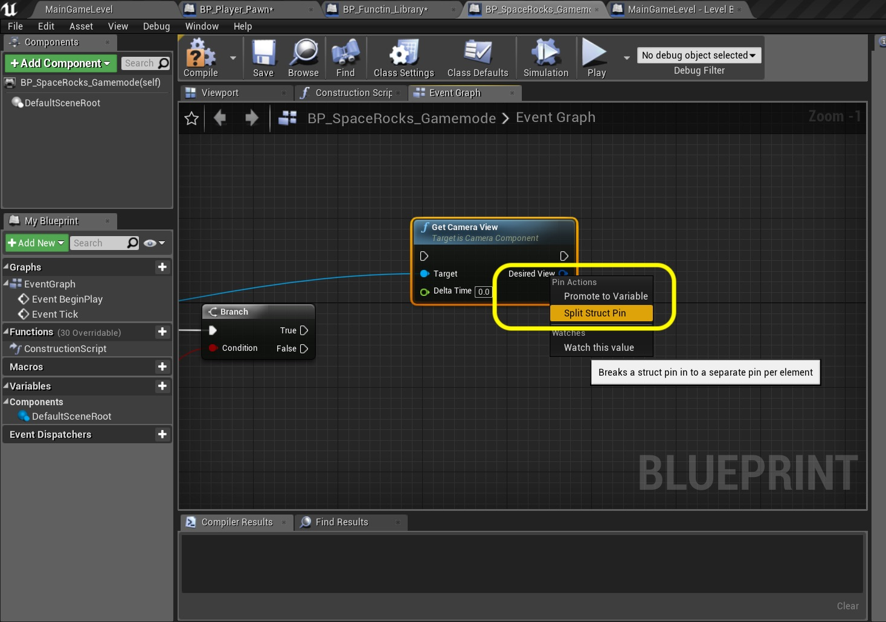
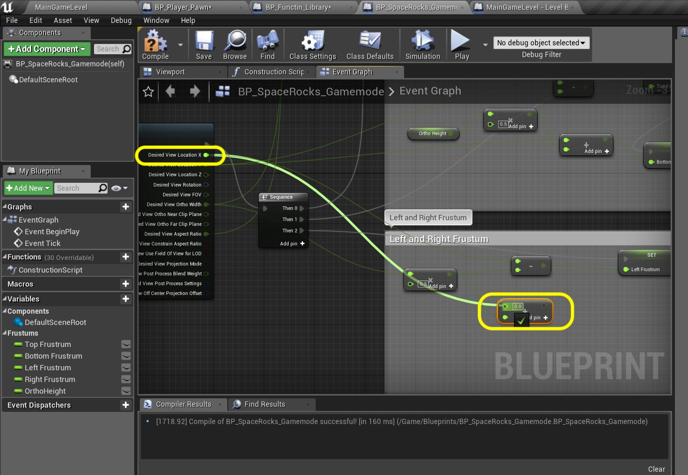
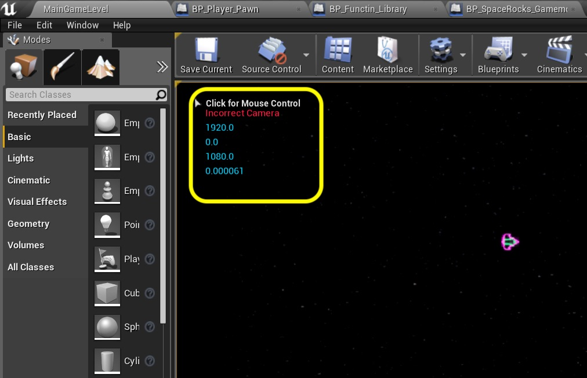

### Screen Wrapping
Now we have a ship that flies around nicely.  But it flies off screen then it is nearly impossible to get it back on screen.  In the original asteroids game when the ship went off one side of the screen it appeared on the other.  So we will be looking to see if the X or Y go out of bounds.  We will also need this for the Space Rocks that fly around so we will create a global function that any object can access.  Lets get started.

_____ 



{:start="{{ num }}"}
{{ num }}. Since we want all the various Rocks and the Ship to all wrap we want to make this function generic enough and available globally.  There is a special type of **Blueprint** that Unreal has availed to us for this very use.  Press the **Add New \| Blueprints \| Blueprint Function Library** and read the explanation carefully.

  

_____ 


{:start="{{ num }}"}
{{ num }}. Call it `BP_Function_Library`.

  

_____ 


{:start="{{ num }}"}
{{ num }}. If there is not a default function there press the **+** button.  In either case name the function `Move Wrap`.

  

_____ 


{:start="{{ num }}"}
{{ num }}. Now since this is a global function I want to write it as generically as possible and for as many situations as possible.  So in thinking about this two things some to mind.  First I want to be able to toggle on and off vertical and horizontal wrapping.  It is possible that in a future scenario that I would just want to wrap on one plane.  Also, all objects will be of different sizes.  We need to know how much each will offset before they are truly outside the room as well as spawning them on the other side just outside the room.  So press the **+** next to inputs four times.  We will create two **Boolean** inputs called `Wrap Vertical` and `Wrap Horizontal`.  Then we will need two **Float** inputs called `X Offset` and `Y Offset`.

  

_____ 


{:start="{{ num }}"}
{{ num }}. Press the **+** next to **Inputs** again and select an **Actor \| Object Reference** and call it `Actor To Wrap`.  This will be passed to the function by the ship so it can access its location.

  

_____ 


{:start="{{ num }}"}
{{ num }}. Now since we want a neat and clean graph we will be using all of these inputs multiple times.  So instead of having 5 lines coming out of each one we will turn them into variables that we can read and write to.  Right click on the **Actors to Wrap** input pin on the **Move Wrap** function on the graph.  Select **Promote to Local Variable**:

  

_____ 


{:start="{{ num }}"}
{{ num }}. Right click on **X Offset** and **Y Offset** and for both **Promote to Local Vaiable**:

  

_____ 


{:start="{{ num }}"}
{{ num }}. Rename the local variables.  You cannot use hte same names as the **Input** names so I picked `X Offset Wrap`, `Y Offset Wrap` and `Actor Target`.

  

_____ 


{:start="{{ num }}"}
{{ num }}. Now comes the tricky part.  We need to find out the camera frustum.  We need to know at what world coordinate that an object is off screen (not in the camera viewport).  So we need to do this in a general location.  I would like to add on to our camera blueprint in the level blueprint.  But I am having a hard time figurout out how to access them from the blueprint library.  I know I can use the **Get Game Mode** function, so the game mode will be the best blueprint to do this in. Open **BP_SpaceRocks_Gamemode** and add a **Get Actor of Class** node that is attached to **Event BeginPlay**.  The selecxt the **Actor Class** pulldown menu and look for `Camera Actor`.

  

_____ 


{:start="{{ num }}"}
{{ num }}. Now look at the output of this pin. It is an array of actors.  So we willneed to loop through them to find the correct camera (remember ther is a stray that is deleted in the level blueprint).  The gamemode blueprint runs first though so there are still two cameras. Pull off of the **Other Actors** pin and select a **For Each Loop** node:

  

_____ 


{:start="{{ num }}"}
{{ num }}. Now how can I tell if it is the camera we want, the good one. Since it is not a level blueprint I can't get a reference from the level.  There is another way to solve this problem we dind't look at in the **Intro to Blueprints** exercises.  It is tagging the actor.  Now there are three spots you can add tags in the camera actor so b ecareful.  Select the **Camera Actor** in the gameview and scroll to the bottom of the **Details** panel.  Find the **Actor** tab and press the **Arrow** button at the bottom to see all of the advanced information.  Press the **+** button next to **Tags** and name it `MainCam`.

  

_____ 


{:start="{{ num }}"}
{{ num }}. Pull off of the **Array Element** pin on the **For EAch Loop** node and select the **Actor Has Tag** node.  Type in `MainCam` exactly how you spelled it in the tag next to the **Tag** pin:

  

_____ 


{:start="{{ num }}"}
{{ num }}. If this is true we want to get the camera frustrum exztents.  Pull off of the output pin from the **Actor Has Tag** node and send it to a new **Branch** node:

  

_____ 


{:start="{{ num }}"}
{{ num }}. Pull off of the **Array Element** pin from the **For Each Loop** node and add a **Get Camera View** node.

  

_____ 


{:start="{{ num }}"}
{{ num }}. Now when this node gets added it automatically adds a **Target to Camera Component** node.  Please connect the output of the **True** execution pin from the **Branch** node to teh input execution pin of the **Get Camera View** node:

  

_____ 


{:start="{{ num }}"}
{{ num }}. Right click the **Desired View** and select **Split Struct Pin**:

  

_____ 


{:start="{{ num }}"}
{{ num }}. Now look at all the variables this node exposed. All the information we need will be contained here.  Now add a new **Float** variable called `Right Frustum` in **Category** `Frustrum`.  Add a **Tooltip** `World Coodinate for Right Edge of View`. 

  

_____ 


{:start="{{ num }}"}
{{ num }}. Copy and paste this three times and call them `Bottom Frustrum`, `Left Frustrum` and `Top Frustum`.  Customize the **Tooltip**s accordingly.

  

_____ 


{:start="{{ num }}"}
{{ num }}. This node gives us the **Orthographic Width** of the camera view but not the height.  We can derive this by dividing this by the aspect ratio.  So lets duplicate **Right Frustrum** and **Duplicate** this variable.  Call is `Ortho Height`, make it **Private** and add a **Tooltip** that states `Height of Windw in UE4 Coordinates`.

  

_____ 


{:start="{{ num }}"}
{{ num }}. Drag and drop a `Set Ortho Height` node to the right of the **Get Camera View** node.  Right click and select a **float / float** node:

  

_____ 


{:start="{{ num }}"}
{{ num }}. Connect the output pin **Desired View Ortho Width** to the top of the **Divide** node and the output of **Desired View Aspect Ratio** pin to the bottom side of the **Divide** node.  Send the output to the **Set Orth Height** input pin.  Also connect the **Branch True** execution pin to the **Get Camera View** execution pin.

  

_____ 


{:start="{{ num }}"}
{{ num }}. Connect the execution pin from the **Get Camera View** node to the **Set Ortho Height** node:

  

_____ 


{:start="{{ num }}"}
{{ num }}. How do we find the top coordinate of the screen.  The **Desired View Location X** and **Desire View Location Y** indicate the point the center of the camera is pointing at.  In this case it is the dead center of our level.  So all we have to do is subtract half of the height (mulitplying by .5 is the same as dividing by 2).  So add a **float - float** node and connect the **Dsired View Location Y** to the top.  Drag a **Get Ortho Height** node and drag off of the output pin to select a **float * float** node.

  

_____ 


{:start="{{ num }}"}
{{ num }}. Why multiply instead of divide by 2?  Multiplication is a bit faster for the CPU to process than a divide and the result is the same.  So add `0.5` to the **Multiply** node of **Ortho Height** and connect the output to the bottom pin of the **Subtraction** node. We are subtracting half the height from the center of the screen in **Y**:

  

_____ 


{:start="{{ num }}"}
{{ num }}. Send the output of the **Subtraction** node to a new **Set Top Frustum** node.  If you have not already add a comment to the set ortho height nodes:

  

_____ 


{:start="{{ num }}"}
{{ num }}. Add a comment to the last batch of nodes called `Top and Bottom Frustum`.  Move the **Get Height** nodes above it as this needs to run before calculating the top and bottom frustrum.  Add a **Sequence** node and highjack the output of the **Get Camera View** execution pin and put it in the input of the **Sequence** node.  Send the **Then 0** to **Set Ortho Height** and **Then 1** to **Set Top Frustrum** like so:

  

_____ 


{:start="{{ num }}"}
{{ num }}. Add room on the bottom of the comment section to add the Bottom Frustrum.  To calculate the bottom all we do is add half the **Ortho Height** to the viewport Y.

  

_____ 


{:start="{{ num }}"}
{{ num }}. Add a **float + float** node and take the output of the **Multiplication** by **0.5** pin and send it to the input of the **Addition** pin. Take the **View Location Y** output pin from the **Get Camera View** node to the other side of the **Addition** pin.

  

_____ 


{:start="{{ num }}"}
{{ num }}. Pull off the output of the **Addition** pin and select the **Set Bottom Frustum** node.  Connect the execution pin from the **Set Top Frustrum** to the **Set Bottom Frustum** node.

  

_____ 


{:start="{{ num }}"}
{{ num }}. All we have left to do is calculate the left and right frustum.  We have an **Ortho Width** node already so we just need to multiply it by .5.  Press the **Add pin +** on the sequence node and add a **float * float** node beneath all the other nodes:

  

_____ 


{:start="{{ num }}"}
{{ num }}. Connect the output pin of **View Otho Width** to the top of the **MUltiplication** node.  Set the bottom to `0.5` to take half that value.  Pull off of the output and add a **float - float** pin.  Connect the top input of this to the **View Location X** pin: 

  

_____ 


{:start="{{ num }}"}
{{ num }}. Pull off of the output of the **Subtraction** pin and add a **Set Left Frustrum** node.  Connect it to the **The 2** output of the **Sequence** node.  Add a comment `Left and Right Frustum`:

  

_____ 


{:start="{{ num }}"}
{{ num }}. Pull off of the **Desired View Location X** pin and select a new **float + float** node:

  

_____ 


{:start="{{ num }}"}
{{ num }}. Attach the output of the **Multiplication** pin to the input of the **Addition** node.  Take the output of the **Addition** node and add a **Set Right Frustum** node.  Connect this to the execution pin of the **Set Left Frustum** node.

  

_____ 


{:start="{{ num }}"}
{{ num }}. Now before we move on we need to test our work.  Since the top left corner of my level is at the **0, 0** mark on x and y I expect to see the following values.  **0** for left and top, **1080** for bottom and **1920** for right.  There might a be a bit of fractional variation but this will be OK.  So lets add some print statements to verify if we did this correctly before we move on. Lets start by double checking the theory that the gamemode runs before the level blueprint so there are two cameras in the scene.  Take the **False** output pin after the **Actor Has Tag** node and send it to a print node that has `Incorrect Camera` and is of **Test Color** `Red`.

  

_____ 


{:start="{{ num }}"}
{{ num }}. Drag all four frustum variables as **Get** to the graph:

  

_____ 


{:start="{{ num }}"}
{{ num }}. Pull off of the **Set Right Frustum** execution pin and add a **Print String** node.  Connect the output of the **Top Frustum** node to the **In String**.  UE4 will add the correcdt cast node.

  

_____ 


{:start="{{ num }}"}
{{ num }}. Drag from the execution output of the **Print String** node and add another **Print String** node.  Connect the output of **Bottom Frustum** to the **In String**:

  

_____ 


{:start="{{ num }}"}
{{ num }}. Repeat this for the **Left Frustum** and **Right Frustum**.

  

_____ 


{:start="{{ num }}"}
{{ num }}. So your node chart should look like:

  

_____ 


{:start="{{ num }}"}
{{ num }}. Press the **Compile** button then go to the game and run it. In mine I see that it does detect a second camera that does not have the tag like the one we added to the level.  I then printed top, bottom, left then right.  In my mind it seems to print them in reverse order.  But I am getting two zeros and the width and height.  For mine I am happy.  If you want to be extra sure you can check them one  at a time to make sure each frustum ahs the correct value.  DELETE ALL OF THE TEST PRINTING NODES BEFORE MOVING FORWARD.

  

_____ 
  

[<- Previous](Space-Rocks-6.html)&nbsp;&nbsp;&nbsp;[Home](../index.html)&nbsp;&nbsp;&nbsp; [Continue ->](Space-Rocks-8.html)
   
   
   

