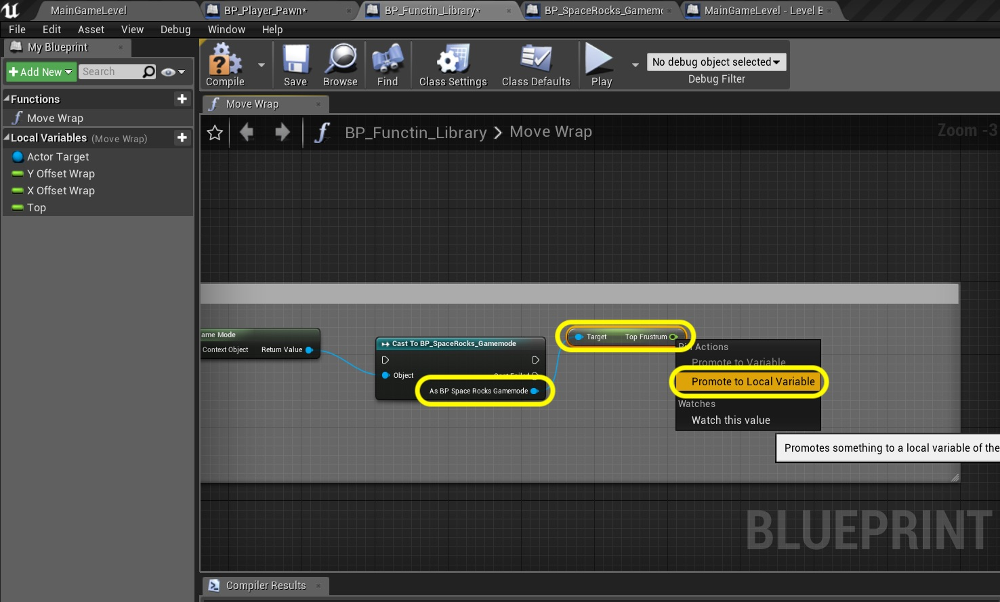
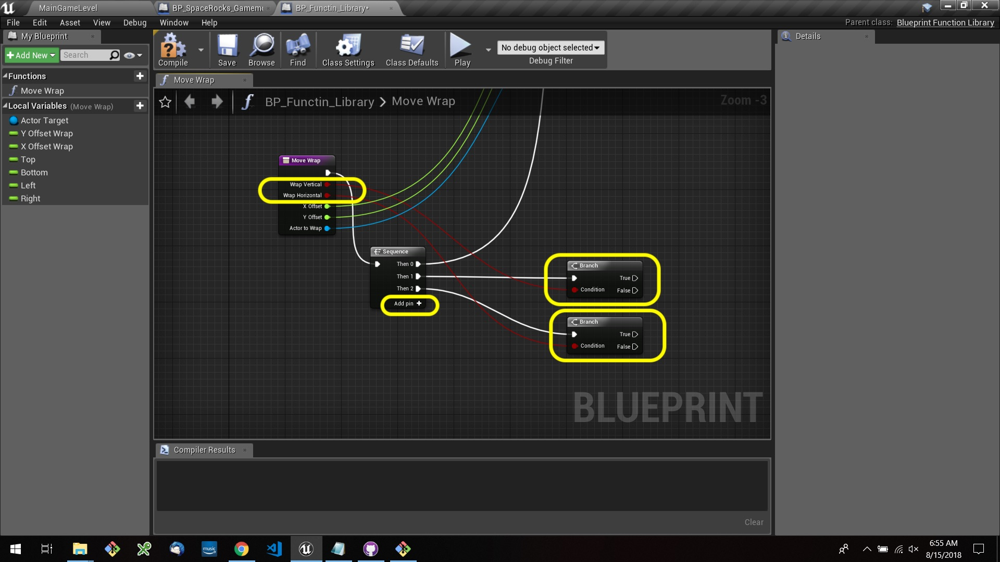
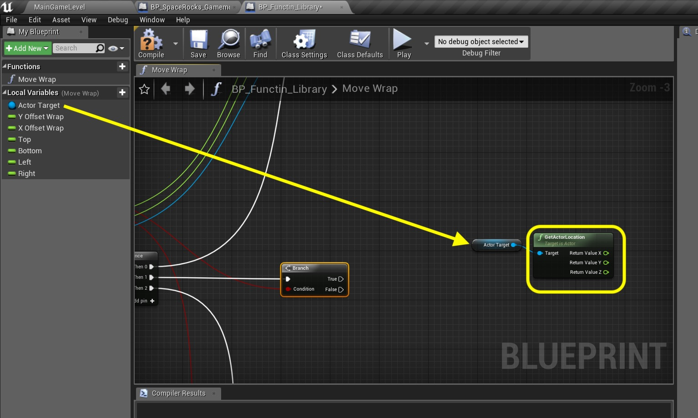
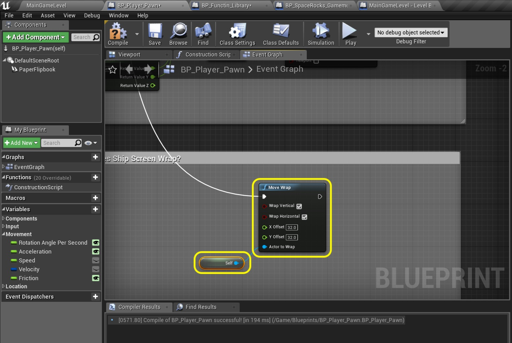
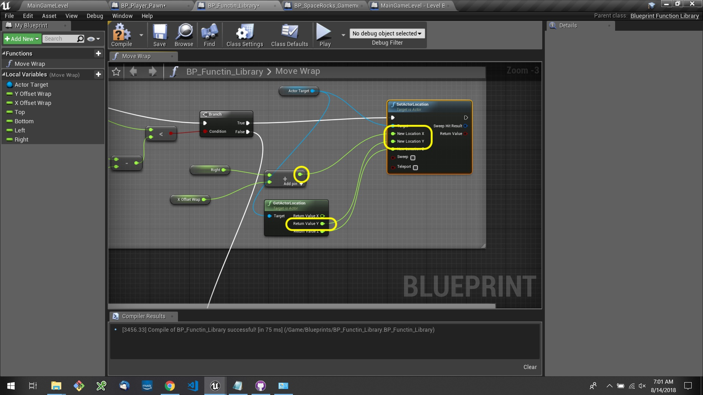

### Screen Wrapping Continued

_____ 



{:start="{{ num }}"}
{{ num }}. Now we have the data we need to finish our **Move Wrap** function.  Open **BP_Function)Library** and select the **Move Wrap** function.  We need to add four more local variables to this function which are the four frustum's we just created.  But we need to get access to the gamemmode variables.  In the same section where you are setting local variables add a **Get GameMode** node and cast it to **BP_SpaceRocks_Gamemode** by pulling off the pin and adding this node:

  

_____ 


{:start="{{ num }}"}
{{ num }}. Pull off of the **Add BP Space Rocks Gamemode** pin and select a **Get Top Frustum** node.  Right click the output of this new node and selecdt **Promote to Local Variable**.

  

_____ 


{:start="{{ num }}"}
{{ num }}. Connect the execution pin from the **Cast** node to the **Set** node you just crated:

  

_____ 


{:start="{{ num }}"}
{{ num }}. Repeat this same process for the bottom frustum:

  

_____ 


{:start="{{ num }}"}
{{ num }}. Connect the execution pins for the **Top** and **Bottom** Set nodes:

  

_____ 


{:start="{{ num }}"}
{{ num }}. Repeat this for the **Left Frustum** and **Right Frustum**.  Rename all thesze **Set** variables to `Top`, `Bottom`, `Left` and `Right` like so:

  

_____ 


{:start="{{ num }}"}
{{ num }}. So your tree should now look like this.  We have some connection issues with out execution pins not reaching all of our setters.

  

_____ 


{:start="{{ num }}"}
{{ num }}. Add a **Sequence** node and highjack the execution pin from the **Move Wrap** to the **Sequence** node.  Send the **Then 0** output pint from the **Sequence** node to your top **Set Node**.  String them together and send the output to the **Cast** node you added recently:

  

_____ 


{:start="{{ num }}"}
{{ num }}. Now we need to check to see if the function should wrap horizontally and vertically.  Drag off of the **Wrap Vertical** pin and add a **Branch** node.  Do the same thing for **Wrap Horizontal**. Press the **Add pin +** button on the **Sequence** node.  Connect the **Then 1** to the **Vertical Branch** and the **Then 2** to the **Horizontal Branch**:

  

_____ 


{:start="{{ num }}"}
{{ num }}. We are going to start by checking the top of the screen to see if the character has gone off screen.  Drag a **Get Actor Target**.  Pull off of its output pin and select the **Get Actor Location** node.

  

_____ 


{:start="{{ num }}"}
{{ num }}. Add comment that says `Check If Ship Is Off Top Of Screen`.  Drag a **Get Top** and **Get Y Offset Wrap** node onto the chart:

  

_____ 


{:start="{{ num }}"}
{{ num }}. Now to check to see if it is off the top of the screen we need to subtract the YOffset value from the Top position of the screen.  Add a `float - float` node and attach **Y Offset Wrap** to the bottom input and **Top** to the upper input.

  

_____ 


{:start="{{ num }}"}
{{ num }}. Add a **float < float** node.  Make sure it is NOT <= as this will not work.  Connect the **Return Y Value** pin from the **Get Actor Location** node to the top of the **Less Than** node.  Connecdt the output of the **Subtraction** node to the bottom of the **Les Than** node.

  

_____ 


{:start="{{ num }}"}
{{ num }}. Pull off of the output boolean from the **Less Than** node and add a **Branch** node.  Connect the input execution pin to the **True** output execution pin of the previous **Branch** node that checked of Vertical to be set to true.

  

_____ 


{:start="{{ num }}"}
{{ num }}. So if this branch is true then the player has left the top of the screen.  We need to move him to the bottom of the screen.  Drag a **Get Actor Target** node onto the chart.  Pull off of its output pin and select **Set Actor Location**. Right click on **New Location** and select **Split Struct Pin**.

  

_____ 


{:start="{{ num }}"}
{{ num }}. Connect the **Branch True** execution pin to the **Set Actor Location** node:

  

_____ 


{:start="{{ num }}"}
{{ num }}. Drag a **Get Offset** and **Get Bottom** node to the chart.  Add these together with a **float + float** node.  Send the ouput of this addition to the **New Location Y** pin of the **Set Actor Location** node.

  

_____ 


{:start="{{ num }}"}
{{ num }}. Now what about the **X** and **Y**.  We don't want to set them to **0** as they are set to now.  We don't want them to change.  So what we want to do is read the existing location and feed them into this setter.  Pull of off the **Actor Target** node and select a **Get Actor Location** node:

  

_____ 


{:start="{{ num }}"}
{{ num }}. Right click on the output pin and select **Split Struct Pin**:

  

_____ 


{:start="{{ num }}"}
{{ num }}. Attach the **Return Value X**  pin from **Get Actor Location** to the **New Location X** pin on the **Set Actor Location** node.  Do the same for **Return Value Z** to **New Location Z**.

  

_____ 


{:start="{{ num }}"}
{{ num }}. Now we are ready to test all of this work in engine.  Go back to **BP_Player_Pawn** and we will be adding this below the Move Ship nodes.  We will handle all the ship physics then at the very end decide if we want it to wrap or not by calling this function.

  

_____ 


{:start="{{ num }}"}
{{ num }}. Right click on an open area where you want this node to be and add a **Move Wrap** node.  Notice that the **F** next to it stands for **Function**:

  

_____ 


{:start="{{ num }}"}
{{ num }}. Now press the **Add pin +** on the sequence node and from the last **Then 3** execution pin attach this to the input execution pin in the **Move Wrap** node you just created:

  

_____ 


{:start="{{ num }}"}
{{ num }}. Right click and add a **Self** node.  This is a reference to this object which is the ship.  Attach the output in the **Actor to Wrap** pin in the **Move Wrap** node.  Make sure that **Wrap Vertical** and **Wrap Horizontal** are set to `true`.  Since the artwork is 64 x 64 units, a ship will be offscreen when its reference point moves there.  Since this is in the center it will be 32 units for it to be off screen.  Set the **X Offset** and **Y Offset** to `32.0`.

  

_____ 


{:start="{{ num }}"}
{{ num }}. Add a comment to these two nodes that states what it does `Does Ship Screen Wrap?`:

  

_____ 


{:start="{{ num }}"}
{{ num }}. Now we can run the game and test it.  Fly the ship off of the top of the screen.  It should wrap on the bottom part like so:

<iframe class="embed-responsive-item" src="https://www.youtube.com/embed/FCT7xVkFa-A?autoplay=1&rel=0&controls=0&amp&showinfo=0&version=3&loop=1&playlist=FCT7xVkFa-A" frameborder="0" allowfullscreen></iframe>

_____ 


{:start="{{ num }}"}
{{ num }}. Now the bottom of the screen will be similar.  So open **BP_Function_Library** and in the **Move Wrap** fucntion copy and paste all of the Top of screen nodes and paste beneath:

  

_____ 


{:start="{{ num }}"}
{{ num }}. Now for execution we can run this if it fails the off the top of the screen branch.  A ship can't be both off the top and bottom of the screen at the same time.  So we can just grab the **False** exectuion pin from the **Branch** in the checking top of screen and attach it to the input execution pin on the **Branch** you just pasted below.  This acts like an `else if` in other programming languages.  Now change the comment from `Top` to `Bottom` so we don't get confused. 

  

_____ 


{:start="{{ num }}"}
{{ num }}. Delete the **Subtration** node and the **Less Than** node. Delete the **Top** node and add a **Get Bottom** node in its place.  

  

_____ 


{:start="{{ num }}"}
{{ num }}. Add a **float > float** node and a **float + float** node:  

  

_____ 


{:start="{{ num }}"}
{{ num }}. Connect the **Return Value Y** to the top input of the *Greater Than** node.  Take the output of the **Bottom** node and send it to the **Addition Node**.  Send the **Y Offset Wrap** to the **Addition** node as well.  Send the output of the **Addition** node to the bottom of the **Greater Than** node. Send the output of the **Greater Than** node to the **Condition** input pin on the Branch node.

  

_____ 


{:start="{{ num }}"}
{{ num }}. Now we are wrapping the player to the top of the screen from the bottom.  So in the area where you have the **Set Actor Location** delete the **Addition** node.  Delete the **Bottom** node.  Add a **Get Top** node here.  Then add a **float - float** node:

  

_____ 


{:start="{{ num }}"}
{{ num }}. Subtract **Y Offset Wrap** from the **Top** node.  Send the output of the **Subtraction** node to the **New Location Y** pin on the **Set Actor Location** node.

  

_____ 


{:start="{{ num }}"}
{{ num }}. Now we can run the game and test it.  Fly the ship off of the top AND bottom of the screen.  It should wrap in both directions like so:

<iframe class="embed-responsive-item" src="https://www.youtube.com/embed/oMphPXGmNog?autoplay=1&rel=0&controls=0&amp&showinfo=0&version=3&loop=1&playlist=oMphPXGmNog" frameborder="0" allowfullscreen></iframe>

_____ 


{:start="{{ num }}"}
{{ num }}. Lets go back to **BP_Function_Library** and prepare for wrapping horizontally.  Copy and paste all the **Top** and **Bottom** nodes and place them underneath:

  

_____ 



{:start="{{ num }}"}
{{ num }}. Change the comments from **Top** and **Bottom** to `Left` and `Right` so we don't get confused.  Take the **Branch False** pin from teh **Left*** section and plug it into the input execution pin on the **Branch** node in the **Right** section:

  

_____ 


{:start="{{ num }}"}
{{ num }}. Now drag the **Branch True** execution pin from the check if **Horizontal** is true and put it to the **Branch** pin on the **Left** wrap portion:

  

_____ 


{:start="{{ num }}"}
{{ num }}. Lets start with Wrapping off the left hand side. Delete the **Top** and **Y Offset** nodes.  Replace them with **Get Left** and **Get X Offset Wrap** nodes.  Connect those to the input pins on the **Minus** node making sure that the offset is subtracting from the left nodes.

  

_____ 



{:start="{{ num }}"}
{{ num }}. Now this is horizontal movement along the **X** axis.  We don't want to check for the **Y Axis** anymore.  Right click on **Return Value Y** and select **Break link to float < float (A)**

  

_____ 


{:start="{{ num }}"}
{{ num }}. Connect the **Return Value X** pin from the **Get Actor Location** node to the top of the **Less Than** node:

  

_____ 



{:start="{{ num }}"}
{{ num }}. Dlete the **Bottom** and **Y Offset** nodes.  Replace them with a **Get Right** node and a **X Offset Wrap** node.  Connect the output of both of these into the **Addition** node.  Break the links from the output of the **Addition** node and the **Returnn Value X** and **Return Value Y**pins from the **Get Actor Location** node:

  

_____ 


{:start="{{ num }}"}
{{ num }}. Connect the output of the **Plus** node to the **New Location X** pin on the **Select Actor Location** node.  Connect the **Return Value Y** from **Get Actor Location** node to the **New Location Y** on the **Select Actor Location** node. On the next page we will do the final wrapping from the right hand side.

  

_____ 
  

[<- Previous](Space-Rocks-7.html)&nbsp;&nbsp;&nbsp;[Home](../index.html)&nbsp;&nbsp;&nbsp; [Continue ->](Space-Rocks-9.html)
   
   
   

