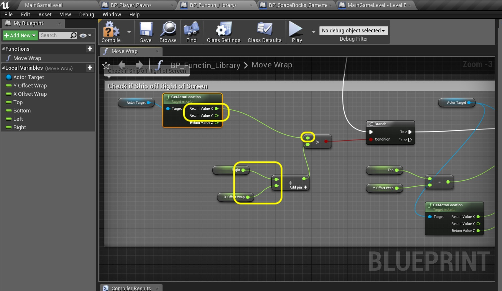

### Screen Wrapping Continued

_____ 



{:start="{{ num }}"}
{{ num }}. Scroll down to our last group of nodes for checking the right hand side of the screen.  Delete the **Bottom** and **Y Offset Wrap** nodes and replace them with a **Get Right** and **X Offset Wrap** node.

  

_____ 


{:start="{{ num }}"}
{{ num }}. Connect the output of the **Right** and **X Offset Wrap** nodes to the **Addition** node.  Break the pin from **Return Value Y** and connect **Return Value X** from the **Get Actor Location** node to the top input of the **Greater Than** node:

  

_____ 


{:start="{{ num }}"}
{{ num }}. Replace the **Top** and **Y Offset Wrap** nodes with a **Get Left** and **X Offset Wrap** node:

  

_____ 


{:start="{{ num }}"}
{{ num }}. Reattach the pins to the **Subtraction** node making sure you are subtracting **X Offset Wrap** from **Left**:

  

_____ 


{:start="{{ num }}"}
{{ num }}. Break the links from the output of the **Subtraction** node as well as the **Return Value X** and **Return Value Y** from the **Get Actor Location** node:

  

_____ 


{:start="{{ num }}"}
{{ num }}. Reattach the output pin of the **Subtraction** node to the **New Location X** pin on the **Set Actor Location** node.  Set the output pin **Return Value Y** from the **Get Actor Location** node to the **New Location Y** in the **Set Actor Location** node:

  

_____ 


{:start="{{ num }}"}
{{ num }}. Play the game and fly off of all 4 sides of the screen.  Make sure it wraps correctly.  Also try flying and keep pressing thrust.  You will accelerate infinitely.  We need to cap the top velocity we want the ship to fly at.

<iframe class="embed-responsive-item" src="https://www.youtube.com/embed/mwQIxb0h6Zw?autoplay=1&rel=0&controls=0&amp&showinfo=0&version=3&loop=1&playlist=mwQIxb0h6Zw" frameborder="0" allowfullscreen></iframe>

_____ 


{:start="{{ num }}"}
{{ num }}. Press **Save All** and update Github by **committing** and **pushing** all the changes made. Up next we will be enforcing a maximumn speed as you can now endlessly accellerate.

  

_____ 

## Ship Maximum Velocity
It is as simple as limiting the magnitude that we set the Speed variable in the player blueprint.  Lets get started.

_____ 



{:start="{{ num }}"}
{{ num }}. Lets start by right clicking on the **Speed** variable and seledting **Duplicate**:

  

_____ 


{:start="{{ num }}"}
{{ num }}. Call it `Maximum Speed`.  Since we will be tuning this variable we want to make it **Instance Editable**. Adjust the **Tooltip** to represent the intention of this variable.

  

_____ 


{:start="{{ num }}"}
{{ num }}. Pull off of the **Set Velocity** node pin and select a **Print String** node.  Drag a **Get Speed** node and plug it into the **In String** pin of the **Print String** node.  UE4 will add the proper conversion node.  

  

_____ 


{:start="{{ num }}"}
{{ num }}. Now run the game.  I start to see numbers but they are very small like between 0 and 5.  I realize this is not Max Speed per second but since the last frame.  Since this time can vary we want to convert it to seconds. Add a **float / float** node and a **Get World Delta Seconds** node and place it under the **Print String** node:

  

_____ 


{:start="{{ num }}"}
{{ num }}. Attach the output of **Get World Delta Seconds** to the bottom of the **Divide** node and the output of **Speed** redirected to the top side of the **Divide** node.  Send the output of **Divide** to the green input node on the conversion from **float to string**:

  

_____ 


{:start="{{ num }}"}
{{ num }}. Play the game and see what is being printed.  Now the numbers look more realistic to me.  At the moment of this screenshot the speed was **231.726766** units per second.

  

_____ 



{:start="{{ num }}"}
{{ num }}. Now delete all of the nodes for printing we don't need them anymore.  This was just to see what range we were talking about.  Now go back to the **Maximum Speed** variable and change the default to `200.0`.

  

_____ 


{:start="{{ num }}"}
{{ num }}. Make some room after the **Friction** nodes and the **Change Length of Velocity** nodes.  This is where we will clamp the value between 0 and Maximum Speed.

  

_____ 


{:start="{{ num }}"}
{{ num }}. Add a **Get Maximum Speed**, **Get World Delta Seconds** and **float * float** node:

  

_____ 


{:start="{{ num }}"}
{{ num }}. Connect the **Get World Delta Seconds** and **Maximum Speed** outputs to the **Multiplication** node.  Connect the output of the **Multiplication** node to the **Max** input pin on the **Clamp** node:

  

_____ 


{:start="{{ num }}"}
{{ num }}. Now instead of setting the speed after the friction is calculated; we will set it after the value is clamped.  So take the outpuf of the **Subtraction** pin before **Set Speed** and disconnect it from **Speed** and connect it toe the **Value** input pin in the **Clamp** node.  Move the **Set Speed** node over to after the clamp.  Take the **Return Value** from the **Clamp** node and feed it to the **Set Speed** node:

  

_____ 


{:start="{{ num }}"}
{{ num }}. Add a comment to these nodes describing the function and put in `Clamp Max Speed`.  Press the **Compile** button:

  

_____ 


{:start="{{ num }}"}
{{ num }}. Now run the game and fly around. I found **200.0** on the **Maxium Speed** variable a bit restrictive so I tuned it up to `300.0` and it feels a lot better to my taste.

<iframe class="embed-responsive-item" src="https://www.youtube.com/embed/2hqY1AX68f0?autoplay=1&rel=0&controls=0&amp&showinfo=0&version=3&loop=1&playlist=2hqY1AX68f0" frameborder="0" allowfullscreen></iframe>

_____ 


{:start="{{ num }}"}
{{ num }}.Press **Save All** and update Github by **committing** and **pushing** all the changes made. Up next we will be firing bullets.

  

_____ 

## Firing Bullets
It wouldn't be much of a game if we couldn't fire bullets.  There are only a few tricky things here.  We have to create some physics for a bullet.  We also have to deal with destroying a bullet when they leave the game screen.  Lets get started.

_____ 


{:start="{{ num }}"}
{{ num }}. We need to add an input event for pressing the fire button.  We will be using the space bar for this.  Go to **Edit \| Project Settings**:

  

_____ 


{:start="{{ num }}"}
{{ num }}. Go to **Engine \| Input** and press the **+** button next to **Action Mappings**.  We already have a **Thrust** action but you will name the new one `Shoot`.  Press the **+** button next to the **Shoot** binding and select the **Space Bar**.

  

_____ 


{:start="{{ num }}"}
{{ num }}. Open **BP_Player_Pawn** and next to **Event Tick**'s press the **Add pin +** button on the **Sequence** node to add a 5th input:

  

_____ 


{:start="{{ num }}"}
{{ num }}. At the very bottom of the node chart right lick and add a **Event Shoot** node: 

  

_____ 



{:start="{{ num }}"}
{{ num }}. Drag off of the **Pressed** and select a **Print String** node.  PUt in the **In String** box `Shot Fired`.  

  

_____ 


{:start="{{ num }}"}
{{ num }}. Go to the game and press play.  Press the space bar to test the event is firing.  You should see a **Shot Fired** text appear for two seconds each time you press the space bar.  When you are satisfied that it is working please DELETE the print node.

  

_____ 


{:start="{{ num }}"}
{{ num }}. Before we create a blueprint for the bullet we need to change the name of a texture.  Go to the **Textures \| Sprites** folder in the **Content Browser**.  Find **SP_Rock_Small_Explode**.  Press the F2 button (or right click and select **Rename**).

  

_____ 


{:start="{{ num }}"}
{{ num }}. Rename it to `SP_Bullet`.

  

_____ 


{:start="{{ num }}"}
{{ num }}. Go to the **Blueprints** folder and press **Add New** and select a new **Blueprint Class**:

  

_____ 


{:start="{{ num }}"}
{{ num }}. Press type **Actor** as it will be just the basic class.  Call the blueprint `BP_Bullet`:

  

_____ 


{:start="{{ num }}"}
{{ num }}. Open this blueprint and add a component by pressing the **Add Component** button.  Look for a **Paper Sprite** component:

  

_____ 


{:start="{{ num }}"}
{{ num }}. Select the **Paper Sprite** component and select `SP_Bulle` from the **Sprite** tab.  We will stick with the default unlit material that UE4 defaults to since this is a white bullet.

  

_____ 


{:start="{{ num }}"}
{{ num }}. Now the rotation of this sprite is wrong. You need to adjust the **Rotation X** to `90.0` and the ***Rotation Z** to `-90.0`.

  

_____ 


{:start="{{ num }}"}
{{ num }}. Go back to the Shooting section in **BP_Player_Spawn**.  Make sure the **Print String** node is deleted.  Instead add a **Spawn Actor From Class** node.  In the **Class** pulldown menu select `BP_Bullet`.  Now the node tree should look like:

  

_____ 


{:start="{{ num }}"}
{{ num }}. Now you need to tell the node where to spawn the bullet actor.  We will spawn it from the current ship transform.  Add a **Get Actor Transform** node and attach it to the **Spawn Transform** input on the **SpawnActor BP Bullet** node.

  

_____ 


{:start="{{ num }}"}
{{ num }}. Now lets test our work out.  Go in game and fly around and press the space bar.  You should be firing bullets but it looks more like you are laying eggs.  On the next page we will be adding physics to the bullets.

<iframe class="embed-responsive-item" src="https://www.youtube.com/embed/twkN1XQoq2s?autoplay=1&rel=0&controls=0&amp&showinfo=0&version=3&loop=1&playlist=twkN1XQoq2s" frameborder="0" allowfullscreen></iframe>

_____

  

[<- Previous](Space-Rocks-8.html)&nbsp;&nbsp;&nbsp;[Home](../index.html)&nbsp;&nbsp;&nbsp; [Continue ->](Space-Rocks-10.html)
   
   
   

